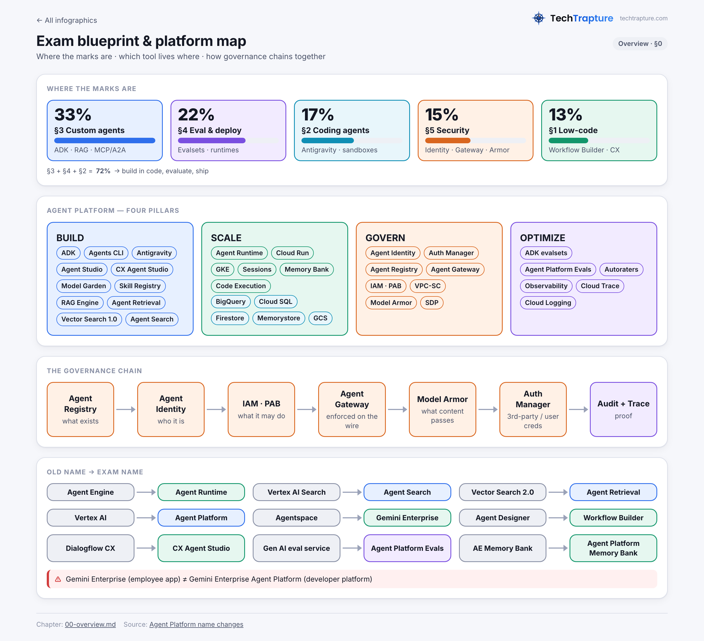
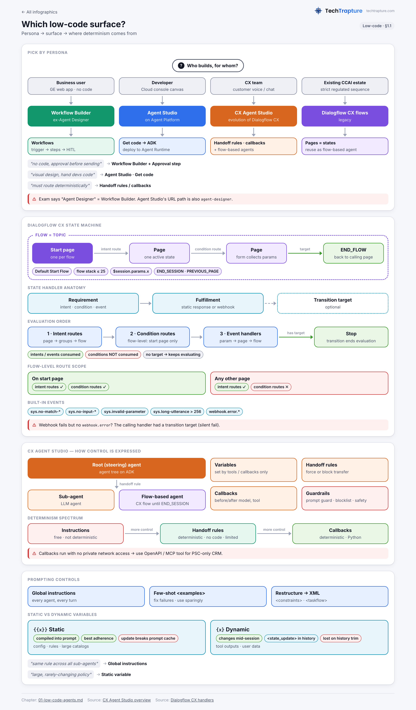
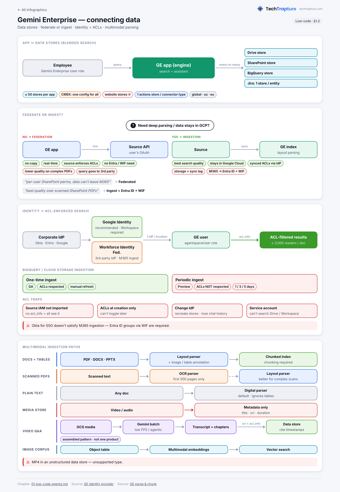
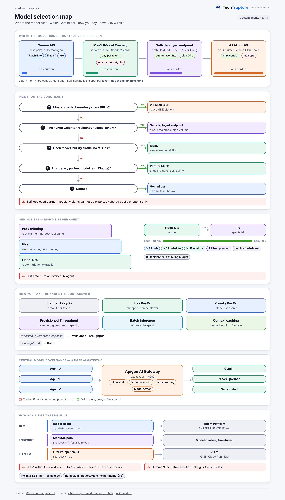
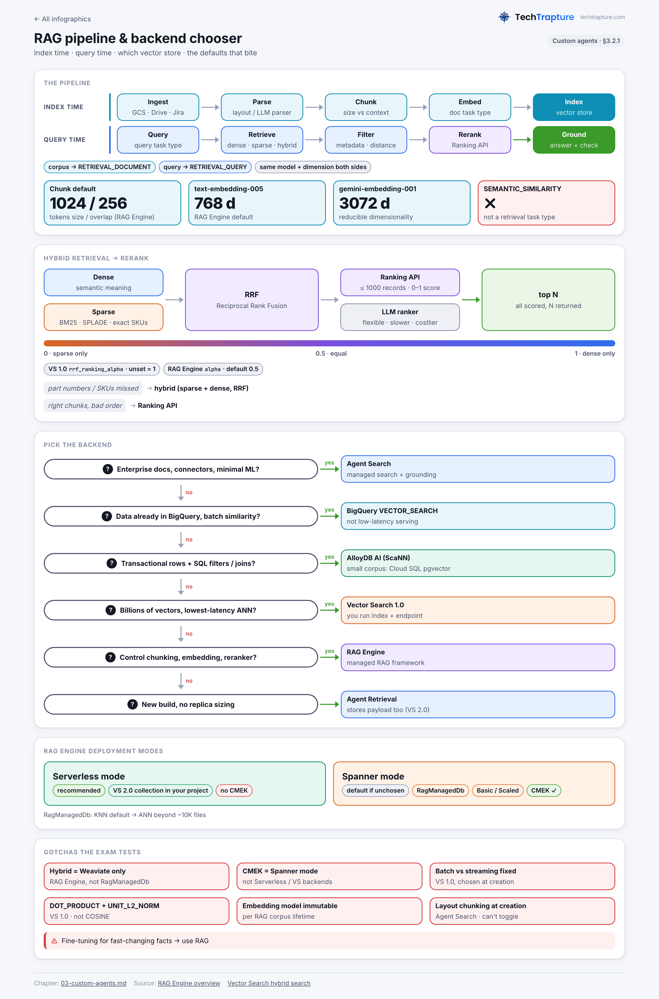
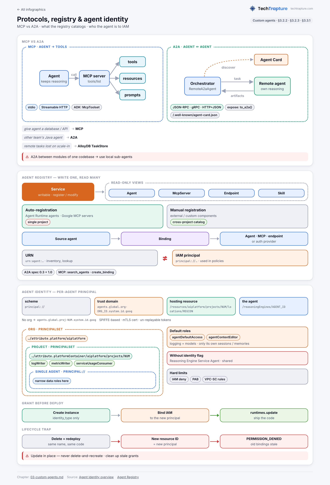
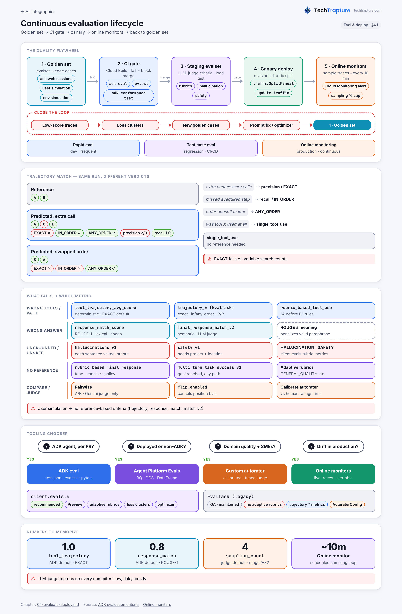
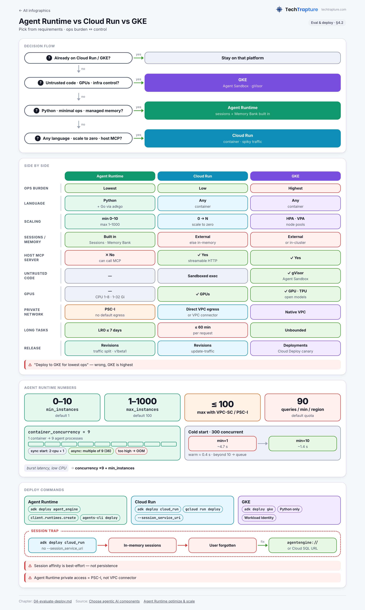

# Google Cloud Agentic Architect Exam Guide

A study guide for the **Google Cloud Certified — Professional Agentic Architect** exam, organized around the five sections of the official exam guide.

Every chapter covers its sub-objectives with core concepts, configuration snippets, decision tables, explicit trade-offs, **exam signals** (question keyword → likely answer), common distractors, and scenario-style practice questions with explanations. Architecture infographics sit alongside the text for the topics that are easier to see than to read.

> **Product names follow the 2026 Gemini Enterprise Agent Platform naming** (Agent Engine → Agent Runtime, Vertex AI Search → Agent Search, Vector Search 2.0 → Agent Retrieval, and so on). The full rename map is in [the overview](sections/00-overview.md#02-the-2026-rename-map-memorize--questions-will-use-new-names).

## Start here

| | |
|---|---|
| 📘 **Read it end to end** | [AGENTIC_ARCHITECT_EXAM_GUIDE.md](AGENTIC_ARCHITECT_EXAM_GUIDE.md) — the whole guide in one file |
| 🗺️ **Plan your prep** | [Overview](sections/00-overview.md) — blueprint, where the marks are, 4-week study plan |
| ⚡ **Last 72 hours** | [Cheat sheet](sections/06-cheat-sheet.md) — decision trees, numbers to memorize, traps |

## Chapters

| # | Exam section | Weight | Practice Qs |
|---|---|---|---|
| 0 | [Overview — blueprint, renames, study plan](sections/00-overview.md) | — | — |
| 1 | [Building agents using low-code tools](sections/01-low-code-agents.md) | ~13% | 10 |
| 2 | [Using coding agents for application development](sections/02-coding-agents.md) | ~17% | 10 |
| 3 | [Developing custom agents](sections/03-custom-agents.md) | ~33% | 15 |
| 4 | [Evaluating and deploying agentic workflows](sections/04-evaluate-deploy.md) | ~22% | 12 |
| 5 | [Securing and governing agentic workflows](sections/05-security-governance.md) | ~15% | 12 |
| 6 | [Last-72-hours cheat sheet](sections/06-cheat-sheet.md) | — | — |

## Infographics

Click a thumbnail for the full-size image.

<table>
<tr><td align="center" width="25%"> <b>00</b> · Exam blueprint & platform map</td><td align="center" width="25%"> <b>01</b> · Low-code surfaces</td><td align="center" width="25%"> <b>02</b> · Enterprise data</td><td align="center" width="25%"> <b>03</b> · Customization primitives</td></tr>
<tr><td align="center" width="25%"> <b>04</b> · Sandbox tiers</td><td align="center" width="25%"> <b>05</b> · Model selection</td><td align="center" width="25%"> <b>06</b> · Orchestration patterns</td><td align="center" width="25%"> <b>07</b> · State & memory</td></tr>
<tr><td align="center" width="25%"> <b>08</b> · RAG pipeline</td><td align="center" width="25%"> <b>09</b> · MCP · A2A · Registry</td><td align="center" width="25%"> <b>10</b> · Eval lifecycle</td><td align="center" width="25%"> <b>11</b> · Runtime selection</td></tr>
<tr><td align="center" width="25%"> <b>12</b> · Troubleshooting</td><td align="center" width="25%"> <b>13</b> · Defense in depth</td><td align="center" width="25%"> <b>14</b> · Identity & access</td><td align="center" width="25%"> <b>15</b> · Guardrail layers</td></tr>
</table>

## Watch — related videos

Hands-on walkthroughs from the [TechTrapture YouTube channel](https://youtube.com/@techtrapture), grouped by exam section.

**§1 · Low-code agents & enterprise data**

<table>
<tr><td align="center" width="33%"> <b>Gemini Enterprise Explained — Connect & Deploy ADK Agents</b> · 26 min</td><td align="center" width="33%"> <b>Build Enterprise RAG Apps with Agent Search</b> · 49 min</td><td align="center" width="33%"> <b>Custom LLM Chatbot on Your Data with Agent Builder & Dialogflow</b> · 25 min</td></tr>
</table>

**§2 · Coding agents & MCP**

<table>
<tr><td align="center" width="33%"> <b>I Explored Google Antigravity</b> · 19 min</td><td align="center" width="33%"> <b>Build Your First MCP Server — Google Maps & VS Code</b> · 14 min</td><td align="center" width="33%"> <b>Build Your First MCP Server — Google Maps & Claude Desktop</b> · 10 min</td></tr>
</table>

**§3 · Custom agents with ADK**

<table>
<tr><td align="center" width="33%"> <b>ADK Session, State & Memory Explained</b> · 18 min</td><td align="center" width="33%"> <b>ADK Session Management Hands-On (InMemory, Cloud SQL, Vertex AI)</b> · 23 min</td><td align="center" width="33%"> <b>ADK State Management Explained with Demo</b> · 27 min</td></tr>
<tr><td align="center" width="33%"> <b>Build a GitHub Agent with ADK — Function Tools</b> · 8 min</td><td align="center" width="33%"> <b>Build a BigQuery Agent with ADK — Built-in Tools</b> · 16 min</td><td align="center" width="33%"> <b>ADK Third-Party Tools — LangChain & CrewAI</b> · 10 min</td></tr>
<tr><td align="center" width="33%"> <b>RAG Explained — Keyword vs Semantic vs Hybrid Search</b> · 22 min</td></tr>
</table>

**§4 · Deploy & operate agents**

<table>
<tr><td align="center" width="33%"> <b>Deploy an ADK Agent to Cloud Run</b> · 14 min</td><td align="center" width="33%"> <b>AI SRE Agent with ADK + MCP — Auto RCA & Log Analysis</b> · 36 min</td><td align="center" width="33%"> <b>An AI Agent That Runs My Google Cloud Operations</b> · 19 min</td></tr>
</table>

**§5 · Guardrails & secure execution**

<table>
<tr><td align="center" width="33%"> <b>ADK Model Callbacks — Before & After LLM Hooks</b> · 9 min</td><td align="center" width="33%"> <b>ADK Tool Callbacks — Before & After Tool Hooks</b> · 13 min</td></tr>
</table>

## How this guide was built

- Scope comes straight from the official exam guide's sections and in-scope tool list.
- Content is researched against official Google documentation (docs.cloud.google.com, adk.dev, antigravity.google) and the ADK docs.
- Anything that could not be confirmed in the docs is marked **(unverified)** in the chapters and collected in [§6.4](sections/06-cheat-sheet.md#64-items-flagged-unverified-by-research-dont-over-invest).

> **Not affiliated with Google.** This is an independent study resource. Google Cloud products change quickly — always confirm details against the current [official documentation](https://docs.cloud.google.com/gemini-enterprise-agent-platform/overview) and the exam guide on [Google Cloud certification](https://cloud.google.com/learn/certification).

## Author

**Vishal Bulbule** — Founder @ [TechTrapture](https://www.techtrapture.com)

[YouTube](https://youtube.com/@techtrapture) · [LinkedIn](https://www.linkedin.com/in/vishal-bulbule/) · [Medium](https://vishalbulbule.medium.com/) · [X](https://x.com/vishal__bulbule)
