# Google Cloud Agentic Architect Exam Guide

> **About me** — I'm **Vishal Bulbule**, founder of the AI startup [TechTrapture](https://www.techtrapture.com), a Google Developer Expert (GDE) and an enterprise architect.
> I contribute to the open-source [Google ADK](https://github.com/google/adk-python) project, build Agentic AI and MCP training through [TechTrapture Academy](https://academy.techtrapture.com), and have been creating Google Cloud content on [YouTube](https://youtube.com/@techtrapture) for 5 years.
>
> I took the Professional Agentic Architect **beta exam on 25 September 2026**. This guide is based on that exam experience, my experience building production agents, and the official exam guide and Google Cloud documentation.

### 📥 [Download the full guide (PDF)](https://github.com/vishal-bulbule/google-cloud-agentic-architect-exam-guide/releases/latest/download/Google-Cloud-Agentic-Architect-Exam-Guide.pdf)

Every chapter, all 83 practice questions and all 19 visual memory maps in one printable file. 

A study guide for the **Google Cloud Certified — Professional Agentic Architect** exam, organized around the five sections of the official exam guide.

Every chapter covers its sub-objectives with core concepts, configuration snippets, decision tables, explicit trade-offs, **exam signals** (question keyword → likely answer), common distractors, and scenario-style practice questions with explanations — **83 in total**. **Visual memory maps** sit alongside the text: one-page diagrams of blocks, flows and decision paths for the topics that are easier to remember as a picture.

> **Product names follow the 2026 Gemini Enterprise Agent Platform naming** (Agent Engine → Agent Runtime, Vertex AI Search → Agent Search, Vector Search 2.0 → Agent Retrieval, and so on). The full rename map is in [the overview](sections/00-overview.md#02-the-2026-rename-map-memorize--questions-will-use-new-names).

## Start here

| | |
|---|---|
| 📘 **Read it end to end** | [AGENTIC_ARCHITECT_EXAM_GUIDE.md](AGENTIC_ARCHITECT_EXAM_GUIDE.md) — the whole guide in one file |
| 📥 **Study offline** | [Download the PDF](https://github.com/vishal-bulbule/google-cloud-agentic-architect-exam-guide/releases/latest/download/Google-Cloud-Agentic-Architect-Exam-Guide.pdf) — print it or read it on any device |
| 🗺️ **Plan your prep** | [Overview](sections/00-overview.md) — blueprint, where the marks are, 4-week study plan |
| ⚡ **Last 72 hours** | [Cheat sheet](sections/06-cheat-sheet.md) — decision trees, numbers to memorize, traps |
| 🔎 **Deep dives** | [Antigravity rules, hooks & skills](sections/02-coding-agents.md#22b-deep-dive--antigravity-rules-hooks-and-skills-paths-formats-when-to-use-which) · [Registering MCP servers in Agent Registry](sections/03-custom-agents.md#324-deep-dive--registering-mcp-servers-in-agent-registry) · [Agent-to-tool authentication](sections/05-security-governance.md#511b-deep-dive--agent-to-tool-authentication-patterns) |

## Chapters

| # | Exam section | Weight | Practice Qs |
|---|---|---|---|
| 0 | [Overview — blueprint, renames, study plan](sections/00-overview.md) | — | — |
| 1 | [Building agents using low-code tools](sections/01-low-code-agents.md) | ~13% | 10 |
| 2 | [Using coding agents for application development](sections/02-coding-agents.md) | ~17% | 18 |
| 3 | [Developing custom agents](sections/03-custom-agents.md) | ~33% | 23 |
| 4 | [Evaluating and deploying agentic workflows](sections/04-evaluate-deploy.md) | ~22% | 12 |
| 5 | [Securing and governing agentic workflows](sections/05-security-governance.md) | ~15% | 20 |
| 6 | [Last-72-hours cheat sheet](sections/06-cheat-sheet.md) | — | — |

## Visual memory maps

One-page diagrams to revise from. Click a thumbnail for the full-size image.

<table>
<tr><td align="center" width="25%"><a href="visual-memory/00-exam-blueprint.png">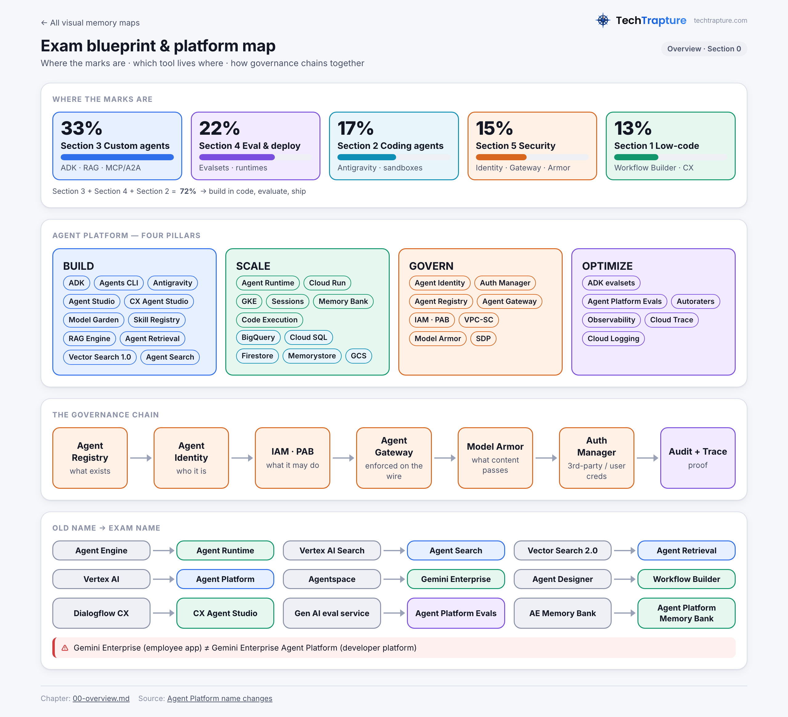</a> <b>00</b> · Exam blueprint & platform map</td><td align="center" width="25%"> <b>01</b> · Low-code surfaces</td><td align="center" width="25%"> <b>02</b> · Enterprise data</td><td align="center" width="25%"><a href="visual-memory/03-coding-agent-primitives.png">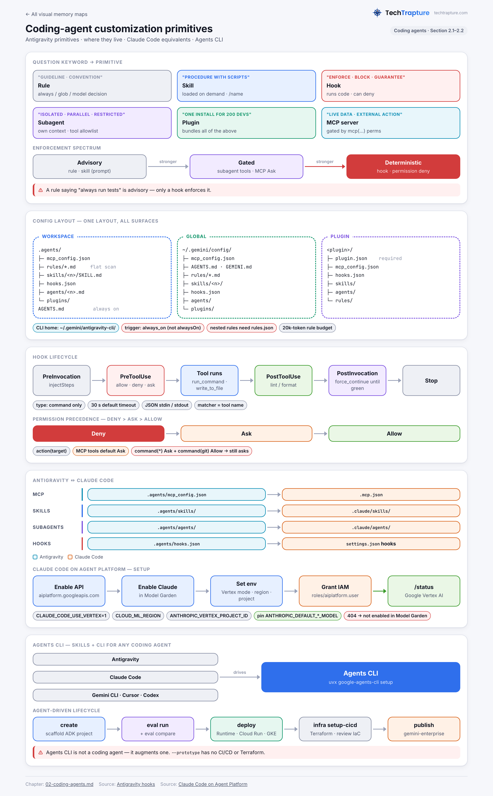</a> <b>03</b> · Customization primitives</td></tr>
<tr><td align="center" width="25%"><a href="visual-memory/04-sandbox-tiers.png">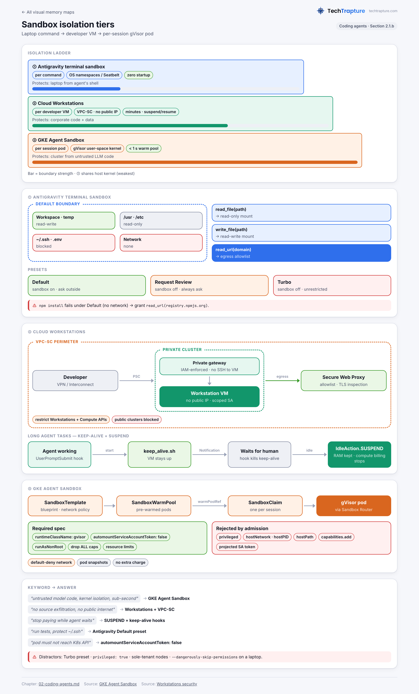</a> <b>04</b> · Sandbox tiers</td><td align="center" width="25%"><a href="visual-memory/16-antigravity-customization.png">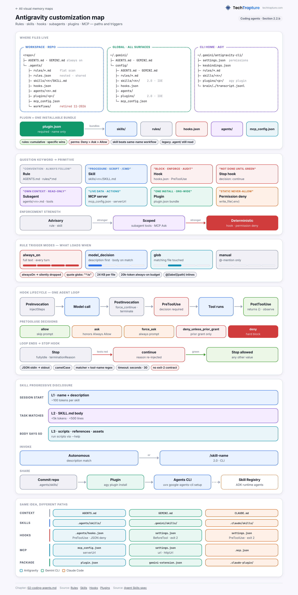</a> <b>16</b> · Antigravity customization</td><td align="center" width="25%"><a href="visual-memory/05-model-selection.png">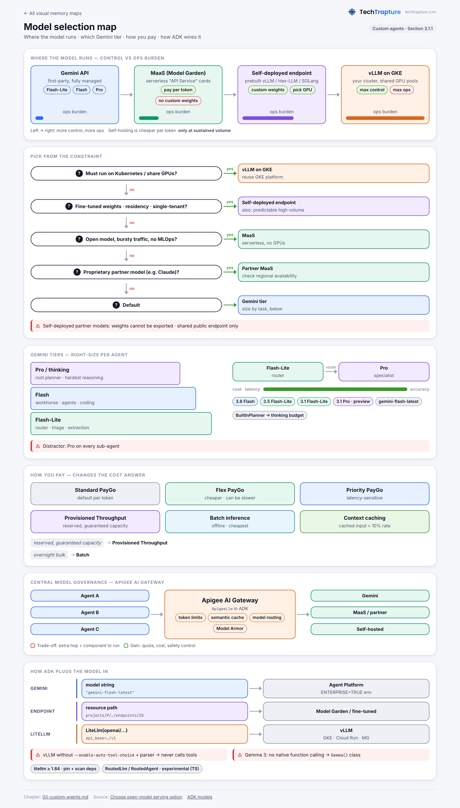</a> <b>05</b> · Model selection</td><td align="center" width="25%"><a href="visual-memory/06-adk-orchestration-patterns.png">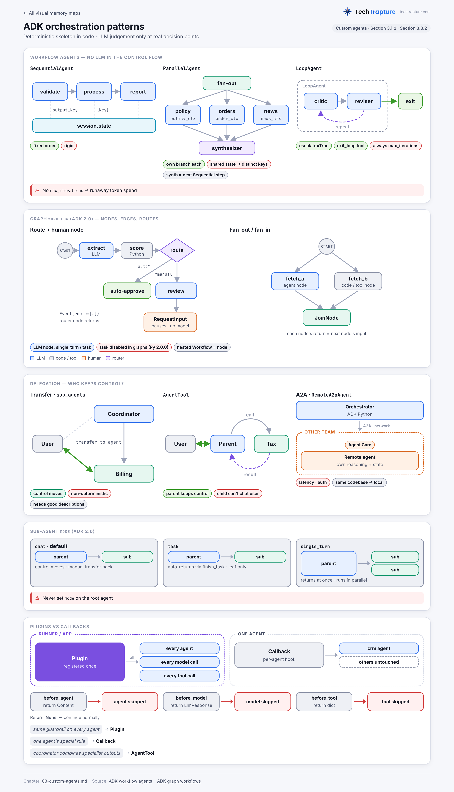</a> <b>06</b> · Orchestration patterns</td></tr>
<tr><td align="center" width="25%"><a href="visual-memory/07-state-memory.png">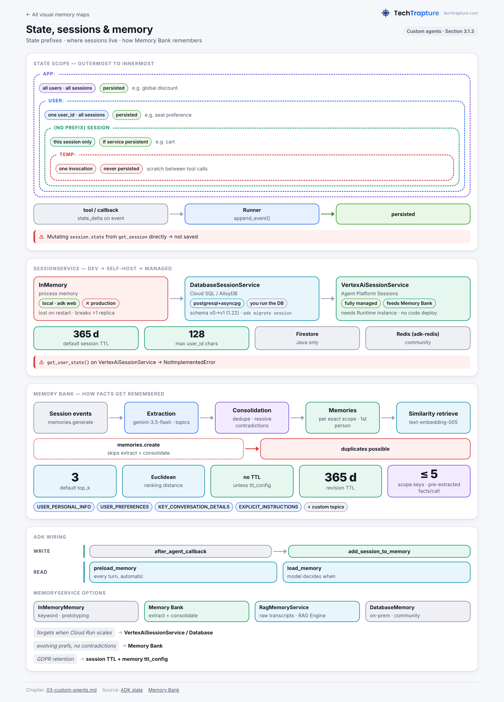</a> <b>07</b> · State & memory</td><td align="center" width="25%"> <b>08</b> · RAG pipeline</td><td align="center" width="25%"><a href="visual-memory/09-protocols-identity-registry.png">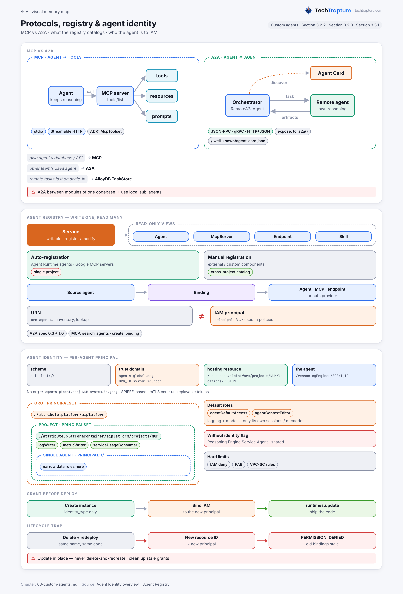</a> <b>09</b> · MCP · A2A · Registry</td><td align="center" width="25%"><a href="visual-memory/17-agent-registry-mcp.png">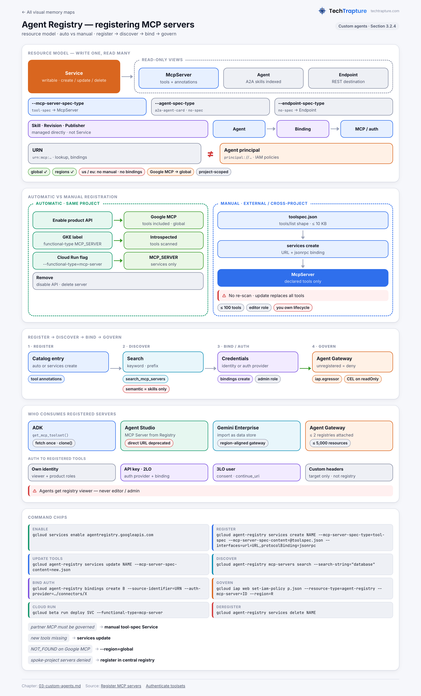</a> <b>17</b> · Agent Registry & MCP</td></tr>
<tr><td align="center" width="25%"> <b>10</b> · Eval lifecycle</td><td align="center" width="25%"> <b>11</b> · Runtime selection</td><td align="center" width="25%"><a href="visual-memory/12-troubleshooting.png">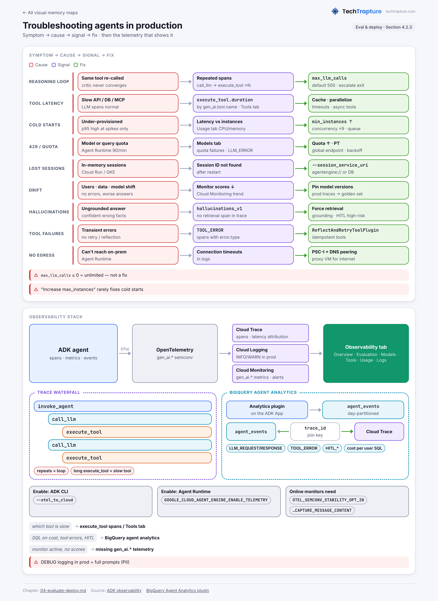</a> <b>12</b> · Troubleshooting</td><td align="center" width="25%"><a href="visual-memory/13-defense-in-depth.png">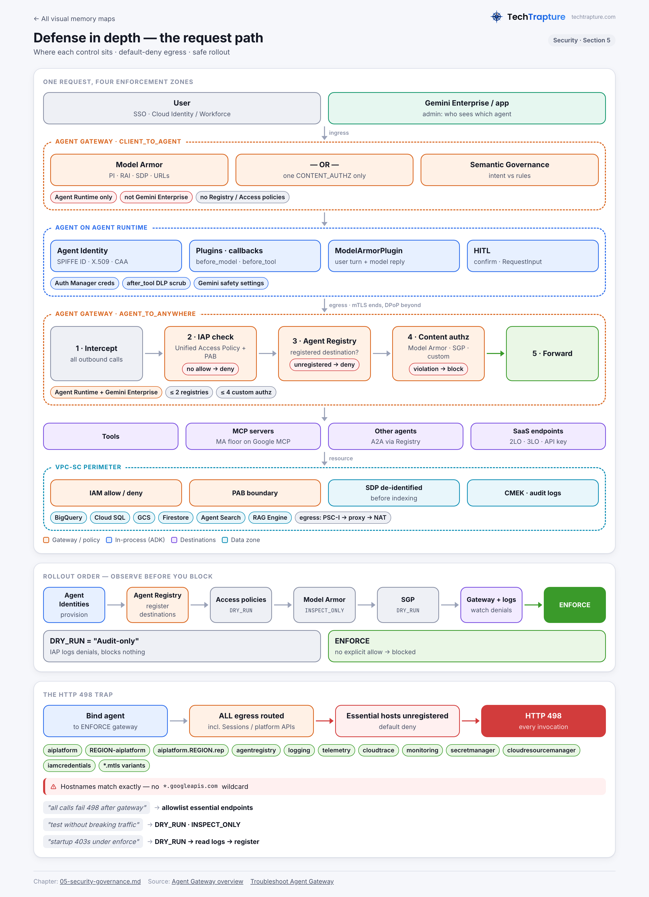</a> <b>13</b> · Defense in depth</td></tr>
<tr><td align="center" width="25%"><a href="visual-memory/14-identity-access-controls.png">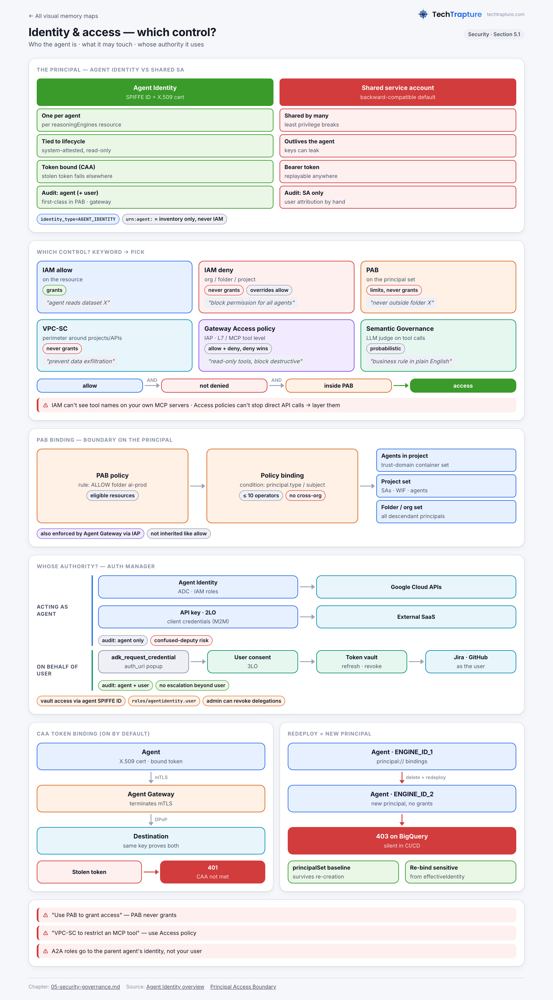</a> <b>14</b> · Identity & access</td><td align="center" width="25%"><a href="visual-memory/15-guardrail-layers.png">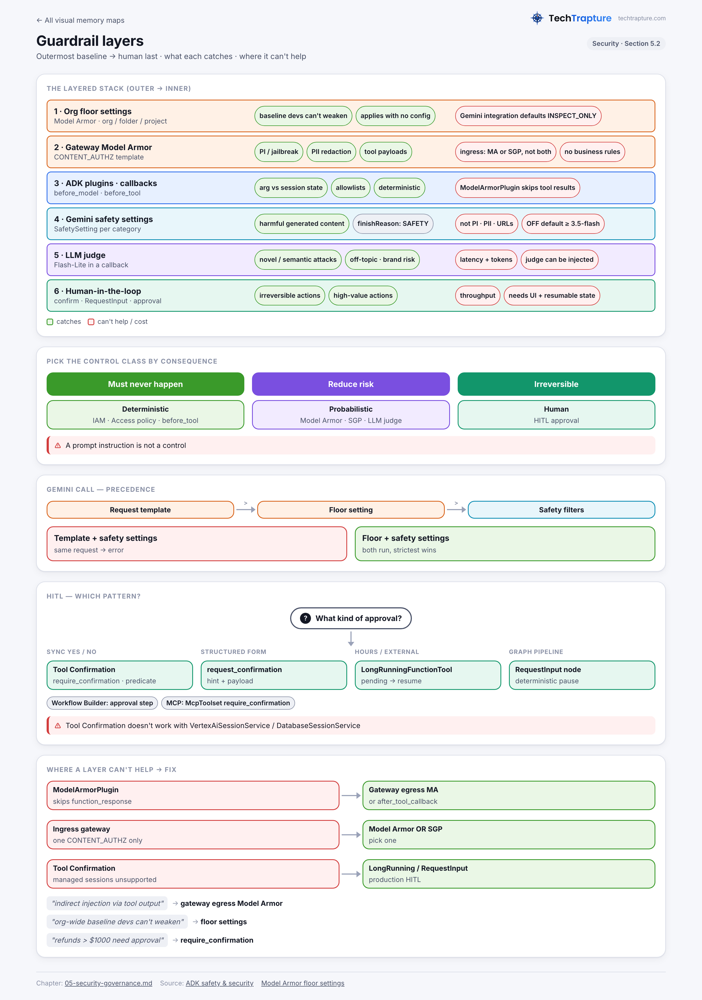</a> <b>15</b> · Guardrail layers</td><td align="center" width="25%"><a href="visual-memory/18-agent-to-tool-auth.png">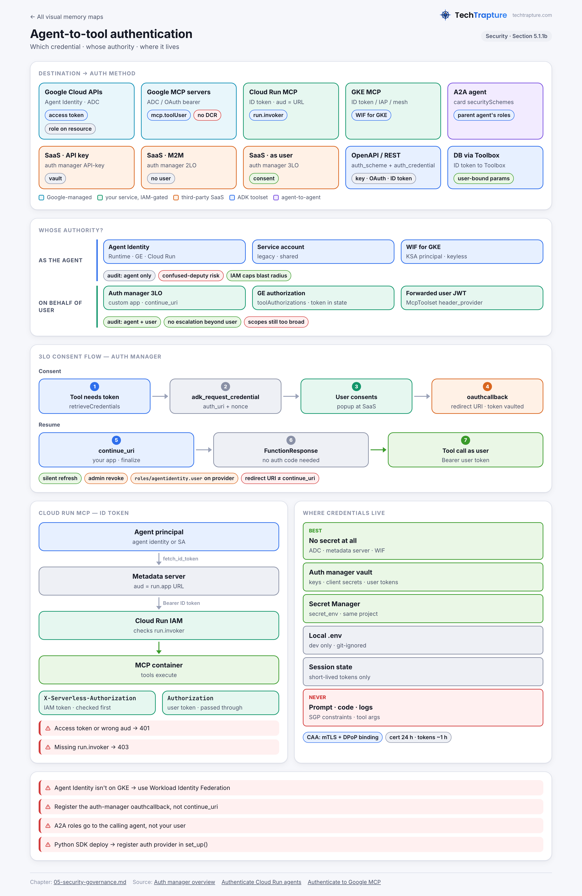</a> <b>18</b> · Agent-to-tool auth</td></tr>
</table>

## Watch — related videos

Hands-on walkthroughs from three [TechTrapture YouTube](https://youtube.com/@techtrapture) playlists: **Master Agentic AI with Google ADK**, **Google AI For Everyone** and **Agent Platform**. Each video is listed once, under the first playlist it appears in.

### Master Agentic AI with Google ADK · [open playlist](https://www.youtube.com/playlist?list=PLLrA_pU9-Gz2HwepRUVpq1TEPuYWo_fSi)

<table>
<tr><td align="center" width="33%"> Google Cloud Agent Development Kit Tutorial | Build Your First ADK Agent</td><td align="center" width="33%"> Google Cloud ADK Agent Tools Explained | In-Built Tools, Function Tools & Third-Party Tools</td><td align="center" width="33%"> Build a BigQuery Agent using Google Cloud ADK | Built-In Tool Demo</td></tr>
<tr><td align="center" width="33%"> Google Cloud ADK Third-Party Tools | Build AI Agents with LangChain & CrewAI</td><td align="center" width="33%"> Build GitHub Agent with Google Cloud ADK | Function Tools Demo</td><td align="center" width="33%"> Google Cloud ADK Agents Explained | LLM, Workflow & Custom Agents</td></tr>
<tr><td align="center" width="33%"> Build a Job Search AI Agent with Google Cloud ADK | Sequential Agent Demo</td><td align="center" width="33%"> Build a Content Creation AI Agent with Google Cloud ADK | Parallel Agent Demo</td><td align="center" width="33%"> Cloud Architect Agent with Google Cloud ADK | Loop Agent Tutorial</td></tr>
<tr><td align="center" width="33%"> Deploy ADK Agent to Vertex AI Agent Engine | Google Cloud ADK Tutorial</td><td align="center" width="33%"> Deploy ADK Agent to Cloud Run | Google Cloud ADK Tutorial</td><td align="center" width="33%"> Model Context Protocol (MCP) Explained with Real Examples</td></tr>
<tr><td align="center" width="33%"> Build Your First MCP Server with Google Maps & VS Code | MCP Beginner Tutorial</td><td align="center" width="33%"> Build Your First MCP Server with Google Maps & Claude Desktop</td><td align="center" width="33%"> I Built a Google Maps AI Agent in 10 Minutes with Google ADK</td></tr>
<tr><td align="center" width="33%"> Connect Your Database to Google ADK AI Agents Using MCP | BigQuery Tutorial</td><td align="center" width="33%"> BigQuery MCP Server Explained with HR Agents</td><td align="center" width="33%"> Google ADK Callbacks Explained | Build Production AI Agents</td></tr>
<tr><td align="center" width="33%"> Unlock Model Callbacks in ADK | Before & After LLM Hooks Explained</td><td align="center" width="33%"> Implementing Agent Callbacks with Google Cloud ADK | Step-by-Step Tutorial</td><td align="center" width="33%"> Master Tool Execution Callbacks in Google Cloud ADK | Before & After Tool Hooks</td></tr>
<tr><td align="center" width="33%"> Google ADK Session & State Management Explained | Session, State & Memory</td><td align="center" width="33%"> Google ADK Session Management Hands-On (InMemory, Cloud SQL, Vertex AI)</td><td align="center" width="33%"> ADK State Management Explained with Demo</td></tr>
<tr><td align="center" width="33%"> Build Agents with Long-Term Memory | InMemory vs Agent Platform Memory Bank</td><td align="center" width="33%"> Agent Platform Memory Bank Demo | Long-Term Memory for AI Agents</td><td align="center" width="33%"> Building an AI SRE Agent with ADK + MCP | Auto RCA, Log Analysis & Send Emails</td></tr>
<tr><td align="center" width="33%"> I Built a CloudOps Agent with Google ADK | Real-World Demo</td><td align="center" width="33%"> Deploy Google ADK Agent on Cloud Run | Live Demo</td><td align="center" width="33%"> Deploy ADK Agent on Agent Runtime (Agent Engine) | Live Demo</td></tr>
<tr><td align="center" width="33%"> Deploy AI Agents on GKE with Google ADK | Live Demo</td></tr>
</table>

### Google AI For Everyone · [open playlist](https://www.youtube.com/playlist?list=PLLrA_pU9-Gz0dqaviUOZmBTrliiVWaELC)

<table>
<tr><td align="center" width="33%"> LLMs Explained in 20 Minutes | The Transformer Behind ChatGPT, Gemini & Claude</td><td align="center" width="33%"> Make Your First Gemini API Call in 10 Minutes | Complete Beginner Guide</td><td align="center" width="33%"> Google AI Explained: From LLMs to Agentic AI</td></tr>
<tr><td align="center" width="33%"> RAG Explained ! Keyword vs Semantic vs Hybrid Search</td><td align="center" width="33%"> Embeddings Explained: I Built a Local RAG App Using Custom Embeddings</td><td align="center" width="33%"> Build Enterprise RAG Apps with Agent Search | Vertex AI Search Demo</td></tr>
<tr><td align="center" width="33%"> Google Gemini Enterprise Agent Platform Explained | The Evolution of Vertex AI</td><td align="center" width="33%"> Build Your First Google ADK Agent | Agent Platform Studio</td><td align="center" width="33%"> Build Enterprise AI Agents with Google's Official Remote MCP Servers</td></tr>
<tr><td align="center" width="33%"> Google Gemini Enterprise Explained | Connect & Deploy ADK Agents</td></tr>
</table>

### Agent Platform

<table>
<tr><td align="center" width="33%"> Build an AI-Powered Enterprise Search App with Elastic & Google Gemini</td><td align="center" width="33%"> Build Agentic FinOps in Google Cloud | Reduce Cloud Costs by 50%</td><td align="center" width="33%"> Data Agent Kit Explained with Live Demo | Build Dataflow Pipelines</td></tr>
</table>

## How this guide was built

- Scope comes straight from the official exam guide's sections and in-scope tool list, weighted by what stood out in the beta exam.
- Content is researched against official Google documentation (docs.cloud.google.com, adk.dev, antigravity.google) and the ADK docs.
- Anything that could not be confirmed in the docs is marked **(unverified)** in the chapters and collected in [Section 6.5](sections/06-cheat-sheet.md#65-items-flagged-unverified-by-research-dont-over-invest).

> **Not affiliated with Google.** This is an independent study resource. Google Cloud products change quickly — always confirm details against the current [official documentation](https://docs.cloud.google.com/gemini-enterprise-agent-platform/overview) and the exam guide on [Google Cloud certification](https://cloud.google.com/learn/certification).

## Connect

[YouTube](https://youtube.com/@techtrapture) · [LinkedIn](https://www.linkedin.com/in/vishal-bulbule/) · [Medium](https://vishalbulbule.medium.com/) · [X](https://x.com/vishal__bulbule)

