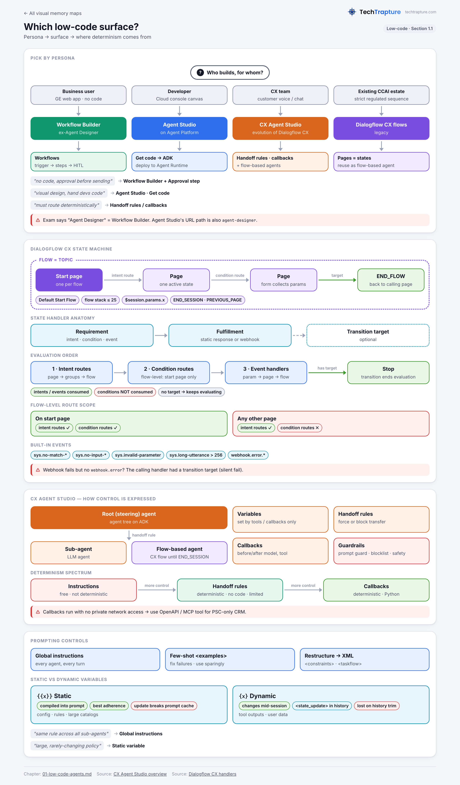
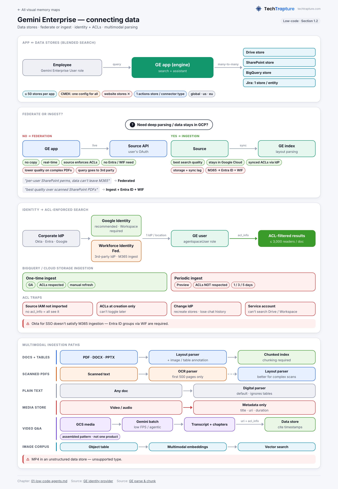

## Section 1 — Building agents using low-code tools (~13%)

**What the exam is really testing**
1. Can you pick the right low-code surface (Gemini Enterprise Workflow Builder / Agent Designer, Agent Studio on Agent Platform, CX Agent Studio, legacy Dialogflow CX flows) for a given persona and determinism requirement, and do you know where determinism actually comes from (flows, handoff rules, callbacks), as opposed to instructions?
2. Can you shape agent behavior with instructions, XML-structured prompts, few-shot examples, variables and global instructions, and do you know when each one helps or hurts (overfitting, prompt-cache invalidation, context loss)?
3. Can you connect enterprise data safely: federated vs ingested connectors, identity provider choice (Google Identity vs Workforce Identity Federation), ACL propagation, and parser choices for multimodal and unstructured content?

---

### Product name map (verified in docs as of Sep 2026)

| Old name | Current name | Evidence |
|---|---|---|
| Google Agentspace | **Gemini Enterprise** | GE release note, Oct 09 2025: "Google Agentspace is part of Gemini Enterprise". IAM role is still `roles/discoveryengine.agentspaceUser` (displayed as "Gemini Enterprise User"). |
| Agent Designer (Gemini Enterprise no-code agents) | **Workflow Builder** | GE release note, Sep 03 2026: "General availability of Workflow Builder (formerly Agent Designer)". The exam guide still says "Agent Designer". |
| Vertex AI Search | **Agent Search on Gemini Enterprise Agent Platform** | Vertex AI name-changes page |
| Vertex AI Studio | **Agent Studio on Gemini Enterprise Agent Platform** (its console canvas URL is still `/agent-platform/studio/agent-designer`) | name-changes page and Agent Studio docs |
| Vertex AI Platform | **Gemini Enterprise Agent Platform** | name-changes page |
| Vertex AI Agent Engine | **Agent Runtime** | name-changes page |
| Vertex AI Vector Search 2.0 | **Agent Retrieval** | name-changes page |
| Vertex AI Conversation | **Agent Conversation on Gemini Enterprise Agent Platform** | name-changes page |
| Dialogflow CX (generative / playbooks) | **Customer Experience Agent Studio (CX Agent Studio)**, described as "the evolution of Dialogflow CX". Dialogflow CX and ES docs are now listed as "Legacy conversational agents". | CX Agent Studio overview. GA on Feb 04 2026. |
| Contact Center AI / CCAI umbrella | **Gemini Enterprise for Customer Experience** (CX Agent Studio + Agent Assist + CX Insights + Commerce agents) | GE for CX overview |
| NotebookLM Enterprise | **Gemini Notebook Enterprise** | GE release note, Jul 16 2026 |
| Generic search apps | **Custom search** | GE release note, Jun 16 2025 |

**Exam trap:** The exam guide says "Gemini Enterprise Agent Designer". The same tool now appears as **Workflow Builder**, and Agent Platform has its own low-code canvas, **Agent Studio**, whose URL path is `agent-designer`. Map the words in a question to the persona: business users working in the Gemini Enterprise web app means Workflow Builder; developers in the Cloud console who deploy to Agent Runtime means Agent Studio.

---

## 1.1 Configuring agentic workflows and behavior using low-code tools

> 🧠 **Visual memory map:** Which low-code surface?
>
> [](../visual-memory/01-low-code-surfaces.png)

### 1.1.a State-based workflows (pages, transition routes, event handlers)

#### Core concepts: the four low-code surfaces

| Surface | Who uses it | Where it runs | Determinism mechanism | Output |
|---|---|---|---|---|
| **Workflow Builder** (formerly Agent Designer), Gemini Enterprise web app | Employees and business users (non-admin), within the connectors and tools the admin provisions | Gemini Enterprise app, invoked by `@mention`, on a schedule, or by an event | **Workflows**: triggers → steps → variables, with Condition branching, loops, filters and HITL steps. **Chat agents**: mostly non-deterministic. | Published or shared agent inside GE |
| **Agent Studio** (Agent Platform, Cloud console) | Developers and architects | Deploys to **Agent Runtime** (optionally "Deploy as A2A") | Main agent plus local or Agent Registry subagents. "Get code" exports ADK Python. | ADK app on Agent Runtime |
| **CX Agent Studio** (`ces.cloud.google.com`) | Customer-experience teams building chat and voice agents | Managed, with channels: web widget, telephony, WhatsApp/Instagram, CCaaS | Root/steering agent plus sub-agents. **Handoff rules**, **callbacks**, **flow-based agents** (imported Dialogflow CX flows). | Agent application ("app") |
| **Dialogflow CX flows** (legacy) | Existing CCAI estates | Dialogflow CX | **Pages = states**, routes, event handlers, forms. This is a full state machine. | Reused from CX Agent Studio via flow-based agents |

#### Dialogflow CX state machine (still tested via "pages, transition routes, event handlers")
- A **flow** is a conversation topic. Every agent has a **Default Start Flow**. A **page** is a state, exactly one page is active at a time, and each flow has a **start page**.
- **Page lifecycle:** entry fulfillment → form pre-fill (session params with the same name, then intent params) → state-handler evaluation → form-parameter prompt → send the response queue → wait for input.
- **State handlers** have three parts: *requirements* (intent and/or condition, or event), *fulfillment* (static responses or a webhook), and an optional *transition target*.
  - **Routes**: an intent route (intent requirement) or a condition route (condition only).
  - **Event handlers**: built-in events (`sys.no-match-default`, `sys.no-match-1..6`, `sys.no-input-default`, `sys.no-input-1..6`, `sys.invalid-parameter` at parameter level only, `sys.long-utterance` over 256 chars, `webhook.error`, `webhook.error.timeout`, `.bad-request`, `.rejected` for 401/403, `.unavailable` for 503) and custom events.
- **Scope rules (common in exam questions):**
  - Flow-level routes are always in scope on the flow **start page**. On any other page, flow-level routes are in scope **only if they have an intent requirement**. This is why a flow-level *condition* route "doesn't fire" on a mid-flow page.
  - Page routes, page and flow event handlers, and parameter-level (reprompt) handlers for the parameter currently being filled are all in scope.
- **Evaluation order:** intent routes (page → page route groups → flow → flow route groups), then condition routes (the same order, with flow-level only on the start page), then event handlers (parameter → page → flow). A handler *with* a transition target ends evaluation. A handler without one lets evaluation continue, which means multiple fulfillments can queue messages. Intents and events are *consumed* by the first match. Conditions are *not* consumed.
- **Webhook-error nuance:** if the handler that called the failing webhook has a transition target, the webhook **fails silently** and `webhook.error` is *not* raised.
- **Symbolic targets:** `START_PAGE`, `END_FLOW`, `END_FLOW_WITH_CANCELLATION`, `END_FLOW_WITH_FAILURE`, `END_FLOW_WITH_HUMAN_ESCALATION`, `END_SESSION`, `PREVIOUS_PAGE`, `CURRENT_PAGE`. The **flow stack limit is 25**. `END_FLOW` returns to the calling page and resumes that page's remaining handlers, because the handler call stack is preserved.
- Conditions: AND, OR, or a custom expression such as `$sys.func.rand() < 0.1`. Parameters are referenced as `$session.params.x` or `$intent.params.x`.
- **Generative options inside flows:** *Generators* (an LLM prompt called from fulfillment, with placeholders `$conversation` and `$last-user-utterance`, excluded from the Dialogflow CX SLA), *generative fallback* (runs on no-match; adds `$flow-description` and `$route-descriptions`), and *banned phrases* (which apply to both). **Playbooks** are the fully generative, instruction-plus-examples unit.

#### CX Agent Studio: how "state" is expressed now
- **Agent application**: a root (steering) agent plus sub-agents, with an agent tree structure built on ADK.
- **Variables** (Text, Number, Yes/No, Custom Object, List). The agent *cannot* set variables. Only tools and callbacks can, for example with `context.state["var"] = value`.
- **Handoff rules**: deterministic parent→child (forward) or child→parent (backward) transfers based on variable conditions or a Python `should_trigger_transfer_callback`. You can *force* a transfer or *block* it until a condition holds. Limits: a single AND/OR operator across conditions in the UI; only text, number and boolean variables; block rules accept variables only, not code; complex API-built rules become read-only in the UI.
- **Callbacks** (`before_agent`, `before_model`, `after_model`, `before_tool`, `after_tool`, and so on) use ADK semantics: returning a value overrides the step. They run in a sandbox with **no private network access**. Use OpenAPI or MCP tools when you need to reach private resources.
- **Flow-based agents**: import an existing Dialogflow CX flow as a sub-agent. Control passes to the flow until `END_SESSION`, then returns. You need to grant the **Customer Engagement Suite Service Agent** the **Dialogflow API Client** role. Map input variables to session parameters and output session parameters back to variables.
- **Guardrails**: prompt guard, blocklist (whole word, any mention, or regex), safety level (Relaxed, Balanced, Strict), and rules (natural language or `after_model_callback` code). Outcomes are *Say exactly*, *Handoff to an agent*, or *Generate a response*. **Supervisor agents** (Sep 2026) cover audio quality and missed tool calls, in blocking or non-blocking mode.
- **Tools**: Python, OpenAPI, MCP, data store, file search, Integration Connectors, Google Search and Maps, client function, system, widget, agent-as-tool, A2A remote agent, plus Jira, Confluence, SharePoint, Salesforce and ServiceNow. Tools run **sync or async** (default timeout 30s sync, 60s async).
- Models include `composite-v1` (voice: listener, thinking and speaker models), `gemini-3.1-flash-live`, and 3.x/2.5 Flash for text.

#### Workflow Builder: how "state" is expressed
- **Triggers**: Manual (`@workflow` with input fields), Schedule (interval or cron plus time zone), and Event (a data change in a connected app, with a filter).
- **Steps**: Gemini Agent (instructions, knowledge, connected apps and actions, model **Gemini 3.0+ only**, plain text or JSON-schema output), Flow control (Condition with a variable, operator and value, AND/OR, plus loops and filtering), Human-in-the-loop (**Request info** or **Approval**; the run pauses with status "Needs Review"), MCP servers as steps or tools, and existing agents as steps.
- Includes versioning (save, compare, restore), execution logs with step traces, and sharing with users or groups.
- **Admin gating**: the admin must enable the Workflow Builder toggle in *Manage web app features*. Agents can only use the connectors, tools and permissions the GE admin provisioned.

#### Decision table

| Requirement | Use |
|---|---|
| Business users automating a cross-app process (Gmail → Jira → approval) inside Gemini Enterprise | **Workflow Builder workflow** with an Approval HITL step |
| Open-ended employee Q&A agent over Drive or Jira | **Workflow Builder chat agent** |
| Developer prototypes a multi-agent app visually, then needs code, Agent Runtime deploy, A2A or Agent Registry subagents | **Agent Studio** (Get code → ADK) |
| Customer-facing voice or chat agent with telephony, web widget, barge-in, low latency | **CX Agent Studio** |
| Strict regulated sequence (authenticate → collect 5 fields → validate) that must never be skipped | Dialogflow CX **flow** (forms plus condition routes) wrapped as a **flow-based agent**, or CX Agent Studio **handoff rules / callbacks** |
| "Route authenticated users to Agent B deterministically" in CX Agent Studio | **Handoff rules** (not instructions) |
| Canned response or fixed business rule | **Callback** (CX Agent Studio best practice: not a flow) |
| Intent classification | **LLM** (the docs flag flows for intent detection as a *bad* use) |

#### Trade-offs
- **Flows vs LLM agents**: flows buy determinism and auditability at the cost of design time and brittleness, because session parameters are implicit globals and upstream changes break downstream flows. Treat flows as **black boxes with explicit input and output parameters**.
- **Instructions vs handoff rules vs callbacks**: instructions cost nothing to write but are not deterministic. Handoff rules are deterministic and need no code, but are limited in expressiveness. Callbacks are fully deterministic and flexible but require Python and run in a sandbox without PNA.
- **Tools vs callbacks**: a tool's internals are deterministic, but the *orchestration* (deciding to call it, choosing arguments, interpreting the result) is LLM-driven and can hallucinate. Callbacks run outside the model's control.
- **Async tools** avoid "dead air" in voice, but the agent keeps talking before results arrive. Design responses so they don't depend on results that haven't arrived yet.

#### Limits and gotchas
- Flow stack limit is 25. `sys.long-utterance` fires above 256 characters for non-generative intents.
- CX Agent Studio steering agents cannot transfer between Dialogflow CX agents until `END_SESSION` hands control back.
- Workflow Builder: event triggers are *not* canvas step nodes. If the full Drive tool is enabled on the same Gemini Agent node, it **overrides** restricted "Add from Drive" knowledge. The workaround is two separate agent nodes.
- Workflow Builder chat agents built from a conversational prompt **cannot connect Cloud-source data stores** (BigQuery, Cloud Storage, Cloud SQL). Use designer (flow builder) mode for those.
- Agent Studio stores all agent config in **`us-west1`**, so an org policy that restricts resource locations can block agent creation. You must **Save** before Preview, Deploy or knowledge upload, because an unsaved agent has no identity.
- Agent Studio **deprecated** direct Vertex AI Search data-store tools and direct MCP URLs in favor of **MCP servers from Agent Registry**. Agent Search appears there as `discoveryengine.googleapis.com`. Legacy tools are read-only.

**Exam signals**
- "Business analyst, no code, Gemini Enterprise, approval before sending" → Workflow Builder + Approval step.
- "Must deterministically route / cannot rely on the model" → handoff rules or callbacks (CX Agent Studio), or a condition route (Dialogflow CX).
- "Reuse existing Dialogflow CX flows while migrating" → flow-based agent, with CX Agent Studio as the steering agent.
- "Flow-level condition route not triggering on page X" → scope rule (only intent routes are in scope off the start page).
- "Webhook fails but no error event fires" → the calling route had a transition target.
- "Visual design, then hand to developers as code" → Agent Studio "Get code".

**Common distractors:** "Add more few-shot examples to force routing" (not deterministic). "Use Dialogflow ES contexts" (legacy). "Build a custom ADK app on GKE" when the scenario says low-code. "Use a flow for intent classification".

---

### 1.1.b System instructions and in-console prompt templates (few-shot, chain-of-thought)

#### CX Agent Studio instructions
- **Reference syntax**: `{var}` for a **dynamic variable**, `{{var}}` for a **static variable**, `{@AGENT: Name}`, and `{@TOOL: tool_name}`. In the editor, typing `@` or `{` opens chip pickers.
- **Static vs dynamic variables**:

| | Static `{{x}}` | Dynamic `{x}` |
|---|---|---|
| How it's injected | Compiled into the prompt text before the model call | Appended to history as `<state_update>` events |
| Instruction adherence | Highest | Slightly lower, and adds latency |
| Changes mid-session? | No (config, business rules, large catalogs) | Yes (tool outputs, user-extracted data) |
| Gotcha | **Updating it invalidates prompt caching**, which raises latency | Can be **lost when history is trimmed** past the context window |

- **Restructure instructions** button: converts prose to the recommended XML with `<role>`, `<persona>`/`<primary_goal>`, `<constraints>`, `<taskflow>`/`<subtask>`/`<step>`/`<trigger>`/`<action>`, and `<examples>`. **Refine** rewrites a selected span using AI, guided by a Requirements field.
- **Inline few-shot format**: `<examples> ... [user] ... [model] ```tool_code ...``` ```tool_outputs ...``` [model] ... </examples>`. Guidance: use few-shot to fix specific failures, complex formats or nuanced logic. **Use sparingly** (to avoid overfitting), be descriptive rather than exhaustive, and **start with instructions first**.
- **Global instructions** (advanced app settings) are inherited by every agent on every turn. Good uses: brand tone, DOs and DON'Ts, shared variables, customer profile.
- **Modular components** (restricted access): channel blocks such as `{@startChannelTELEPHONY}…{@endChannelTELEPHONY}`, modality blocks such as `{@startModalityVOICE}`, and Jinja-style ``. For evals, set the `_session` scenario variable.
- **Language**: write instructions in English. The agent auto-detects the user's language and responds in it unless instructed otherwise.

#### Dialogflow CX playbooks (legacy, still documented)
- A playbook has a Goal, Instructions, **Examples** (the few-shot examples) and Parameters. The docs recommend **at least 1 example, ideally 4 or more**, and say that *example quality and quantity matter more than instruction precision*.
- Example end states: `OK`, `CANCELLED`, `FAILED`, `ESCALATED`, `PENDING`. Input and output *summaries* pass context between playbooks. Parameters are the **only** way to exchange data between flows and playbooks.

#### Agent Studio (Agent Platform) prompts
- **System instructions** field plus prompt. **Prompt templates** use `{variable}` placeholders (curly braces, no spaces). Limits: **system instructions cannot be a template variable**, and **templates don't support multimodal prompts**.
- **Prompt management**: saved prompts are versioned, available in the SDK (`types.Prompt`, `PromptData` with `system_instruction` and `variables`), support CMEK and VPC-SC, and are shareable. Anyone with `roles/aiplatform.user` sees all saved prompts in the project.
- The **prompt optimizer** (Preview) and "Build with code > Get code" are also available.

#### Workflow Builder prompting
- Build by natural-language prompt (the best-practice advice is to give context, set boundaries, and tell Gemini to *ask you questions*) or in the flow builder. Starter prompts appear as a random 3 at a time. GE admins **cannot override the core assistant's LLM system instructions** (removed Jul 2025). Customize through agents or skills instead.

#### Chain-of-thought (verified guidance)
- CoT example ordering: never show the final structured answer **before** the reasoning steps in examples.
- For **Thinking** models, first try *without* explicit step-by-step reasoning instructions and rely on Thinking (adjustable thinking levels). Keep explicit CoT only if it measurably helps.
- For multi-step tasks, **chain prompts** (sequential) or **aggregate** them (parallel). In low-code terms, that means splitting into sub-agents or workflow steps instead of writing one mega-prompt.

#### Trade-offs
- More few-shot examples improve format fidelity but cost tokens and risk overfitting and poor generalization.
- XML structure improves adherence but makes prompts longer and less editable by non-technical owners.
- Explicit CoT improves transparency on non-thinking models, but adds latency and output tokens, and is often redundant with Thinking.
- Static variables give the best adherence but break the prompt cache when changed.

**Exam signals:** "agent ignores rule buried in long prose" → Restructure instructions (XML `<constraints>`). "Output must follow exact JSON/format" → few-shot (or structured output / JSON schema in Workflow Builder). "Same rule across all sub-agents" → global instructions. "Value changes each turn from a tool" → dynamic variable. "Large rarely-changing catalog, maximize adherence" → static variable. "Different greeting for voice vs chat" → modality conditions.

**Distractors:** "Fine-tune the model" to fix formatting (overkill). "Put the system instruction in a prompt-template variable" (not supported). "Let the agent set variables from instructions" (only tools and callbacks can).

---

## 1.2 Connecting enterprise data to Gemini Enterprise

> 🧠 **Visual memory map:** Gemini Enterprise — connecting data
>
> [](../visual-memory/02-ge-enterprise-data.png)

### 1.2.a Securely connecting and querying proprietary data (Gemini Enterprise, Agent Search)

#### Core model
- **App (engine)** ↔ **data stores** is many-to-many. Multiple stores on one app is **blended search**, with a **50 data stores per search app** limit. If one store uses CMEK, **all** must use the same CMEK config. Unstructured data imported from BigQuery isn't supported in blended search. **Website data stores cannot be connected** to GE search/assistant apps.
- Each third-party source creates **one data store per entity** (for example Jira issues, attachments, comments, worklogs).
- **Actions** (write-back: create a Jira issue, send Gmail, upload to SharePoint) are enabled per data store. Users must authorize them in chat ("Enable Actions"). Best practice: associate only **one actions-enabled data store per connector type** per app.
- Regions: `global`, `us`, `eu`. US and EU stores are encrypted, with Google-managed keys by default or CMEK.

#### Federated vs ingested

| | **Federation** | **Ingestion (indexing)** |
|---|---|---|
| Data copy | None. Queries go live to the source API. | Copied into the GE index |
| Freshness | Real time | Depends on sync (full and incremental schedules, or **real-time sync** via webhooks, Preview) |
| Search quality | Can be lower (no index; complex PDFs are under-parsed) | Higher (full layout parsing, knowledge graph) |
| Cost / time | No storage | Storage plus ingestion time |
| Privacy | **Query string (and possibly LLM-rewritten session history) goes to the third party**, under *their* ToS | Stays in Google Cloud |
| ACLs | The source enforces them through the user's OAuth | Synced ACLs, enforced by GE through your IdP |
| M365 identity | No Entra/WIF requirement | **Requires Microsoft Entra ID + Workforce Identity Federation** |

Choose federation for rapidly changing data, data you don't want copied, or quick setup. Choose ingestion for search quality, complex documents, cross-source relevance, or when data must stay inside the Google Cloud boundary.

#### First-party Google Cloud sources
- **BigQuery / Cloud Storage**: *one-time* ingestion (GA, manual refresh, **supports ACLs**, console or API) vs *periodic* ingestion (Preview, every 1, 3 or 5 days, console only, **ACLs NOT respected**). Tables can't be changed after creation.
- **Cloud SQL**: exports through an intermediate Cloud Storage location (optional serverless export at extra cost). Spanner and others are also listed.
- **Cross-project import**: grant the `service-PROJECT_NUMBER@gcp-sa-discoveryengine.iam.gserviceaccount.com` agent the roles `bigquery.jobUser` + `bigquery.dataEditor`, or `storage.objectViewer`/`objectAdmin`.
- **Critical gotcha**: *source IAM permissions are not imported*. Without ACL metadata, anyone with GE access can see ingested BigQuery or Cloud Storage data. Fix it with `acl_info.readers.principals` (`user_id`/`group_id`, or `idp_wide: true` for public) in the metadata, plus **"This data store contains access control information"** (`"aclEnabled": true`) **at creation time**. You **can't toggle ACLs later**.
- **Google Drive**: federated through the Drive API. Needs a Workspace customer ID (no @gmail.com), smart features ON, and the Google-managed OAuth app allowlisted. Searches only domain-owned docs. **Service-account credentials can't search Workspace stores**; they need user credentials. Drive index limits: 1 MB of extracted text, 10 MB files for most types, PDF OCR up to 80 pages. CMEK and data residency don't extend to Drive data itself. Admin folder filters are no longer supported for new Drive stores.

#### Third-party sources
- The docs list Jira Cloud/DC, Confluence Cloud/DC, SharePoint, OneDrive, Outlook, Entra ID, ServiceNow, Box, Dropbox, Zendesk, Linear, Slack (in workflows) and more. Many new ones are Preview.
- **SharePoint federated**: Graph delegated `Sites.Search.All` + `AllSites.Read`, results filtered by the user's own permissions. **Ingested**: application `Sites.FullControl.All` or `Sites.Selected` (plus `GroupMember.Read.All` and so on) with federated credentials or an OAuth refresh token. Supports GCC, GCC High and DoD.
- **VPC-SC**: you **can't enforce a perimeter on existing** third-party stores (Box, Linear, Confluence DC and others). You must delete and recreate them.
- **Static IP egress** is available on supported connectors, for allowlisting on the source system.
- A **Sensitive Data Protection policy** can be attached to a data store (for example Drive) to inspect and de-identify retrieved data.
- **Custom connector**: Fetch → Transform (to Discovery Engine `Document` with `aclInfo`) → Sync (incremental or full). Use **identity mapping** (an Identity Mapping Store bound to the data store; nested groups must be flattened; use `external_group:` prefixes in document ACLs) when the source uses non-IdP identities.

#### Identity and access
- **Identity provider (one per location)**: **Google Identity** is recommended. It's *required* for Workspace sources, and third-party IdPs federate into it via OIDC/SAML. **Workforce Identity Federation** is for third-party IdP setups, and is *mandatory* for **M365 sources via ingestion** (Entra ID groups). Configure it in Console → Gemini Enterprise → Settings → Authentication.
- **WIF attribute mapping**: `google.subject=assertion.email.lowerAscii()` (lowercase, because license assignment is case-sensitive), `google.groups`, and `attribute.as_user_identifier_1..50` for alternate IDs. Configure SCIM for Entra with large group counts and for sharing autocomplete.
- **Changing the IdP** (Google ↔ third-party, or a new WIF pool) means you must **delete and recreate ingestion data stores**, and users **lose chat history**. Editing attribute mapping or switching providers within the same pool does not require recreation.
- ACL limit: **3,000 readers per document**, where each group or user counts as one.
- **Users need `roles/discoveryengine.agentspaceUser`** (Gemini Enterprise User). App-level IAM (GA Feb 2026) scopes access to individual apps. Creating data stores needs `roles/discoveryengine.editor`.
- **Model Armor** can screen prompts and responses in GE apps.

#### Agents querying the data
- Workflow Builder / GE agents: admin-provisioned data stores and actions only.
- **CX Agent Studio data store tool**: Website and Cloud Storage stores can be created inline. A tool can hold multiple stores **from one region only**. Settings include a filter (Never/Always/Auto), per-modality rewriter and summarization models and prompts, and a grounding score.
- **Agent Studio**: the Agent Search **MCP server via Agent Registry** (`discoveryengine.googleapis.com`), with auth resolved via IAM on the **agent identity** principal (`principal://agents.global.org-…/reasoningEngines/ID`). Knowledge-file uploads get `roles/storage.objectViewer` on the `{projectNumber}_{location}_agent_studio_files` bucket, and anyone with project or bucket access can read those files.
- **Grounding in Agent Studio prompts**: "Your data" → RAG Engine, Agent Search (data store path, **max 10 data stores**) or Elasticsearch. Requires `discoveryengine.servingConfigs.search`.
- ADK equivalent: `VertexAiSearchTool(data_store_id=...)`. This requires Google Cloud auth, not an AI Studio key. Subclass it and override `_build_vertex_ai_search_config` for per-user filters.

**Exam signals**
- "Results must respect per-user SharePoint permissions, data can't leave M365" → **federated** SharePoint.
- "Best search quality over complex scanned PDFs in SharePoint" → **ingestion** + layout parser, which requires Entra ID + WIF.
- "Okta shop, only third-party sources" → Google Identity (recommended) or WIF.
- "Users see BigQuery rows they can't access in BigQuery" → ACLs weren't enabled at creation, or periodic ingestion was used (which ignores ACLs).
- "Legacy app with its own group names" → custom connector + identity mapping.
- "Enforce VPC-SC on existing Confluence DC store" → recreate the store.

**Distractors:** "Grant BigQuery IAM and GE will inherit it" (it won't). "Enable ACLs on the existing data store" (creation-time only). "Use a service account to search Drive" (not supported). "Periodic BigQuery sync with ACLs" (not respected).

---

### 1.2.b Ingesting and processing unstructured multimodal data (video, audio, images)

#### Options by layer

| Need | Mechanism | Key facts |
|---|---|---|
| Images, tables and charts *inside documents* for search/RAG | **Agent Search / GE layout parser** (default in GE) with **image annotation** and **table annotation**, plus **Gemini layout parsing** (Preview, PDFs) | Supported file types: PDF, HTML, DOCX, PPTX, XLSX, XLSM. Detected image types: BMP, GIF, JPEG, PNG, TIFF. Available only with **document chunking** turned on. Configured via `documentProcessingConfig.defaultParsingConfig.layoutParsingConfig`. HTML exclusion uses `excludeHtmlElements`, `excludeHtmlClasses`, `excludeHtmlIds`. |
| Scanned PDFs / text in images | **OCR parser** (`ocrParsingConfig.useNativeText=true` for mixed PDFs) | **First 500 pages only.** For complex scanned layouts, Google recommends the layout parser over OCR. |
| Default when nothing is specified | **Digital parser** | Also the fallback for unsupported types (for example TXT under the layout parser) |
| Already-parsed content | Bring your own parsed document (Preview) | |
| Unstructured data store document types | TXT, PDF, HTML, DOCX, PPTX, XLSX, XLSM | **No native audio or video documents** in unstructured stores. **Media data stores** index *metadata* (title, uri, categories, duration, available time), not the media content. |
| RAG over images and diagrams (DIY) | **RAG Engine LLM parser** | Accepts PDF, PNG, JPEG, WEBP, HEIC, HEIF. **Gemini 2.x only (3.x not supported)**. Custom parsing prompt and `max_parsing_requests_per_min`. Cost is roughly files × pages × tokens. Alternatively the **Document AI layout parser** (`LAYOUT_PARSER_PROCESSOR`; 20 MB and 500 pages max per file; recommended chunk size 1024 with overlap 256). |
| Video and audio *understanding* in the workflow | **Gemini multimodal** (`fileData.fileUri` from Cloud Storage, YouTube or inline) | Video: default **1 FPS** sampling (lower for lectures, higher for fast motion) and `videoMetadata` clipping offsets. **Agentic video understanding** (`media_processing="agentic"`, Preview) navigates long videos with fewer tokens, but you must pass `step_list` back each turn. With VPC-SC on, HTTP media URLs aren't supported, so use Cloud Storage. |
| Semantic search over image corpora | BigQuery object table + `AI.GENERATE_EMBEDDING` (multimodal embedding / `gemini-embedding-2`) + `VECTOR_SEARCH`, or **Agent Retrieval** multimodal embeddings | Batch limit of 25,000 rows per `AI.GENERATE_EMBEDDING` call (per the tutorial). Retry `RESOURCE_EXHAUSTED` rows. |
| Ad-hoc user uploads in GE chat | Assistant upload | Images (.png/.jpeg) up to 30 MB, **.mp4 video up to 200 MB, .mp3 audio up to 200 MB**, PDF up to 100 MB, DOCX up to 3 MB. The **max upload/download file size for connector actions is 200 MB**. |
| Voice agents | CX Agent Studio native audio (`gemini-3.1-flash-live`, `composite-v1`, Chirp 3 voices) | Real-time audio, not ingestion |

#### Recommended pattern for "index our training videos / call recordings for agent Q&A" (a design pattern I've assembled from the pieces above; there's no single documented product)
1. Land the media in Cloud Storage. 2. Run Gemini (batch) to produce transcripts, timestamped chapters and scene descriptions as text or JSON. 3. Ingest those derived documents, with a `uri` back to the media and `acl_info`, into an Agent Search or GE data store (or a RAG Engine corpus). 4. Agents cite the chapter and timestamp. The trade-off is added cost and latency at ingest in exchange for cheap, fast, ACL-aware retrieval. Sending raw video to Gemini on every query is simple but expensive per query and can't be ACL-filtered across a corpus.

#### Trade-offs
- The **layout parser** gives better chunking and answers but is billed as a Document AI feature. The **digital parser** is cheaper but ignores tables and headings.
- The **Gemini layout / LLM parser** gives the best quality on charts and flowcharts, at a per-page token cost plus quota and rate tuning.
- **Higher video FPS** captures more detail but costs more tokens. Agentic video processing uses fewer tokens but is Preview and requires carrying `step_list` state.
- Federated connectors use the layout parser too, but real-time querying can prevent full analysis of complex PDFs. **Choose ingestion for deep parsing**.

#### Limits and gotchas
- OCR: 500 pages. Drive OCR: 80 pages. RAG Engine layout parser: 20 MB and 500 pages. Gemini API `fileUri`: one video, one audio file and up to 10 images per request in the REST sample, with a 15 MB cap for HTTP-URL media.
- Parsing and chunking settings are chosen **at data store creation**. Re-importing into an existing RAG corpus doesn't re-parse files imported without a parser, so delete and re-import them.
- Agent Studio knowledge files: **PDF or plain text only, up to 10 files, 2 MB each, parent node only**.

**Exam signals:** "scanned PDFs with infographics and tables" → layout parser (+ image/table annotation, Gemini enhancement). "long lecture videos, reduce token cost" → lower FPS or agentic video understanding. "search images by text description" → multimodal embeddings + vector search. "diagrams in slide decks for RAG Engine" → LLM parser or Document AI layout parser.

**Distractors:** "Upload MP4s to an unstructured Agent Search data store" (unsupported type). "Use a media data store to answer questions about what is said in videos" (metadata only). "OCR parser for a 900-page scanned manual" (processes only 500 pages).

---

### Practice questions

**Q1.** A retail bank's HR team (no developers) wants an automation in Gemini Enterprise. When a new-hire email arrives, it should draft onboarding tasks in Jira and schedule calendar invites. A manager must sign off before anything is created. What should you recommend?

- **A.** A Workflow Builder workflow with an event trigger, a Gemini Agent step, and an Approval human-in-the-loop step
- **B.** A Workflow Builder chat agent with instructions to "always ask the manager first"
- **C.** An ADK agent deployed to Agent Runtime and registered in Gemini Enterprise
- **D.** A CX Agent Studio app with a handoff rule to a "manager" sub-agent

**Answer: A.** Workflows support event triggers and native Approval HITL steps that pause the run ("Needs Review"). B relies on non-deterministic instructions. C needs developers. D is a customer-experience conversational tool, not internal cross-app automation.

**Q2.** A Dialogflow CX agent has a flow-level condition route `$session.params.vip = true → VIP page`. It works on the start page but never fires once the user is on the "Collect address" page. Why?

- **A.** Conditions are consumed after the first evaluation
- **B.** Flow-level routes with only a condition requirement are in scope only on the flow start page
- **C.** Event handlers are evaluated before routes
- **D.** The flow stack limit of 25 was exceeded

**Answer: B.** Off the start page, only flow-level *intent* routes are in scope. A is wrong because conditions are not consumed. C is wrong because routes are evaluated before event handlers. D doesn't match the symptom.

**Q3.** In CX Agent Studio, unauthenticated callers must never reach the "Payments" sub-agent, even if they ask convincingly. What is the lowest-effort way to guarantee this?

- **A.** Add a `<constraints>` rule in the root agent's XML instructions
- **B.** Add four few-shot examples showing refusals
- **C.** Configure a handoff rule that blocks transfer to Payments until `is_authenticated == true`
- **D.** Set the safety guardrail to Strict

**Answer: C.** Handoff rules are the deterministic, no-code control. A and B are non-deterministic. D targets harmful content, not authorization.

**Q4.** A CX agent references a 40 KB product policy on every turn. It rarely changes, and adherence is poor when it's supplied through a tool-updated variable. What should you do?

- **A.** Make it a static variable `{{policy}}`
- **B.** Keep it a dynamic variable `{policy}` and add few-shot examples
- **C.** Move it into a callback that rewrites the user message
- **D.** Put it in a data store tool

**Answer: A.** Static variables compile into the prompt and give the best adherence (at the cost of prompt-cache invalidation when updated). B: dynamic variables sit in history, can be trimmed, and have lower adherence. C is hacky. D adds retrieval non-determinism for content that should always be present.

**Q5.** An enterprise uses Okta for SSO and Microsoft 365. It wants the highest-quality Gemini Enterprise answers over complex SharePoint PDFs, with document-level permissions enforced. What is required?

- **A.** Federated SharePoint connector with Google Identity
- **B.** Ingestion-mode SharePoint connector, with Workforce Identity Federation configured against Microsoft Entra ID
- **C.** Ingestion-mode connector with Okta WIF only
- **D.** Export SharePoint to Cloud Storage and use periodic ingestion

**Answer: B.** M365 ingestion requires Entra ID groups via WIF, even if another IdP handles SSO. Ingestion gives full layout parsing. A: federation gives lower quality on complex PDFs. C: Okta alone doesn't satisfy the Entra requirement. D: periodic Cloud Storage ingestion doesn't respect ACLs.

**Q6.** After ingesting a BigQuery table into a Gemini Enterprise data store, analysts see rows they can't query in BigQuery. What is the fix?

- **A.** Grant `roles/bigquery.dataViewer` more narrowly
- **B.** Recreate the data store with ACLs enabled and `acl_info` in the data, using one-time ingestion
- **C.** Toggle "access control" on the existing data store
- **D.** Switch to periodic ingestion so permissions stay in sync

**Answer: B.** Source IAM isn't imported, ACLs are set only at creation time, and only one-time ingestion honors ACLs. A has no effect on GE. C can't be done after creation. D ignores ACLs.

**Q7.** A legal team needs to query 3,000 scanned contracts, each 50–900 pages long, with tables and stamps, through Agent Search. Which configuration is best?

- **A.** Digital parser (the default)
- **B.** OCR parser with `useNativeText=false`
- **C.** Layout parser with chunking, table annotation and Gemini layout parsing enabled at data store creation
- **D.** Upload the files to the Gemini Enterprise chat

**Answer: C.** The layout parser is recommended for complex scanned PDFs with tables, and chunking is required. A misses scanned text. B processes only the first 500 pages and ignores structure. D is ad hoc with no index or ACLs.

**Q8.** A company wants its agent to answer questions about hour-long recorded town halls stored in Cloud Storage, while minimizing per-query token cost. What should it do?

- **A.** Put the MP4 files in an unstructured Agent Search data store
- **B.** Create a media data store
- **C.** Pre-process with Gemini (a low-FPS or agentic video pass) into timestamped transcripts and chapters, then ingest those text documents with ACLs into a data store
- **D.** Send the full video at 5 FPS with every question

**Answer: C.** Derived text is cheap to retrieve and ACL-aware. A: MP4 isn't a supported unstructured type. B indexes metadata only. D maximizes token cost.

**Q9.** A developer builds an agent in Agent Studio on Agent Platform that must search an existing Agent Search data store. The legacy "Vertex AI Search Data Store" tool is read-only. What should they do?

- **A.** Recreate the agent in Workflow Builder
- **B.** Add the Agent Search MCP server (`discoveryengine.googleapis.com`) from Agent Registry, and make sure the agent identity has the required roles
- **C.** Upload the documents as knowledge files
- **D.** Add the data store's URL as a direct MCP endpoint

**Answer: B.** Agent Studio deprecated direct data store and direct MCP tools in favor of Agent Registry MCP servers, with auth through the agent identity. C is limited to 10 files of 2 MB, PDF or text. D is also deprecated. A switches surface for no reason.

**Q10.** Your team's CX Agent Studio callback must look up a customer in an on-prem CRM reachable only over Private Service Connect. The callback times out. What is the best fix?

- **A.** Increase the callback timeout
- **B.** Move the lookup into an OpenAPI or MCP tool that supports private network access, and set the result into a variable
- **C.** Configure Service Directory for the callback
- **D.** Use a static variable containing the CRM data

**Answer: B.** Callbacks run in a sandbox without private network access (even with Service Directory configured). OpenAPI and MCP tools support PNA. A doesn't address reachability. C is explicitly not supported for callbacks. D gives stale, non-scalable data.

---

### Key doc links
- CX Agent Studio overview: https://docs.cloud.google.com/gemini-enterprise-cx/cx-agent-studio
- CX Agent Studio release notes: https://docs.cloud.google.com/gemini-enterprise-cx/cx-agent-studio/resources/release-notes
- CX Agent Studio instructions: https://docs.cloud.google.com/gemini-enterprise-cx/cx-agent-studio/instruction
- CX Agent Studio variables: https://docs.cloud.google.com/gemini-enterprise-cx/cx-agent-studio/variable
- CX Agent Studio agents and models: https://docs.cloud.google.com/gemini-enterprise-cx/cx-agent-studio/agent
- CX Agent Studio handoff rules: https://docs.cloud.google.com/gemini-enterprise-cx/cx-agent-studio/handoff
- CX Agent Studio callbacks: https://docs.cloud.google.com/gemini-enterprise-cx/cx-agent-studio/callback
- CX Agent Studio flow-based agents: https://docs.cloud.google.com/gemini-enterprise-cx/cx-agent-studio/flow
- CX Agent Studio guardrails: https://docs.cloud.google.com/gemini-enterprise-cx/cx-agent-studio/guardrail
- CX Agent Studio best practices: https://docs.cloud.google.com/gemini-enterprise-cx/cx-agent-studio/best-practices
- CX Agent Studio tools and data store tool: https://docs.cloud.google.com/gemini-enterprise-cx/cx-agent-studio/tool , https://docs.cloud.google.com/gemini-enterprise-cx/cx-agent-studio/tool/data-store
- Gemini Enterprise for CX overview: https://docs.cloud.google.com/gemini-enterprise-cx
- Dialogflow CX basics, pages, handlers: https://docs.cloud.google.com/dialogflow/cx/docs/basics , https://docs.cloud.google.com/dialogflow/cx/docs/concept/page , https://docs.cloud.google.com/dialogflow/cx/docs/concept/handler
- Dialogflow CX generators, generative fallback, generative vs deterministic: https://docs.cloud.google.com/dialogflow/cx/docs/concept/generators , https://docs.cloud.google.com/dialogflow/cx/docs/concept/generative-fallback , https://docs.cloud.google.com/dialogflow/cx/docs/generative-deterministic
- Dialogflow CX playbooks and examples: https://docs.cloud.google.com/dialogflow/cx/docs/concept/playbook , https://docs.cloud.google.com/dialogflow/cx/docs/concept/playbook/example , https://docs.cloud.google.com/dialogflow/cx/docs/concept/playbook/best-practices
- Workflow Builder: https://docs.cloud.google.com/gemini/enterprise/docs/workflow-builder , https://docs.cloud.google.com/gemini/enterprise/docs/workflow-builder/workflow-agents , https://docs.cloud.google.com/gemini/enterprise/docs/workflow-builder/create-chat-agent , https://docs.cloud.google.com/gemini/enterprise/docs/workflow-builder/use-hitl-steps
- Gemini Enterprise release notes (renames): https://docs.cloud.google.com/gemini/enterprise/docs/release-notes
- Gemini Enterprise agents overview: https://docs.cloud.google.com/gemini/enterprise/docs/agents-overview
- Agent Studio (Agent Platform) overview and design agents: https://docs.cloud.google.com/gemini-enterprise-agent-platform/agent-studio , https://docs.cloud.google.com/gemini-enterprise-agent-platform/agent-studio/design-agents
- Agent Platform agents paths: https://docs.cloud.google.com/gemini-enterprise-agent-platform/agents
- Vertex AI → Agent Platform name changes: https://docs.cloud.google.com/gemini-enterprise-agent-platform/vertex-ai-name-changes
- Prompt templates, prompt sharing and management, strategies, break-down prompts, few-shot: https://docs.cloud.google.com/gemini-enterprise-agent-platform/models/prompts/prompt-templates , https://docs.cloud.google.com/gemini-enterprise-agent-platform/models/prompt-sharing , https://docs.cloud.google.com/gemini-enterprise-agent-platform/reference/models/prompt-classes , https://docs.cloud.google.com/gemini-enterprise-agent-platform/models/prompts/prompt-design-strategies , https://docs.cloud.google.com/gemini-enterprise-agent-platform/models/prompts/break-down-prompts , https://docs.cloud.google.com/gemini-enterprise-agent-platform/models/prompts/few-shot-examples
- GE connectors and data stores: https://docs.cloud.google.com/gemini/enterprise/docs/connectors/introduction-to-connectors-and-data-stores , https://docs.cloud.google.com/gemini/enterprise/docs/apps-data-stores , https://docs.cloud.google.com/gemini/enterprise/docs/concepts
- GE BigQuery, Cloud Storage, Cloud SQL connectors: https://docs.cloud.google.com/gemini/enterprise/docs/connectors/connect-bigquery , https://docs.cloud.google.com/gemini/enterprise/docs/connectors/connect-cloud-storage , https://docs.cloud.google.com/gemini/enterprise/docs/connectors/connect-cloud-sql
- GE Drive, SharePoint connectors: https://docs.cloud.google.com/gemini/enterprise/docs/connectors/gdrive , https://docs.cloud.google.com/gemini/enterprise/docs/connectors/gdrive/set-up-data-store , https://docs.cloud.google.com/gemini/enterprise/docs/connectors/ms-sharepoint , https://docs.cloud.google.com/gemini/enterprise/docs/connectors/ms-sharepoint/set-up-data-store , https://docs.cloud.google.com/gemini/enterprise/docs/connectors/ms-sharepoint/third-party-config
- GE identity provider and ACLs: https://docs.cloud.google.com/gemini/enterprise/docs/configure-identity-provider , https://docs.cloud.google.com/gemini/enterprise/docs/identity , https://docs.cloud.google.com/gemini/enterprise/docs/identity-mapping
- GE custom connector: https://docs.cloud.google.com/gemini/enterprise/docs/connectors/custom-connector , https://docs.cloud.google.com/gemini/enterprise/docs/connectors/create-custom-connector
- GE parse and chunk: https://docs.cloud.google.com/gemini/enterprise/docs/parse-chunk-documents
- GE assistant uploads and limits: https://docs.cloud.google.com/gemini/enterprise/docs/assistant-chat
- Agent Search product page and parse/chunk: https://cloud.google.com/products/gemini-enterprise-agent-platform/agent-search , https://docs.cloud.google.com/generative-ai-app-builder/docs/parse-chunk-documents , https://docs.cloud.google.com/generative-ai-app-builder/docs/media-documents
- Grounding with Agent Search: https://docs.cloud.google.com/gemini-enterprise-agent-platform/models/grounding/grounding-with-vertex-ai-search
- RAG Engine LLM parser and layout parser: https://docs.cloud.google.com/gemini-enterprise-agent-platform/build/rag-engine/llm-parser , https://docs.cloud.google.com/gemini-enterprise-agent-platform/build/rag-engine/layout-parser-integration
- Video understanding: https://docs.cloud.google.com/gemini-enterprise-agent-platform/models/capabilities/video-understanding
- BigQuery multimodal embeddings: https://docs.cloud.google.com/bigquery/docs/generate-multimodal-embeddings
- ADK grounding with Agent Search: https://adk.dev/grounding/grounding_with_search/ ; ADK callbacks: https://adk.dev/callbacks/
