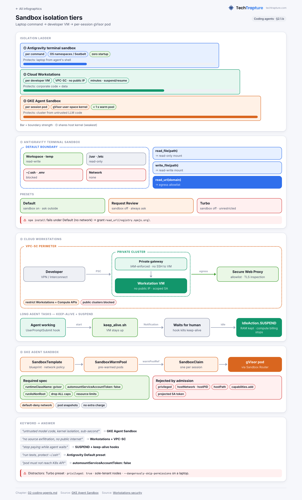
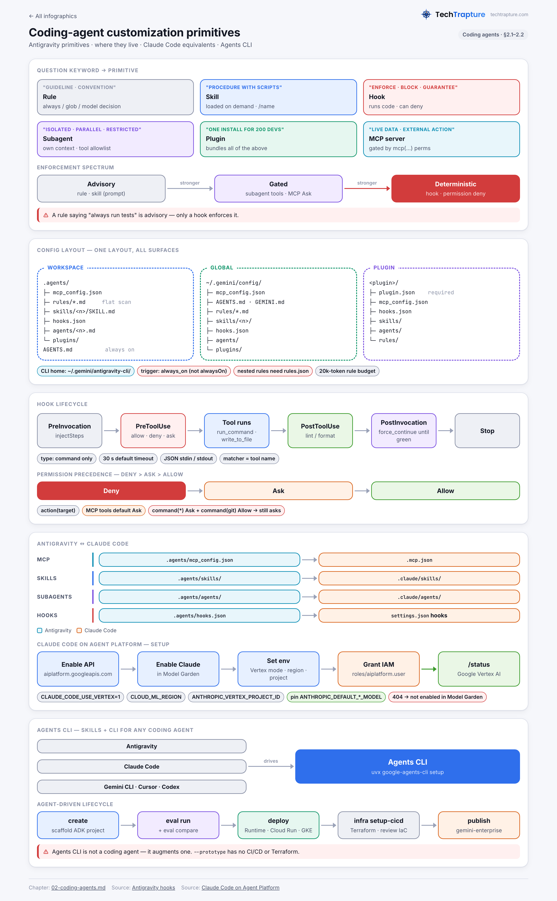

## Section 2 — Using coding agents for application development (~17%)

**What the exam is really testing**
1. Do you know *where* each customization lives (file name, path, scope) in Antigravity and Claude Code on Google Cloud, and which primitive fits the need: rule, skill, hook, subagent, plugin, MCP server, or extension?
2. Can you pick the right isolation boundary for agent-run code (Antigravity terminal sandbox, Cloud Workstations, GKE Agent Sandbox with gVisor) and pair it with least-privilege credentials and egress control?
3. Can you connect the inner loop (coding agent) to the outer loop (Agents CLI, then Agent Runtime / Cloud Run / GKE, then Skill Registry / Agent Registry, then Gemini Enterprise) without hand-rolling glue?

> Naming note (2026): Vertex AI is now **Gemini Enterprise Agent Platform** ("Agent Platform"). Agent Engine is now **Agent Runtime**. The API is still `aiplatform.googleapis.com`. Antigravity has three surfaces: **Antigravity 2.0** (standalone desktop app, successor of Agent Manager), **Antigravity CLI** (`agy`), and **Antigravity IDE** (standalone editor) plus **IDE extensions** (VS Code, Visual Studio, JetBrains, Zed, Xcode). There is also the **Antigravity SDK** (Python, `pip install google-antigravity`).

---

### 2.1 Using coding agents effectively

#### 2.1.a Configuring coding agents with MCP servers, custom skills, and tool access

**Core concepts**
- **MCP** gives the agent live context (schemas, logs) and actions (create a ticket, run a query). **Skills** give it procedural know-how, loaded on demand. **Permissions** decide what the agent may do without asking.
- Antigravity uses **one config layout across all three surfaces**. Workspace scope lives under `.agents/`. Global scope lives under `~/.gemini/config/`. The CLI also has its own home at `~/.gemini/antigravity-cli/`.

**Antigravity MCP configuration**

| Scope | File |
|---|---|
| Global | `~/.gemini/config/mcp_config.json` |
| Workspace | `.agents/mcp_config.json` |
| Plugin | `<plugin>/mcp_config.json` |
| SDK | `LocalAgentConfig(mcp_servers=[McpStdioServer(...)/McpStreamableHttpServer(...)])`; the SDK also auto-discovers `.agents/mcp_config.json` |

```json
{
  "mcpServers": {
    "sqlite-explorer": {
      "command": "node",
      "args": ["/usr/local/bin/sqlite-mcp-server.js"],
      "env": { "SQLITE_DB_PATH": "/var/data/app.db" }
    },
    "bigquery": {
      "serverUrl": "https://bigquery.googleapis.com/mcp",
      "authProviderType": "google_credentials",
      "disabledTools": ["execute_sql_write"]
    },
    "drive": {
      "serverUrl": "https://drivemcp.googleapis.com/mcp/v1",
      "oauth": { "clientId": "…", "clientSecret": "…" }
    }
  }
}
```
(The BigQuery `serverUrl` and tool name in this example are illustrative and unverified. Every field name comes from the Antigravity MCP docs.)

- **Transport.** Use `command` for stdio or `serverUrl` for Streamable HTTP or SSE. **Gotcha:** the legacy `url` and `httpUrl` fields are **not supported** for remote servers, so `serverUrl` is mandatory.
- **Optional fields:** `args`, `env`, `cwd`, `headers`, `authProviderType`, `oauth`, `disabled`, `disabledTools`.
- **Auth has three modes:**
  - **`authProviderType: "google_credentials"`** uses ADC. Run `gcloud auth application-default login` first, and set a quota project with `gcloud auth application-default set-quota-project`. This is the right answer for Google Cloud remote MCP servers.
  - **OAuth with DCR** needs zero config. Without DCR, supply `oauth.clientId` and `oauth.clientSecret`, and register the redirect URI `https://antigravity.google/oauth-callback`. Tokens are stored in `~/.gemini/antigravity/mcp_oauth_tokens.json`.
  - **Static `headers`** (API key or bearer token) is the least preferred option.
- **UI and TUI.** Antigravity 2.0 uses Settings → Customizations → Installed MCP Servers → **Add MCP** (the MCP Store). The IDE uses "…" → MCP Servers → Manage → *View raw config*. The CLI uses `/mcp`, the interactive MCP Manager, which shows status, lets you authenticate, and lists tools.
- **The MCP Store** lists Google servers (BigQuery, AlloyDB, Cloud SQL, Spanner, Bigtable, Dataplex, MCP Toolbox for Databases, GKE OneMCP, Cloud CLI Execution (gcloud), Apigee, Firebase, Cloud Audit Manager, Quotas) and third-party servers (GitHub, SonarQube, Wiz, CrowdStrike, and others).

**Antigravity tool access (permissions engine)**
- Every sensitive operation is a resource of the form `action(target)`. The actions are `read_file`, `write_file`, `read_url`, `execute_url`, `command`, `mcp` (plus `unsandboxed` on Windows and in the CLI).
- **Precedence is Deny > Ask > Allow.** If `command(*)` is in Ask and `command(git)` is in Allow, every command still prompts.
- **MCP tools default to Ask.** Grant them with `mcp(server/tool)`, `mcp(server/*)` or `mcp(*)`.
- The CLI stores rules in `~/.gemini/antigravity-cli/settings.json`:
```json
{ "permissions": {
    "allow": ["command(git)", "command(regex:npm run (build|lint|test))", "write_file(src/)", "read_url(google.com)", "mcp(linter/*)"],
    "deny":  ["command(rm -rf)", "command(sudo)", "write_file(.git/)", "write_file(/home/user/.ssh)"],
    "ask":   ["execute_url(aws.amazon.com)", "mcp(sql/execute_mutation)"] } }
```
- **Implicit rules:** allowing write also allows read on the same path, and denying read also denies write.
- **Anti-smuggling:** prefix matching is disabled when the command contains `$(…)`, backticks, `<(…)`, brace expansion, or tool flags such as `git -c core.pager=…`. These need an exact full-line match, or they fall back to Ask. `git status && git log` still prefix-matches.
- **SDK equivalent:** a declarative policy engine, `policies=[deny("*"), allow("view_file"), ask_user("run_command", handler=…)]`. `policy.safe_defaults()` allows read-only tools and asks before writes. You can restrict tools with `CapabilitiesConfig(enabled_tools=BuiltinTools.read_only())`.

**Custom skills (Agent Skills open standard, agentskills.io)**
- A skill is a folder: `SKILL.md` (YAML frontmatter plus body), with optional `scripts/`, `examples/`/`references/`, and `resources/`/`assets/`.
- Only `description` is required in Antigravity. `name` defaults to the folder name.
- **Progressive disclosure:** only the name and description are indexed up front. The body is read on activation.
- You can invoke a skill **autonomously** (the model matches it by description) or by **slash command** (`/<skill-name>`). The CLI turns every skill into a slash command automatically.

| Surface | Workspace | Global |
|---|---|---|
| Antigravity 2.0 / IDE | `.agents/skills/<name>/` | `~/.gemini/config/skills/<name>/` (IDE also reads legacy `~/.gemini/antigravity/skills/`) |
| Antigravity CLI | `.agents/skills/<name>/` | `~/.gemini/antigravity-cli/skills/<name>/`; plugin skills in `~/.gemini/antigravity-cli/plugins/<p>/skills/` |
| Gemini CLI (legacy) | `.gemini/skills/` or `.agents/skills/` | `~/.gemini/skills/` or `~/.agents/skills/` |
| SDK | `LocalAgentConfig(skills_paths=[...])` | n/a |

- **Gotcha:** `.agent/skills` (singular) is still read for backward compatibility. The default is `.agents/skills`.
- **Migrating from Gemini CLI:** workspace `.gemini/skills/` must be moved to `.agents/skills/` by hand. `agy plugin import gemini` converts extensions into plugins.

**Claude Code on Google Cloud (Claude via Agent Platform)**

| Setting | Value / purpose |
|---|---|
| `CLAUDE_CODE_USE_VERTEX=1` | Route Claude Code to Agent Platform instead of the Anthropic API |
| `CLOUD_ML_REGION` | `global`, a multi-region (`us` or `eu`, which use `aiplatform.{us,eu}.rep.googleapis.com`), or a region such as `us-east5`. If unset, it falls back to `us-east5` |
| `ANTHROPIC_VERTEX_PROJECT_ID` | Billing and quota project. **It wins over** `GOOGLE_CLOUD_PROJECT` and the project in the credentials file |
| `VERTEX_REGION_CLAUDE_*` | Per-model region override, used when `global` isn't supported for a model (for example `VERTEX_REGION_CLAUDE_HAIKU_4_5=us-east5`) |
| `ANTHROPIC_DEFAULT_OPUS_MODEL` / `_SONNET_MODEL` / `_HAIKU_MODEL`, `ANTHROPIC_MODEL` | **Pin models** for fleet rollouts. Aliases otherwise resolve to Claude Code's built-in defaults |
| `ANTHROPIC_VERTEX_BASE_URL` | Custom endpoint or gateway |
| `gcpAuthRefresh` (settings.json) | Command run when ADC has expired, for example `gcloud auth application-default login` |
| `DISABLE_PROMPT_CACHING=1` / `ENABLE_PROMPT_CACHING_1H=1` | Prompt caching is on by default with a 5-minute TTL. The 1-hour TTL costs more |
| IAM | `roles/aiplatform.user` (the key permission is `aiplatform.endpoints.predict`). You can use a custom role with only that permission |

- **Setup:** `gcloud services enable aiplatform.googleapis.com`, then enable the Claude models in **Model Garden**. Alternatively, run the in-product wizard: `claude` → 3rd-party platform → Google Vertex AI, or `/setup-vertex`. The wizard writes the `env` block of `~/.claude/settings.json`.
- **Auth** uses the standard ADC chain, including X.509 Workload Identity Federation through `GOOGLE_APPLICATION_CREDENTIALS`. `/logout` is unavailable in Vertex mode.
- **Verify** with `/status`, which should show `API provider: Google Vertex AI`.
- **Troubleshooting:**
  - A 404 "model not found" means the model isn't enabled in Model Garden or isn't available in that location or on `global`.
  - A 429 means you should check that both the primary and the small/fast model exist in the region, or switch to `global`.
- **Best practice:** use a dedicated GCP project for Claude Code, which simplifies cost tracking and IAM.
- **Claude Code config files:**
  - MCP: `.mcp.json` (project) or `claude mcp add --scope project|user …`. The ADK docs example is `claude mcp add adk-docs --transport stdio -- uvx --from mcpdoc …`.
  - Skills: `.claude/skills/<name>/SKILL.md`.
  - Subagents: `.claude/agents/*.md`.
  - Hooks: `settings.json`.
  - Enterprise enforcement: managed settings.
- The Anthropic docs note that MCP **tool search** is on by default for Claude 4.5-generation and later models on Agent Platform.

**Trade-offs**
- **ADC vs OAuth vs headers for MCP.** ADC reuses GCP IAM and needs no new secret, but it runs with *your* identity, which is broad. OAuth is per-user and revocable, but it needs a client registration. Static headers are simplest, but they are a long-lived secret on disk.
- **`global` vs regional endpoint for Claude.** `global` gives better availability and fewer 429s. Regional or multi-region gives data residency, but some models aren't available there.
- **Unpinned model aliases** mean zero maintenance, but upgrades are uncontrolled and can shift cost (for example, the default moving from Sonnet to Opus). Pinning gives predictable cost and behavior, but you have to bump versions yourself.

**Exam signals**

| Keyword in the question | Likely answer |
|---|---|
| "Connect Antigravity to a Google Cloud remote MCP server without storing secrets" | `serverUrl` plus `authProviderType: "google_credentials"` (ADC) |
| "Share MCP config with the whole repo team" | `.agents/mcp_config.json`, committed |
| "Hide a destructive tool from the model but keep the server" | `disabledTools` (config), or a `deny` rule `mcp(server/tool)` |
| "Use Claude Code but keep billing, quota and data in our GCP org" | `CLAUDE_CODE_USE_VERTEX=1` plus `ANTHROPIC_VERTEX_PROJECT_ID` plus `roles/aiplatform.user` |
| "Consistent model across 500 developers" | Pin `ANTHROPIC_DEFAULT_*_MODEL` (Claude Code), or `--model` (agy headless fails loudly on an unknown model) |
| "Model not available on global endpoint" | `VERTEX_REGION_CLAUDE_<MODEL>` override |

**Distractors**
- The `url` or `httpUrl` field in Antigravity (not supported).
- Putting API keys in rules or `AGENTS.md`.
- Granting `roles/aiplatform.admin` to developers.
- Using the Anthropic API key when the requirement is "stay within GCP governance".

---

#### 2.1.b Using coding agents in secure sandboxes (GKE, Cloud Workstations, Antigravity)

> 📊 **Infographic:** Sandbox isolation tiers
>
> [](../infographics/04-sandbox-tiers.png)

**Layer 1: the Antigravity terminal sandbox (local, per command)**
- **OS primitives, no VM or Docker, no startup delay:**
  - Linux uses kernel **namespaces**.
  - macOS uses **`sandbox-exec`** (Seatbelt/SBPL).
  - The CLI docs also list `nsjail` on Linux and AppContainer on Windows.
- **Default boundary:** read-write on the workspace, temp dirs and build caches. Read-only on system dirs (`/usr`, `/etc`). **`~/.ssh` and `.env` are blocked.** **No network access.**
- **Permissions expand the boundary:**
  - `read_file` paths become read-only mounts.
  - `write_file` paths become read-write mounts.
  - **`read_url` domains become the sandbox's outbound network allowlist.** This is how you express egress control.
- **Presets (macOS and Linux)** are set under Settings → General → Permission Settings, with per-project overrides under Settings → Projects (default "Inherit General"):

| Preset | Sandbox | Terminal commands | File access | MCP & web |
|---|---|---|---|---|
| **Default** | On | Allowed in sandbox; ask outside | Workspace + temp | Ask |
| **Request Review** | Off | Always ask | Workspace only | Ask |
| **Turbo** | Off | Allowed, unrestricted | Full filesystem | Allowed |

- **Escape hatch:** the agent can ask to run a command unsandboxed, and approval is always required unless a rule covers it. On macOS and Linux that rule is `command(git push)`. On Windows and in the CLI it is `unsandboxed(git push)`. An "always allow" on a bypass prompt records an `unsandboxed(...)` rule.
- **CLI:** set `"enableTerminalSandbox": true` in `~/.gemini/antigravity-cli/settings.json` (default `false` in the CLI features doc; unverified whether the newer macOS/Linux default preset supersedes this).
- **Windows** still uses the legacy model. Sandbox Mode is Preview, and *none* of the presets turn it on. Enabling it switches the preset to Custom.
- **Headless (`agy -p`):**
  - Tools needing approval are **soft-denied**: the run exits 0 and prints a notice to stderr.
  - Pre-grant tools with `permissions.allow`.
  - `--dangerously-skip-permissions` approves everything. It is a distractor unless the environment is itself disposable and isolated.
- **Claude Code equivalent:**
  - Enable with `/sandbox` or `"sandbox": {"enabled": true}`. It uses Seatbelt on macOS and bubblewrap plus socat on Linux/WSL2.
  - `network.allowedDomains`, `allowUnsandboxedCommands: false` (strict mode), `strictAllowlist`, and `allowManagedDomainsOnly` (managed-settings lockdown) control the boundary.

**Layer 2: Cloud Workstations (managed dev VM, per developer)**
- Workstation images include Gemini CLI. Google's Data Agent Kit is preinstalled in Cloud Shell and Cloud Workstations.
- **Agent-optimized development:**
  - `IdleAction.SUSPEND` suspends the VM (RAM, processes and agent context persisted, compute billing stopped) instead of stopping and deleting it.
  - A lifecycle **keep-alive hook** runs `/google/scripts/keep_alive.sh` while the agent works and kills it when the agent waits for input.
  - Samples ship under `/google/samples/agents/keepalive/{claude,gemini}/`.
  - Claude Code uses the `UserPromptSubmit` hook to start and the `Notification` hook to stop. The docs name `BeforeAgent`/`Notification` for Antigravity CLI.
- **Security controls:**
  - A **private cluster** (Private gateway plus a PSC endpoint, reached over VPN or Interconnect).
  - **VPC Service Controls:** restrict the Compute Engine API whenever you restrict the Cloud Workstations API. Make Cloud Storage and Artifact Registry VPC-accessible. Public clusters are blocked inside a perimeter.
  - **Disable public IPs** (org policy `constraints/compute.vmExternalIpAccess`). Then use Private Google Access or Cloud NAT.
  - **Secure Web Proxy** for auditable, identity-aware egress allowlisting with TLS inspection. Set `https_proxy` in a custom image.
  - `gcloud workstations configs update … --disable-ssh-to-vm` forces access through the IAM-enforced gateway.
  - The workstation config's **service account** is the agent's cloud identity, so scope it minimally.

**Layer 3: GKE Agent Sandbox (server-side, per agent session, untrusted LLM-generated code)**
- A managed GKE add-on based on the OSS `kubernetes-sigs/agent-sandbox` project. It provides **gVisor kernel-level isolation** (Kata Containers is supported but not a Google product), **sub-second provisioning** through warm pools, and **Default Deny networking**. There is no extra charge beyond GKE resources.
- **CRDs** (`extensions.agents.x-k8s.io/v1beta1`, with `Sandbox` in `agents.x-k8s.io/v1beta1`):
  - `SandboxTemplate` is the blueprint.
  - `SandboxWarmPool` holds pre-warmed pods (`replicas`).
  - `SandboxClaim` is the request. In v1beta1 it **must** set `spec.warmPoolRef`. A cold start uses a pool with `replicas: 0`.
  - `Sandbox` is a single stateful pod with a stable hostname and storage, and no warm pool.
  - A **Sandbox Router** provides the stable endpoint.
  - It integrates with **Pod snapshots** for suspend and resume.
- **Enable it:**
  - Autopilot: `gcloud beta container clusters create-auto … --enable-agent-sandbox`.
  - Standard: create a gVisor node pool (`--image-type=cos_containerd --sandbox=type=gvisor`), then `clusters update --enable-agent-sandbox`.
  - Verify with `addonsConfig.agentSandboxConfig.enabled`.
  - Version: 1.36.3-gke.1767000 or later for v1beta1. The concept doc says 1.35.2 or later for snapshots.
- **Required pod spec**, enforced by a Validating Admission Policy (non-compliant manifests are **rejected**):
```yaml
spec:
  runtimeClassName: gvisor
  automountServiceAccountToken: false      # least privilege: no KSA token in untrusted code
  securityContext: { runAsNonRoot: true }
  nodeSelector: { sandbox.gke.io/runtime: gvisor }
  tolerations: [{ key: sandbox.gke.io/runtime, value: gvisor, effect: NoSchedule }]
  containers:
  - resources: { limits: { cpu: "500m", memory: "1Gi" } }   # limits required (DoS)
    securityContext: { capabilities: { drop: ["ALL"] } }
```
- **Prohibited settings:** `hostNetwork`, `hostPID`, `hostIPC`, `privileged`, `hostPath`, `capabilities.add`, `hostPort`, custom sysctls, and projected SA-token volumes.
- **Programmatic access:** the Agentic Sandbox Python client. `kubectl port-forward` to the router is dev-only.
- **Storage:** ephemeral PVC via `volumeClaimTemplates`, or Filestore agent volumes (RWX) for persistent high-density workspaces.

**Sandbox options compared**

| | Antigravity terminal sandbox | Cloud Workstations | GKE Agent Sandbox |
|---|---|---|---|
| Protects | Developer laptop from the agent's shell commands | Corporate code/data; standardizes the dev env | Platform/cluster from **untrusted LLM-generated code** at scale |
| Isolation unit | Per command (OS namespaces / Seatbelt) | Per developer VM (container on COS VM) | Per session pod (gVisor user-space kernel) |
| Egress control | `read_url` allowlist | VPC-SC, no public IP, Secure Web Proxy, Cloud NAT | Default-deny NetworkPolicy in `SandboxTemplate` |
| Identity | Developer's local creds / ADC | Workstation config service account | No KSA token by default; add Workload Identity deliberately |
| Startup | Zero | Minutes (image streaming helps); suspend/resume | <1 s with warm pool |
| Best for | Interactive local coding | Regulated enterprises, "code never leaves the perimeter", long-running agents | Code-interpreter tools, agent runtimes, multi-tenant execution |
| Trade-off | Weakest boundary (shares the host kernel) | VM cost, network setup (PSC, DNS) | Cluster ops burden, warm-pool idle cost, gVisor syscall overhead |

**Limits and gotchas**
- Under the Default preset, the sandbox has **no network** access. `npm install` fails until you add a `read_url(registry.npmjs.org)` grant or approve an unsandboxed run.
- Antigravity's permission system for macOS and Linux differs from the one on Windows.
- In a Workstations VPC-SC perimeter with image streaming, you must add `containerfilesystem.googleapis.com` plus an egress rule.
- Agent Sandbox v1alpha1 → v1beta1 migration uses `migrate.sh`, run as bootstrap → control-plane upgrade → migrate. Phase 3 is the point of no return.
- Skill Registry and Vertex AI calls from a sandbox with no egress **fail**. ADK then falls back to local filesystem skills.

**Exam signals**

| Keyword in the question | Likely answer |
|---|---|
| "execute untrusted model-generated code", "kernel-level isolation", "sub-second" | GKE Agent Sandbox (gVisor + `SandboxWarmPool`) |
| "prevent source-code exfiltration", "developers' cloud IDE", "no public internet" | Cloud Workstations private cluster + VPC-SC + no public IP (+ Secure Web Proxy for an allowlist) |
| "long agent task, stop paying while waiting for human" | Workstations `IdleAction.SUSPEND` + keep-alive hooks |
| "let agent run tests without prompting but protect `~/.ssh`" | Antigravity Default preset (terminal sandbox) |
| "allow the sandbox to reach only the internal package mirror" | `read_url(mirror.corp)` → sandbox egress allowlist |
| "pod must not access Kubernetes API" | `automountServiceAccountToken: false` (required) + default-deny network |

**Distractors**
- "Turbo mode for productivity".
- `privileged: true` "to allow Docker-in-Docker".
- "Run untrusted code on Cloud Run with the default SA" (no kernel sandbox story, and the default SA is over-privileged).
- `--dangerously-skip-permissions` on a developer laptop.
- Sole-tenant nodes (they isolate tenants from each other, not code from the kernel).

---

#### 2.1.c Using coding agents to refactor code, optimize runtimes, and patch app-layer vulnerabilities

**Core patterns (Antigravity)**
- **Plan first for risky change.** Use Planning Mode (Antigravity 2.0), `/plan`, or `agy --mode=plan`. The agent investigates with read-only tools and produces an **Implementation Plan artifact** you can comment on.
- The **Artifact Review Policy** can be "Request Review" (recommended) or "Always Proceed".
- Use **Fast Mode** only for localized edits such as a rename or a small refactor.
- **`--mode=accept-edits`** auto-approves file edits (subagents inherit it). It suits long refactors *after* the plan has been approved.
- **Parallelize safely.** `invoke_subagent` with the workspace option **`branch`** creates an isolated **Git worktree** per subagent. The other options are `inherit` and `share`. Subagents start with a clean context window.
- **`/boost`** is a three-tier multi-agent orchestrator (Orchestrator → DeepCoder / DeepInvestigator → workers) for hard concurrency bugs and non-trivial refactors, with independent verification loops. It requires a paid tier.
- **`/teamwork-preview`** coordinates multiple agents for large multi-file projects, with milestone decomposition and verification.
- **Recovery:** `/rewind` (`/undo`), `/fork`, `/resume`, and `Esc` to interrupt a turn.
- **Deterministic quality gates:** a `PostToolUse` hook on `write_to_file`/`replace_file_content` runs a linter or formatter. A `PreToolUse` hook on `run_command` can `deny`. A `PostInvocation` hook can `force_continue` until tests pass (a verification-loop pattern).
- **Evidence from tools via MCP:**
  - SonarQube, Wiz, CrowdStrike and Splunk MCP servers for security findings.
  - Chrome DevTools MCP for front-end performance traces.
  - Cloud Trace/Logging data (via the gcloud or observability MCP) for runtime hotspots.
- **CodeMender agent on Agent Platform** is Google's managed code-security agent. It finds vulnerabilities, **validates exploitability by building and running a PoC exploit in a customer-managed environment**, and generates verified patches. It can ingest findings from tools such as Wiz, and a lightweight CLI keeps source code in your environment.
- **CI automation:** `agy -p "…" --output-format json|stream-json --model <slug>`. The status field is `SUCCESS`/`ERROR`/…, and the default timeout of 5 minutes is overridable with `--print-timeout`. Headless mode fails loudly on an unknown model, whereas the UI silently falls back.

**Trade-offs**
- **Planning mode** costs latency and tokens but buys correctness on multi-file changes. **Fast mode** is the reverse.
- **Parallel subagents in worktrees** are faster but need merge and conflict resolution. **A single agent** is slower but coherent.
- **`/boost`** gives higher accuracy on hard problems at far higher cost and time. Don't use it for a rename.
- **LLM patching without exploit validation** is fast but risks false positives. CodeMender-style validation costs compute but removes alert fatigue.

**Exam signals**
- "Ensure every edit is linted/tests pass before the agent continues": **hooks** (`PostToolUse` / `PostInvocation`). Rules alone don't enforce anything.
- "Large refactor across 40 services without agents stepping on each other": subagents with `branch` (worktree) isolation, or `/teamwork-preview`.
- "Prioritize only exploitable vulnerabilities and auto-generate verified fixes": **CodeMender**.
- "Human must approve the approach before files change": Planning Mode + Request Review.

**Distractors**
- Tuning the model temperature to "make patches safer".
- Trusting a rule saying "always run tests" as enforcement (it is advisory; a hook enforces).
- Turbo preset on production credentials.

---

### 2.2 Customizing coding agents for enterprise workflows

> 📊 **Infographic:** Coding-agent customization primitives
>
> [](../infographics/03-coding-agent-primitives.png)

#### 2.2.a Creating skills, plugins, extensions, hooks, rules, and subagents using Antigravity

**Rules (persistent constraints and invariants)**
- **Files:**
  - `AGENTS.md` and `GEMINI.md` have no frontmatter and are always on.
  - `.agents/rules/*.md` needs frontmatter.
  - Global rules live in `~/.gemini/AGENTS.md`, `~/.gemini/GEMINI.md`, `~/.gemini/config/{AGENTS,GEMINI}.md`, and `~/.gemini/config/rules/*.md`. The CLI also reads `~/.gemini/antigravity-cli/rules/`.
  - Plugin rules live in `plugins/<p>/rules/`.
- **Directory scoping:** when the agent touches a file, it walks up to the workspace root and loads `AGENTS.md`/`GEMINI.md`/`.agents/rules/` at each level. Rules are **cumulative**, and the more specific rule wins on conflict.
- **Frontmatter:**
```yaml
---
trigger: model_decision   # always_on | model_decision | glob | manual
description: "Apply when writing DB migrations"   # required for model_decision
globs: "*.proto, **/*.pb.go"                        # required for glob
---
```
- **Gotchas:**
  - A missing frontmatter or an invalid trigger (camelCase `alwaysOn`, `modelDecision`) means the rule is **silently discarded**.
  - `.agents/rules/` is scanned **flat**. Nested dirs are ignored unless listed in `.agents/rules.json` (`inherits`, `entries`, `include_only`, `exclude`), which is also how you share rules across repos.
  - `@[label](path)` inlines a file, while `@file` only canonicalizes a path reference.
- **Limits:** 24,000 bytes per rule file (truncated beyond that), and a **20,000-token aggregate budget** for always-on and global rules. When the budget is exceeded, the largest rules are demoted to pointers (`path: description`).

**Skills (multi-step, on-demand procedures)**
- Covered in 2.1.a.
- **Legacy workflows** (`.agents/workflows/*.md`, 12,000-character limit, whole file loaded) are **deprecated and retired on 2026-11-01**. Migrate with `/migrate-workflows`, which scaffolds `.agents/skills/<name>/SKILL.md` and renames the original to `.bak`. When names collide, the skill wins over the workflow.

**Hooks (deterministic interception)**
- **Files:** `.agents/hooks.json` (workspace) and `~/.gemini/config/hooks.json` (global). The CLI also reads `~/.gemini/antigravity-cli/settings.json` and plugin `hooks.json`. Inspect them with `/hooks` (CLI) or Customizations → Hooks.
- **Events:** `PreToolUse`, `PostToolUse` (both take a `matcher` on the tool name, such as `run_command`, `write_to_file`, `replace_file_content`, `invoke_subagent`, …), `PreInvocation`, `PostInvocation`, `Stop`.
- **Handler:** `{"type":"command","command":"./scripts/x.sh","timeout":30}`. The default timeout is 30 s and only `command` is supported. Add `"enabled": false` to disable a hook.
```json
{ "safety-gate": { "PreToolUse": [ { "matcher": "run_command",
    "hooks": [ { "command": "./scripts/safety-check.sh", "timeout": 10 } ] } ] } }
```
- **I/O contract:** JSON on stdin and stdout, camelCase. The common input fields are `conversationId`, `workspacePaths`, `transcriptPath`, `artifactDirectoryPath`, `modelName`.
  - `PreToolUse` output: `decision` = `allow` | `deny` | `ask` | `force_ask` | `deny_unless_prior_grant`, plus `reason` and `permissionOverrides`.
  - `PreInvocation`/`PostInvocation` can return `injectSteps` (`userMessage`, `ephemeralMessage`, `toolCall`).
  - `PostInvocation` can also return `terminationBehavior: force_continue|terminate`.
  - `PostToolUse` returns `{}` and receives `error` when the tool failed.
- The transcript lives at `<app_data_dir>/brain/<conversationId>/.system_generated/logs/transcript.jsonl`, where `<app_data_dir>` is `~/.gemini/antigravity`, `~/.gemini/antigravity-cli`, or `~/.gemini/antigravity-ide`. It is useful for audit export.

**Subagents (context-isolated specialists)**
- **Files:**
  - `.agents/agents/<name>.md` or `.agents/agents/<name>/agent.md`.
  - `~/.gemini/config/agents/`.
  - `plugins/<p>/agents/`.
  - Created at runtime via the `define_subagent` tool.
- **Frontmatter:** `name`, `description` (both required), `tools` (explicit allowlist), `mainAgent` (default true), `subagent` (default true), `model` (`inherit`|`flash`|`pro`), `commandExecutionPolicy` (`off`|`auto`|`eager`|**`sandbox`** default), `mcpServers`, `skills`/`plugins`. The body is the system prompt.
- **Built-ins:** `research`, `browser` (only via `/browser`, sandboxed Chrome), `self` (a clone).
- **Behavior:**
  - Each subagent runs in its own context window and does **not** inherit the parent's history.
  - Workspace can be `inherit`, `branch` (git worktree), or `share`.
  - Monitor with `/agents` or Alt+J (CLI).
- **Known issue:** a misspelled tool name in `tools` can **hang** the subagent.
- **SDK:** `CapabilitiesConfig(enable_subagents=True)` gives dynamic self-cloning. `types.SubagentConfig(...)` defines static subagents. Custom tools given to a subagent **must also be registered on the parent**.

**Plugins (the distribution unit)**
- **Layout:** `plugin.json` (required; `name` must match `^[a-zA-Z0-9-_]+$`, required for the CLI; `$schema: https://antigravity.google/schemas/v1/plugin.json`), plus optional `mcp_config.json`, `hooks.json`, `skills/`, `agents/`, `rules/`.
- **Install:**
  - Workspace: `.agents/plugins/`. Global: `~/.gemini/config/plugins/`.
  - CLI: `agy plugin list|install <path/url>|enable|disable|uninstall`, staged under `~/.gemini/antigravity-cli/plugins/<name>/`.
  - Antigravity 2.0 → Customizations → **Build with Google** curated plugins, such as Data Agent Kit (`agy plugin install https://github.com/gemini-cli-extensions/data-agent-kit-starter-pack`).

**Extensions (two meanings; the exam may use either)**
1. **Antigravity IDE extensions** put the Antigravity agent inside VS Code (≥1.90), Visual Studio 2026, JetBrains (2026.2.1+), Zed, or Xcode. They auto-install the local `agy` backend. **Enterprise sign-in** (Gemini Enterprise) is supported on Antigravity 2.0, the CLI, and IDE extensions, with JetBrains/Zed/Xcode in Preview. The **standalone Antigravity IDE is not supported for enterprise**.
2. **Gemini CLI extensions** (`gemini-extension.json` with `mcpServers`, `contextFileName`, `excludeTools`, `settings[]` with `envVar`/`sensitive` stored in the keychain, and `commands/*.toml`, `hooks/hooks.json`, `skills/`, `agents/`). In Antigravity these are **plugins**. Convert them with `agy plugin import gemini`, which turns legacy commands into skills.
- Separately, **Agents CLI extensions** (`agents-cli-extension.yaml`, `agents-cli extension add|list|remove|update`) override or add agents-cli commands, for example an org deploy policy or another framework. Experimental.

**When to use which**

| Primitive | Loaded | Enforced? | Use it for | Don't use it for |
|---|---|---|---|---|
| **Rule** (`AGENTS.md`, `.agents/rules`) | Always / glob / model decision / manual | Advisory (prompt) | Invariants: "use zod", "never import internal/" | Multi-step procedures (bloats every turn) |
| **Skill** (`SKILL.md`) | On demand (progressive disclosure) or `/name` | Advisory | Repeatable workflows with scripts/assets: deploy, migrate, review | Hard security guarantees |
| **Hook** (`hooks.json`) | Every matching event | **Deterministic** (runs code, can deny) | Lint/format after write, block commands, audit, keep-alive | Teaching the model "how" |
| **Subagent** (`.agents/agents/*.md`) | When delegated | Tool allowlist + execution policy | Context isolation, parallelism, least-privilege specialist (read-only reviewer) | Tiny tasks (spawn overhead) |
| **MCP server** | Tools listed; called on demand | Permission engine (`mcp(...)`) | Live data and external actions | Static knowledge (use a skill) |
| **Plugin** (`plugin.json`) | Bundles the above | Inherits component semantics | Distributing a team or org standard kit as one unit | A single one-off rule |
| **Extension** | IDE host / legacy Gemini CLI bundle | n/a | Bringing the agent into an existing IDE; migrating Gemini CLI assets | New Antigravity packaging (use plugins) |

**Exam signals**
- "Guarantee" / "enforce" / "block" means a **hook** (or permission deny). "Guideline" / "convention" means a **rule**. "Procedure with scripts" means a **skill**. "Separate context / restricted tools / parallel" means a **subagent**. "Distribute to 200 devs as one install" means a **plugin**. "Our devs use VS Code" means an **IDE extension**.
- "Rule isn't being applied" usually means missing frontmatter, a camelCase trigger, or a nested folder not listed in `rules.json`.
- "Rules suddenly partially ignored in a large monorepo" means the 20k-token budget demoted them to pointers.

#### 2.2.b Augmenting Antigravity with Agents CLI (build, scale, govern, optimize deployed agents)

**What Agents CLI is**
- It is the **"Agents CLI in Agent Platform"** (`google-agents-cli`, GitHub `google/agents-cli`). It is **not itself a coding agent**. It is a machine-readable CLI plus **skills** that give any coding agent (Antigravity, Claude Code, Codex, Gemini CLI, Cursor) expert ADK, eval and deploy knowledge.
- **Install** with `uvx google-agents-cli setup`, which is the *only* command you run yourself. It installs `agents-cli`, the ADK packages, and the skills into detected coding agents. `--workspace` installs project-level (default is global), `--agent` targets specific agents, and `agents-cli update` refreshes. Alternatives: `pipx`/`pip install google-agents-cli`, or skills only with `npx skills add google/agents-cli`.
- **Bundled skills:** `google-agents-cli-workflow`, `-adk-code`, `-scaffold`, `-eval`, `-deploy`, `-publish` (Gemini Enterprise registration), `-observability`.

**Lifecycle mapped to commands**

| Stage | Commands | Notes |
|---|---|---|
| Build | `agents-cli create <name> [--prototype] [--deployment-target agent_runtime\|cloud_run\|gke\|none] [--session-type in_memory\|cloud_sql\|agent_platform_sessions] [--cicd-runner google_cloud_build\|github_actions\|skip]`, `scaffold enhance\|upgrade`, `install`, `lint --fix`, `playground` (ADK web UI, :8080), `run "msg" [--mode adk\|adk_live\|a2a] [--url]` | The agent writes `DESIGN_SPEC.md` first. Project files: `app/agent.py`, `fast_api_app.py`, `tests/eval/`, `agents-cli-manifest.yaml`, `Dockerfile`, `GEMINI.md`, `.env` |
| Evaluate / optimize | `eval run` (= `generate` + `grade`), `eval compare`, `eval dataset synthesize`, `eval metric list`, `eval analyze\|optimize` (experimental) | Evalset at `tests/eval/evalsets/*.evalset.json`, LLM-as-judge config in `tests/eval/eval_config.json`; results as JSON under `artifacts/` |
| Deploy / scale | `deploy [--deployment-target …] [--min-instances --max-instances --concurrency --memory --cpu] [--dry-run] [--no-wait]`, `build` | Reads `deployment_target` from `pyproject.toml`. Network flags: `--network-attachment`, `--dns-peering-domain`, `--agent-gateway-egress/ingress` |
| Infra / CI-CD | `infra single-project [--apply]` (SA, bucket, BQ dataset for telemetry), `infra setup-cicd` | Terraform-based; **review generated IaC** before production |
| Govern / publish | `publish gemini-enterprise` | Registers the deployed agent in Gemini Enterprise |
| Observe | Cloud Trace on by default; "set up observability" provisions prompt-response logging to GCS/BQ | |

- **IAM:** **Agent Platform User** is enough to deploy to Agent Runtime. **Owner** is needed for the full production setup (Terraform, CI/CD, IAM). The docs recommend an empty project.
- **Modes:** `-i/--interactive` (required for `login`) or `-y/--yes/--auto-approve` for non-interactive agent-driven runs. `cmd-info --json` gives machine-readable output. The exam guide's phrase "agent vs. human mode" (Section 3.1) most likely maps to this non-interactive, auto-approve, JSON-output path for agents versus the interactive prompts for humans (**unverified**, since no doc uses the term).
- **Where Skill Registry fits in governance:**
  - **Skill Registry** (Agent Platform, Preview) is a private, low-latency repository of skills. A **Skill** is mutable. A **Skill revision** is an immutable snapshot.
  - Create with `POST https://LOCATION-aiplatform.googleapis.com/v1beta1/projects/P/locations/L/skills?skillId=…` and body `{displayName, description, zippedFilesystem: base64}`, or with `agentplatform.Client(...).skills.create(...)`.
  - `SKILL_ID` must be 1–63 lowercase characters, cannot start with `gcp-`, and is reserved forever.
  - **Payload validation** is async. It requires a zip with a root `SKILL.md`. Limits: ≤10 MB zipped, ≤500 MB unzipped, ≤10,000 entries, depth ≤8, compression ratio ≤100, no symlinks or `..`. The `name` must be ≤64 characters, lowercase and hyphenated. The `description` must be ≤1024 characters.
  - The built-in skill **`gcp-skill-registry`** appears after the first API call.
  - **ADK consumption:** `SkillToolset(skills=[], registry=GCPSkillRegistry(project_id, location))` adds `search_skills` and `load_skill`, and loaded skills are cached in session state.
  - **Agent Registry** can also govern standalone skills: `gcloud alpha agent-registry skills create ID --payload=zip` or `--gcs-source-uri`. It prefixes `private-` to the ID. It needs `roles/agentregistry.user`, and the service agent `service-PROJECT_NUMBER@gcp-sa-agentregistry.iam.gserviceaccount.com` needs `storage.objects.get` for the GCS import. **Its limits differ:** 500 KB zipped, 10 MB uncompressed, 1 MB per file.

**Trade-offs**
- **Agents CLI scaffold vs hand-rolled ADK.** The scaffold gives an opinionated, production-shaped project with evals, CI/CD and Terraform, but it is more files and more opinion. For learning or throwaway work, `adk create` is simpler (per principle 2).
- **`--prototype`** is fast but has no CI/CD or IaC. The full scaffold is audit-ready but needs Owner and more setup.
- **Skills bundled in the repo vs Skill Registry.** Repo skills are versioned with the code and work offline. Registry skills are centrally governed, revisioned and discoverable across agents, but they need network egress to Agent Platform and IAM.

**Exam signals**
- "Let the team's coding agent build, eval and deploy ADK agents using Google best practices": `uvx google-agents-cli setup`, then prompt the agent.
- "Add CI/CD and Terraform to an existing ADK project": `agents-cli scaffold enhance` (or `infra setup-cicd`).
- "Regression-check an agent change": `agents-cli eval run` then `eval compare`.
- "Make the deployed agent available to business users": `agents-cli publish gemini-enterprise`.
- "Centrally version and share skills across many agents; load only when relevant": **Skill Registry** plus ADK `GCPSkillRegistry` (or Agent Registry skills for org-wide governance).

**Distractors**
- "Agents CLI replaces Antigravity" (it augments any coding agent).
- "Run every agents-cli command manually" (the agent drives it).
- "Upload skills as a tar.gz" (zip only, with `SKILL.md` at the root).
- "Deploy with the `--prototype` scaffold to prod with Terraform" (prototype has none).

---

### Practice questions

**Q1.** Your platform team wants every developer's Antigravity agent to query BigQuery and Spanner through Google's remote MCP servers. Security prohibits storing any long-lived secrets on laptops, and access must respect each developer's IAM grants. What should you configure?
A. `headers: {"Authorization": "Bearer <SA key token>"}` in `~/.gemini/config/mcp_config.json`
B. `serverUrl` with `authProviderType: "google_credentials"` in a committed `.agents/mcp_config.json`, with developers using `gcloud auth application-default login`
C. `url` with an OAuth client ID and secret per server
D. A shared service account key referenced through `env` in a stdio MCP wrapper
**Answer: B.** ADC reuses each developer's identity and IAM with no stored secret, and the workspace file distributes the config. A and D put long-lived credentials on disk and collapse everyone onto one identity. C uses the unsupported `url` field, and OAuth client secrets are unnecessary for Google Cloud servers that accept ADC.

**Q2.** A fintech runs an ADK agent that includes a "code interpreter" tool executing Python the LLM writes. The tool must start in under a second per session, must not reach the Kubernetes API, and must isolate the host kernel. What is the best design?
A. Cloud Run jobs with the default compute service account
B. GKE Agent Sandbox: a gVisor `SandboxTemplate` with `automountServiceAccountToken: false`, a `SandboxWarmPool`, and a `SandboxClaim` per session
C. GKE Standard pods with `privileged: true` inside a dedicated namespace
D. Cloud Workstations with Turbo preset
**Answer: B.** gVisor provides kernel-level isolation, warm pools deliver sub-second claims, and the admission policy *requires* no SA token. A lacks a warm, sandboxed claim model and uses an over-privileged default SA. C violates the prohibited-config list. D is a developer environment, not a multi-tenant execution runtime.

**Q3.** A team added `.agents/rules/frontend/react.md` with `trigger: alwaysOn`. The agent ignores it. What are the two root causes?
A. The rule exceeds 12,000 characters, and rules need a `name` field
B. The file is nested in a subdirectory (flat scan) and `alwaysOn` is an invalid trigger (it must be `always_on`)
C. Rules only load from `~/.gemini/config/rules/`, and require `/rules reload`
D. React rules must be skills
**Answer: B.** `.agents/rules/` is scanned flat unless the file is registered in `.agents/rules.json`, and an invalid camelCase trigger is silently discarded. The 12,000-character limit belongs to legacy workflows, and rules don't need `name`. Workspace rules are fully supported.

**Q4.** Compliance requires that no agent in the repo can run `terraform apply` or `gcloud … delete`, regardless of prompts or model behavior, and that every blocked attempt is logged to an internal endpoint. What should you use?
A. An `AGENTS.md` rule stating "never run terraform apply"
B. A skill named `safe-infra` describing the approved process
C. A `PreToolUse` hook on `run_command` in `.agents/hooks.json` that logs and returns `{"decision":"deny"}` for those patterns (optionally with matching `deny` permission rules)
D. A subagent with `model: pro`
**Answer: C.** Hooks and permission denies are deterministic and can run logging code, while rules and skills are advisory prompt content. A model tier doesn't enforce anything.

**Q5.** 300 engineers will use Claude Code through Agent Platform. Finance wants predictable per-token cost and platform wants controlled upgrades. Some models aren't served on the `global` endpoint. Which configuration fits best?
A. `CLAUDE_CODE_USE_VERTEX=1`, `CLOUD_ML_REGION=global`, `ANTHROPIC_VERTEX_PROJECT_ID`, pinned `ANTHROPIC_DEFAULT_{OPUS,SONNET,HAIKU}_MODEL`, and `VERTEX_REGION_CLAUDE_<MODEL>` for regional-only models
B. Use the `opus` alias so users always get the newest model
C. An Anthropic API key per developer with a spending cap
D. `CLOUD_ML_REGION=us-east5` and grant `roles/aiplatform.admin`
**Answer: A.** Pinning controls both cost and upgrade timing, `global` improves availability, and per-model region overrides cover the gaps. B drifts cost and model. C leaves GCP governance and billing. D is over-privileged (`aiplatform.user` suffices) and forgoes global availability.

**Q6.** A regulated bank wants developers to use AI coding agents, but source code must never leave its perimeter, direct internet egress is forbidden except for an approved package mirror, and SSH to VMs must be auditable through IAM. What should you choose?
A. Antigravity 2.0 on laptops with the Default preset
B. Cloud Workstations: private cluster with PSC, a VPC-SC perimeter (restricting both the Workstations and Compute Engine APIs), public IPs disabled, Secure Web Proxy allowlisting the mirror, and `--disable-ssh-to-vm`
C. GKE Agent Sandbox for each developer
D. Cloud Shell with Gemini CLI
**Answer: B.** Each listed control maps to a documented Workstations security practice. A keeps code on endpoints outside the perimeter. C is a code-execution runtime, not a developer IDE platform with gateway SSH controls. D offers no perimeter or egress control.

**Q7.** Your team's coding agent must build a new ADK agent, create an evalset, deploy it to Cloud Run with CI/CD and Terraform, and make it available in Gemini Enterprise. What should you do with the least custom tooling?
A. Write a custom MCP server that wraps `gcloud run deploy`
B. Install Agents CLI (`uvx google-agents-cli setup`) and let the agent drive `create`, `eval run`, `scaffold enhance --deployment-target cloud_run`, `infra setup-cicd`, `deploy`, and `publish gemini-enterprise`
C. Use `adk create` and deploy manually with a Dockerfile
D. Use `agents-cli create --prototype` and deploy to production
**Answer: B.** Agents CLI skills and commands cover the full lifecycle, including publishing. A reinvents existing tooling. C lacks evals, CI/CD and publishing. D's `--prototype` omits CI/CD and Terraform.

**Q8.** An org has 400 internal skills. Loading them all into every agent's context is too expensive, and security wants immutable, versioned snapshots with central management. ADK agents run on Agent Runtime. What should you use?
A. Put all skills in `AGENTS.md`
B. Skill Registry with ADK `SkillToolset(registry=GCPSkillRegistry(...))`, so agents call `search_skills` and `load_skill` on demand, backed by immutable skill revisions
C. Bake all skills into the container image under `skills/`
D. One MCP server per skill
**Answer: B.** The registry provides on-demand discovery with progressive loading, and revisions are immutable snapshots. A loads everything on every turn. C has no central governance and requires a redeploy per change. D misuses MCP for procedural knowledge and multiplies operational overhead.

**Q9.** A nightly CI job runs `agy -p "fix lint errors and run tests"`. It exits 0, but no tests ran and stderr mentions a tool being denied. What is the best fix?
A. Add `--dangerously-skip-permissions`
B. Add scoped rules such as `command(regex:npm run (lint|test))` under `permissions.allow` in `~/.gemini/antigravity-cli/settings.json` for the CI runner
C. Switch to Turbo preset
D. Increase `--print-timeout`
**Answer: B.** In headless mode, unapproved tools are soft-denied and the run still exits 0, so pre-granting the exact commands is the least-privilege fix. A and C remove all guardrails. D doesn't address the denial.

**Q10.** Developers on Cloud Workstations run Claude Code and Antigravity CLI for multi-hour refactors, often pausing for review. Workstations keep timing out and losing agent state, and finance objects to raising idle timeouts. What should you do?
A. Set the idle timeout to 24 hours
B. Configure `IdleAction.SUSPEND` and install the sample keep-alive hooks (for example Claude Code `UserPromptSubmit` to start and `Notification` to stop `/google/scripts/keep_alive.sh`)
C. Move developers to GKE Agent Sandbox
D. Run agents with `nohup` on the workstation
**Answer: B.** Suspend preserves RAM and agent context while stopping compute billing, and the hooks keep the VM alive only during active work. A burns compute while idle. C is the wrong tool for interactive dev environments. D doesn't prevent the idle shutdown.

---

### Key doc links
- Antigravity MCP: https://antigravity.google/docs/mcp
- Antigravity skills: https://antigravity.google/docs/skills
- Workflows → skills migration: https://antigravity.google/docs/migration/workflows-to-skills
- Antigravity rules: https://antigravity.google/docs/rules
- Antigravity hooks: https://antigravity.google/docs/hooks
- Antigravity subagents: https://antigravity.google/docs/subagents
- Antigravity plugins: https://antigravity.google/docs/plugins
- Antigravity permissions: https://antigravity.google/docs/permissions
- Antigravity terminal sandbox: https://antigravity.google/docs/sandbox
- Antigravity agent settings / presets: https://antigravity.google/docs/agent-settings
- Antigravity CLI features (terminal sandbox, plugins): https://antigravity.google/docs/cli/features
- Antigravity CLI headless mode: https://antigravity.google/docs/cli/headless
- Antigravity CLI modes: https://antigravity.google/docs/cli/modes
- Antigravity CLI best practices: https://antigravity.google/docs/cli/best-practices
- Migrating from Gemini CLI: https://antigravity.google/docs/cli/gcli-migration
- Antigravity in Gemini Enterprise: https://antigravity.google/docs/enterprise
- IDE extensions: https://antigravity.google/docs/ide/extensions
- Artifacts / artifact review / implementation plan: https://antigravity.google/docs/artifacts, https://antigravity.google/docs/artifact-review, https://antigravity.google/docs/implementation-plan
- Antigravity SDK: https://antigravity.google/docs/sdk/overview, https://antigravity.google/docs/sdk/tools, https://antigravity.google/docs/sdk/mcp, https://antigravity.google/docs/sdk/policies, https://antigravity.google/docs/sdk/subagents
- Claude Code on Agent Platform: https://code.claude.com/docs/en/google-vertex-ai
- Claude Code sandboxing: https://code.claude.com/docs/en/sandboxing
- GKE Agent Sandbox concepts: https://docs.cloud.google.com/kubernetes-engine/docs/concepts/machine-learning/agent-sandbox
- Enable GKE Agent Sandbox: https://docs.cloud.google.com/kubernetes-engine/docs/how-to/how-install-agent-sandbox
- Agent Sandbox isolation / storage: https://docs.cloud.google.com/kubernetes-engine/docs/how-to/agent-sandbox, https://docs.cloud.google.com/kubernetes-engine/docs/how-to/agent-sandbox-storage
- Filestore agent volumes with Agent Sandbox: https://docs.cloud.google.com/filestore/docs/agent-sandbox
- Cloud Workstations agent-optimized development: https://docs.cloud.google.com/workstations/docs/agent-optimized-development
- Cloud Workstations security best practices: https://docs.cloud.google.com/workstations/docs/set-up-security-best-practices
- Cloud Workstations VPC-SC and private clusters: https://docs.cloud.google.com/workstations/docs/configure-vpc-service-controls-private-clusters
- Gemini CLI in Cloud Workstations: https://docs.cloud.google.com/workstations/docs/ai-agent-assisted-coding-gemini-cli
- Agents CLI quickstart (Agent Platform): https://docs.cloud.google.com/gemini-enterprise-agent-platform/agents/quickstart-adk
- Agents CLI (ADK docs): https://adk.dev/get-started/agents-cli/, https://adk.dev/deploy/agent-runtime/agents-cli/, https://adk.dev/tutorials/coding-with-ai/
- Agents CLI docs / CLI reference / extensions / repo: https://google.github.io/agents-cli/, https://google.github.io/agents-cli/cli/, https://google.github.io/agents-cli/guide/extensions/, https://github.com/google/agents-cli
- Skill Registry: https://docs.cloud.google.com/gemini-enterprise-agent-platform/build/skill-registry, https://docs.cloud.google.com/gemini-enterprise-agent-platform/build/skill-registry/create-manage
- ADK Skill Registry integration / ADK skills: https://adk.dev/integrations/skills-registry/, https://adk.dev/skills/
- Agent Registry skills: https://docs.cloud.google.com/agent-registry/register-skills
- Gemini CLI extensions / skills: https://geminicli.com/docs/extensions/reference/, https://geminicli.com/docs/cli/skills/
- CodeMender: https://cloud.google.com/security/codemender
- Data Agent Kit: https://cloud.google.com/products/data-agent-kit
