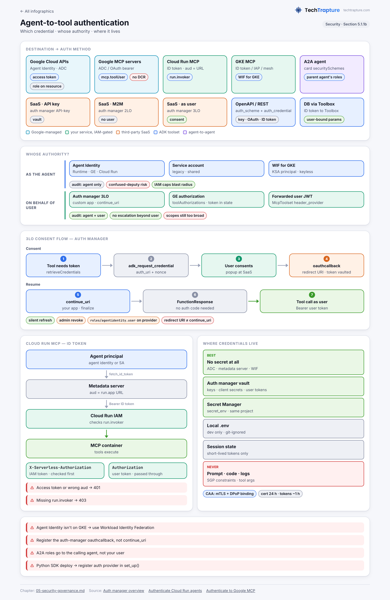
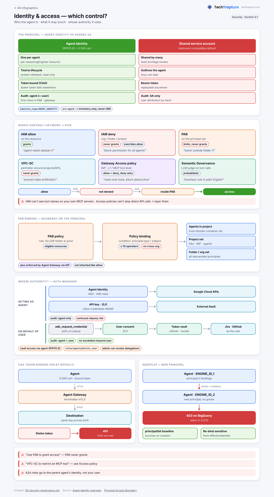
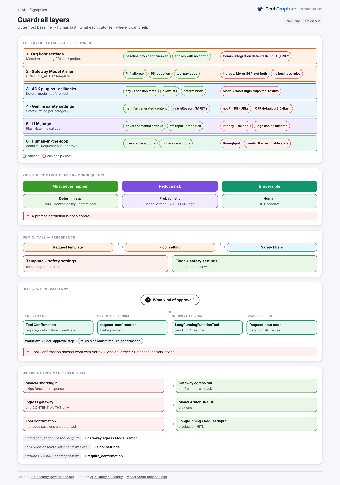
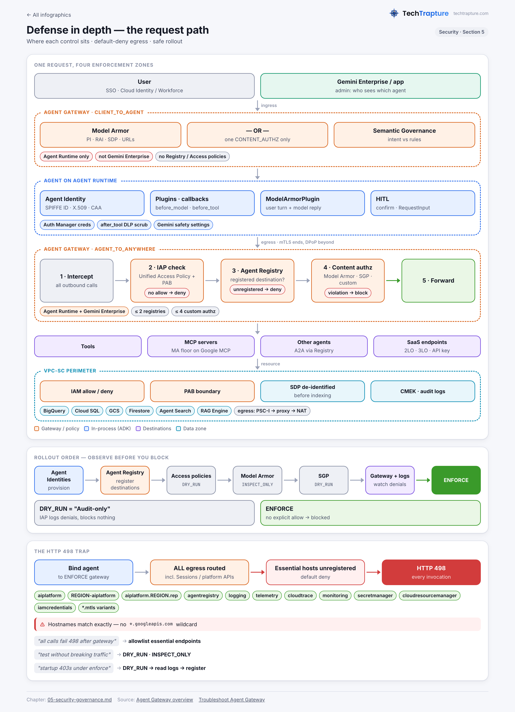

## Section 5 — Securing and governing agentic workflows (~15%)

**What the exam is really testing**
1. Can you pick the *right control at the right layer*: identity (Agent Identity, IAM allow/deny, PAB), network/egress (Agent Gateway + IAP Access policies, VPC-SC), content (Model Armor, Semantic Governance, Gemini safety settings), and behavior (ADK callbacks, plugins, HITL)?
2. Do you know how agent authority works, meaning **acting as the agent** (SPIFFE agent identity, 2LO, API key) versus **acting on behalf of the user** (3LO through auth manager or a Gemini Enterprise authorization resource), and where that shows up in audit logs?
3. Can you roll out governance safely: `DRY_RUN`/`INSPECT_ONLY` first, default-deny egress, allowlisting essential endpoints, and least privilege that survives agent re-creation?

> Naming (2026): Vertex AI Agent Engine is now **Agent Runtime** (the resource is still `reasoningEngines`). Vertex AI is now **Gemini Enterprise Agent Platform**. Docs live under `docs.cloud.google.com/gemini-enterprise-agent-platform/govern/...`. The console calls the governance pillar "Govern".

---

### 5.0 The governance model in one table

The "Govern" pillar answers four questions. Learn this table first, because most scenario questions map onto one row.

| Question | Component | Enforced where |
|---|---|---|
| *Who made the request?* | **Agent Identity**: a per-agent SPIFFE ID with an X.509 cert and cert-bound tokens | IAM, CAA (mTLS/DPoP), audit logs |
| *Which destinations are approved?* | **Agent Registry**: catalog of agents, MCP servers, endpoints, and skills (Preview) | Agent Gateway checks it before connecting |
| *Which actions are permitted?* | **Policies**: IAM **Unified Access Policies** (allow + deny rules with CEL), **Model Armor**, **Semantic Governance Policies**, custom authz extensions | Agent Gateway, through Service Extensions authz policies |
| *Where is it enforced?* | **Agent Gateway**: ingress (Client-to-Agent) and egress (Agent-to-Anywhere) | IAP evaluates Access policies; Model Armor/SGP are content callouts |
| *What happened?* | Agent Observability, Cloud Logging, Cloud Audit Logs, Cloud Trace | `networkservices.googleapis.com/Gateway` logs, IAP `data_access` audit logs |

Internally, every gateway policy type is an **authorization policy managed through Service Extensions**. IAP is a `REQUEST_AUTHZ` extension. Model Armor, Semantic Governance, and custom ext_proc engines are `CONTENT_AUTHZ` extensions.

Recommended configuration order (from the docs): **provision Agent Identities → register destinations in Agent Registry → IAM Access policies (DRY_RUN) → Model Armor templates (INSPECT_ONLY) → Semantic Governance (DRY_RUN) → deploy Agent Gateway and watch logs → switch to enforce.**

---

## 5.1 Configuring agent security and governance

### 5.1.1 Authentication and secure tool execution (agent-to-tool OAuth 2.0)

#### Agent Identity (the principal)
- Each agent on **Agent Runtime** or **Gemini Enterprise** (and on Cloud Run services configured with agent identity) gets a **SPIFFE ID**. The ID is strongly attested, tied to the agent's lifecycle, and derived from the hosting resource path:
  - SPIFFE: `spiffe://agents.global.org-ORG_ID.system.id.goog/resources/aiplatform/projects/PROJ_NUM/locations/us-central1/reasoningEngines/ENGINE_ID`
  - IAM principal: `principal://agents.global.org-ORG_ID.system.id.goog/resources/aiplatform/projects/PROJ_NUM/locations/REGION/reasoningEngines/ENGINE_ID`
  - Trust domain: `agents.global.org-ORG_ID.system.id.goog`, or `agents.global.proj-PROJ_NUM.system.id.goog` for projects without an org.
  - Gemini Enterprise agents use `.../resources/discoveryengine/projects/.../engines/...`.
  - `urn:agent:...` identifiers are for **inventory/catalog lookup only** and are **never** used in IAM bindings.
- **Credentials:** an auto-provisioned X.509 cert plus cert-bound access tokens. Calls straight to Google APIs use **mTLS**. When traffic goes through Agent Gateway, the gateway terminates mTLS and **DPoP** (RFC 9449) re-binds the token beyond the gateway. The docs call this "double-bound credentials".
- **Opting in on Agent Runtime.** Without the flag, the agent keeps using a service account for backward compatibility.
  ```python
  remote_app = client.runtimes.create(agent=AdkApp(agent=agent), config={
      "display_name": "my-agent",
      "identity_type": types.IdentityType.AGENT_IDENTITY,   # v1beta1
      "staging_bucket": "gs://BUCKET"})
  print(remote_app.api_resource.spec.effective_identity)
  ```
  Other ways to opt in: `agents-cli deploy --agent-identity`; for `adk deploy`, put `{"identity_type": "AGENT_IDENTITY"}` in `.agent_engine_config.json`; in Terraform, set `identity_type = "AGENT_IDENTITY"` on `google_vertex_ai_reasoning_engine`. You can also create the runtime instance with **only** `identity_type` and no code. That lets you set up IAM before the code ships.
- **Default roles:** `roles/aiplatform.agentContextEditor` and `roles/aiplatform.agentDefaultAccess`, which cover the agent's own logging, sessions, memories, and sandboxes. The docs also recommend `roles/aiplatform.expressUser`, `roles/serviceusage.serviceUsageConsumer`, and `roles/browser`. `roles/browser` is needed for `resourcemanager.projects.get` during SDK init. Without it you see the startup error "Failed to convert project number to project ID".
- **Grant to many agents** with a principal set: `principalSet://agents.global.org-ORG_ID.system.id.goog/attribute.platformContainer/aiplatform/projects/PROJ_NUM` covers all Agent Runtime agents in a project. `.../attribute.platform/aiplatform` covers the whole org.
- **Limitation:** agent identities can't get Legacy Bucket roles (`storage.legacyBucket*`).

**Service account vs Agent Identity**

| | Service account | Agent Identity |
|---|---|---|
| Granularity | Often shared by many agents or workloads | One per agent (per `reasoningEngines` resource) |
| Lifecycle | Independent. Keys can leak, and the account outlives the agent | Tied to the agent. Read-only and system-attested |
| Credential theft | Bearer tokens can be replayed anywhere | CAA forces mTLS/DPoP, so a stolen token fails outside the runtime (`401 "Context-Aware Access requirements are not met"`) |
| Audit | Logs show the SA. User attribution must be built by hand | Logs show the agent. For delegated flows they show **both user and agent** |
| Gateway, PAB, Access policies | Only partially usable as an agent principal | First-class principal in Access policies, PAB principal sets, and VPC-SC ingress/egress rules |
| Gotcha | — | **Delete and redeploy = new principal.** Old bindings become inactive grants and are not inherited. Blue-green, ephemeral, and Terraform re-create pipelines lose access silently |

Mitigate the redeploy gotcha in one of two ways. (a) Read `spec.effectiveIdentity` after deploy (`gcloud ai reasoning-engines describe ... --format="value(spec.effectiveIdentity)"`) and re-bind. (b) Put baseline, non-sensitive roles on the **project `principalSet`**, which survives re-creation, and keep individual `principal://` bindings for sensitive data only. Clean up stale bindings when you decommission an agent.

Opting out of CAA is possible but **strongly discouraged**. You would set `GOOGLE_API_PREVENT_AGENT_TOKEN_SHARING_FOR_GCP_SERVICES=False`, and the only intended use is corner cases where agents share tokens.

#### Authentication models (which auth for which target)

| Authority | Method | Target | Solution |
|---|---|---|---|
| Agent's own | Agent Identity (IAM) | Google Cloud APIs | Grant roles to the `principal://` agent ID. ADC picks it up automatically |
| Agent's own | OAuth 2.0 **2-legged** (client credentials) | External SaaS (M2M) | Auth manager 2LO auth provider. **Recommended** for M2M with services that support OAuth |
| Agent's own | API key | External services | Auth manager API-key auth provider |
| Agent's own | HTTP basic | External | Stored like an API key. **Not recommended** |
| **User-delegated** | OAuth 2.0 **3-legged** | External tools (Jira, GitHub, Salesforce...) or Google APIs as the user | Auth manager 3LO auth provider: consent, token vault, refresh |

#### Agent Identity auth manager (the "Auth Manager (OAuth 2.0)" in-scope tool)
- A **centralized credentials vault and authentication broker** for *outbound* tool auth. It stores API keys, OAuth client secrets, and user tokens, and it runs the consent, code exchange, and refresh flows. Access to it is governed by IAM, with the agent authenticating using its **own SPIFFE ID**. All end-user access events are attributable to that SPIFFE ID, and admins get visibility into user delegations and can **revoke** them.
- Resources: **auth providers** (API key / 2LO / 3LO). The current v2 CLI is `gcloud agent-identity auth-providers ...`; the legacy v1 command is `gcloud alpha agent-identity connectors ...`, and its resource path uses `connectors/` instead of `authProviders/`.
  ```bash
  gcloud agent-identity auth-providers create jira-3lo --location=us-central1 \
    --three-legged-oauth-client-id=ID --three-legged-oauth-client-secret=SECRET \
    --three-legged-oauth-authorization-url=https://auth.atlassian.com/authorize \
    --three-legged-oauth-token-url=https://auth.atlassian.com/oauth/token
  gcloud agent-identity auth-providers add-iam-policy-binding jira-3lo --location=us-central1 \
    --role=roles/agentidentity.user --member="principal://agents.global.org-.../reasoningEngines/ENGINE_ID"
  ```
  The role is `roles/agentidentity.user`. It was `roles/iamconnectors.user` on the v1 connectors API. Also grant it to `user:you@` for local `adk web` testing.
- **Service caveats:** GitHub and Microsoft are **single-scope only**. ServiceNow grants only the scopes configured on the app side, so a missing scope causes a request loop.
- **Agent Registry bindings** connect an agent to an auth provider, so ADK resolves the credential without code config: `gcloud agent-registry bindings create ... --source-identifier=... --auth-provider=projects/.../connectors/ID`. Bindings aren't supported in the `us`/`eu` multi-regions.

#### ADK side
```python
# Agent Identity auth manager (Preview), pip install "google-adk[agent-identity]"
from google.adk.auth.credential_manager import CredentialManager
from google.adk.integrations.agent_identity import GcpAuthProvider, GcpAuthProviderScheme
CredentialManager.register_auth_provider(GcpAuthProvider())          # once
toolset = McpToolset(
    connection_params=StreamableHTTPConnectionParams(url="https://mcp.example.com"),
    auth_scheme=GcpAuthProviderScheme(
        name="projects/P/locations/L/authProviders/jira-3lo",
        continue_uri="https://myapp.example.com/oauth/continue"))    # 3LO only
# Or resolve from Agent Registry bindings:
# AgentRegistry(project_id, location).get_mcp_toolset(mcp_server_name="mcpServers/ID", continue_uri=...)
```
- **3LO consent loop.** ADK emits a `FunctionCall` named **`adk_request_credential`** carrying `auth_uri`. The client opens it in a popup. After consent, the provider redirects to `continue_uri`, and your handler POSTs to `https://agentidentitycredentials.googleapis.com/v1/{auth_provider}/credentials:finalize`. The client then resumes the agent by sending a `FunctionResponse`. With auth manager, **no auth code is needed** on resume, and you resume whether consent succeeded or failed.
- **Native ADK auth (no auth manager).** A tool takes `auth_scheme` (OpenAPI-style, e.g. `OAuth2(flows=...)`, `OpenIdConnect`, API key) and `auth_credential` (`AuthCredential(auth_type=AuthCredentialTypes.OAUTH2, oauth2=OAuth2Auth(client_id, client_secret))`). This works on `OpenAPIToolset`, `McpToolset`, and `AuthenticatedFunctionTool`. Inside a custom `FunctionTool`, you:
  1. check cached tokens in state,
  2. call `tool_context.get_auth_response(auth_config)`,
  3. if still missing, call `tool_context.request_credential(AuthConfig(auth_scheme=..., raw_auth_credential=...))` and return a "pending auth" result.

  **Trade-off:** you own token storage and refresh. Keep tokens in session state keyed per user, never in `app:` state.
- **Per-user headers for MCP:** `McpToolset(header_provider=callable(ReadonlyContext))` builds headers per invocation. Use it in multi-tenant apps that forward user JWTs.
- **Gemini Enterprise-hosted ADK/A2A agents acting as the user.** Create an OAuth web client with redirect URIs `https://vertexaisearch.cloud.google.com/oauth-redirect` and `.../static/oauth/oauth.html`. Then create a Discovery Engine **authorization resource** (`serverSideOauth2`) and reference it in `authorizationConfig.toolAuthorizations` when you register the agent. For A2A agents on Cloud Run, Gemini Enterprise sends a service-agent OIDC token in **`X-Serverless-Authorization`** (Cloud Run checks `roles/run.invoker`) and the **user's** OAuth token in `Authorization`, so the two never collide.
- **Leakage gotcha:** the BigQuery Agent Analytics plugin can write `client_secret`/`access_token` values into BigQuery, because `adk_request_credential` arguments are serialized in camelCase and the plugin's redaction misses that (issue #3845, open). Redaction is not DLP.

**Acting as the agent vs on behalf of the user**

| | Agent-auth (own identity: agent ID, 2LO, API key) | User-auth (3LO delegation) |
|---|---|---|
| Use when | Every user has the same access level, or the job is back-office or batch | Per-user data such as mailbox, repos, tickets, or row-level entitlements |
| Security property | IAM caps the blast radius (read-only role means no writes, whatever the LLM decides) | The agent can only do what the user could already do, which blocks confused-deputy escalation |
| Risk | Confused deputy: a low-privilege user steers a high-privilege agent. You must log user attribution yourself | OAuth scopes are often broader than needed, so still constrain with in-tool guardrails, Access policies, and SGP |
| Audit | Logs show the agent only | Logs show **agent + user** |
| Ops | No consent UX | Consent popup, `continue_uri` handler, token revocation |

### 5.1.1b Deep dive — Agent-to-tool authentication patterns

> 📊 **Infographic:** Agent-to-tool authentication
>
> [](../infographics/18-agent-to-tool-auth.png)

The exam tests this area heavily. Almost every agent-to-tool auth question comes down to three decisions:

1. **Whose authority?** The agent's own (Agent Identity, a service account, 2LO, or an API key), or the end user's (3LO or a platform-passed user token).
2. **What does the destination accept?** Google APIs accept a Google **access token**. Your own IAM-protected services (Cloud Run, IAP) accept a Google-signed **ID token** whose `aud` claim matches them. SaaS accepts **its own** OAuth token or API key. Maps-style Google services that aren't IAM-based accept a **Google API key**.
3. **Where does the secret live?** In the auth manager vault, in Secret Manager, or nowhere, because the metadata server mints short-lived tokens. It never belongs in code, prompts, or model-visible state.

**Token types in one table**

| Token | Proves | Audience / scope | Accepted by | Typical lifetime |
|---|---|---|---|---|
| Google **access token** (OAuth 2.0) | Permissions of a principal (agent, SA, WIF, user) | OAuth scopes (`cloud-platform`, `bigquery`…) + IAM roles | Google APIs and **Google remote MCP servers** (`bigquery.googleapis.com/mcp`, `run.googleapis.com/mcp`…) | 1 h by default (`gcloud auth print-access-token --lifetime` up to 12 h) |
| Google **ID token** (OIDC JWT) | Identity of the caller | `aud` = receiving service URL, or a configured custom audience | Cloud Run / Cloud Run functions (`run.invoker`), IAP (`iap.httpsResourceAccessor`), your own JWT validators | ~1 h. Fetched per request, no background refresh in ADK |
| **Third-party OAuth** token | Agent (2LO) or user (3LO) authority at the SaaS | SaaS scopes | Jira, GitHub, Salesforce, ServiceNow… | Set by the SaaS. Refresh token needed for 3LO |
| **API key** | "Caller has the key". No principal | API restrictions on the key | Services that don't need a principal (Maps Grounding Lite MCP, Translation v2), SaaS keys | Until rotated |
| **Agent X.509 cert** | The agent's SPIFFE identity (mTLS) | — | Google APIs over mTLS, Agent Gateway | 24 h, auto-rotated |

> Rule of thumb from the ADK docs: an **access token is your keycard** (it calls Google APIs), and an **ID token is your passport** (it calls your own IAM-secured services). Sending an access token to a private Cloud Run service gets a 401. So does sending an ID token to BigQuery.

#### Master matrix — destination → auth

| Destination | Recommended auth | Identity used | Where creds live | IAM / config needed | Exam keyword |
|---|---|---|---|---|---|
| **Google Cloud APIs** (BigQuery, GCS, Vertex/Gemini) | Agent Identity through ADC. Client libraries fetch a cert-bound access token | **Agent** (or user with 3LO: auth-manager 3LO provider with a Google authorization URL and scopes) | Nowhere. Minted by the metadata server | Resource-level role to `principal://agents.global.org-ORG.system.id.goog/resources/aiplatform/projects/NUM/locations/L/reasoningEngines/ID` (Cloud Run agents: `.../resources/run/projects/NUM/locations/L/services/NAME`) | "per-agent least privilege", "no keys", "ADC" |
| **Google remote MCP servers** (BigQuery, Cloud Run, Monitoring, IAM… MCP) | ADC/OAuth access token in `Authorization: Bearer`, plus `x-goog-user-project` | Agent/workload (production) or user | Nowhere (ADC), or auth-manager 3LO for user delegation | **`roles/mcp.toolUser`** (`mcp.tools.call`) **plus** the product role (e.g. `bigquery.dataViewer`). The MCP endpoint must be enabled. IAM **deny** on `mcp.googleapis.com/tools.call` with `tool.isReadOnly` blocks write tools | "MCP Tool User", "read-only MCP tools org-wide", "no DCR" |
| **Custom MCP server on Cloud Run** | Google-signed **ID token**, `aud` = service URL. Deploy `--no-allow-unauthenticated --functional-type=mcp-server` | **Agent** (Cloud Run IAM sees the caller only) | Nowhere. The metadata server mints the ID token | **`roles/run.invoker`** on the service for the calling agent's principal. For developer/CLI access: `--iap` + `roles/iap.httpsResourceAccessor` + a custom OAuth client allowlisted for programmatic access | "run.invoker", "audience", "X-Serverless-Authorization" |
| **MCP server on GKE** | Server validates a Google ID token (`aud` check), or put it behind IAP, a service mesh (mTLS), or Agent Gateway as a registered endpoint (pattern, unverified as a single documented recipe) | Agent (caller). The server's own calls use **Workload Identity Federation for GKE** | Nowhere (WIF), or Secret Manager for SaaS keys the server uses | Server → Google APIs: role to `principal://iam.googleapis.com/projects/NUM/locations/global/workloadIdentityPools/PROJECT.svc.id.goog/subject/ns/NS/sa/KSA` | "GKE", "no service account keys", "Workload Identity" |
| **SaaS with API key** | **Auth manager API-key provider**. ADK injects the header | Agent | Auth manager vault (Google-managed) | `roles/agentidentity.user` **on the auth provider** for the agent principal | "no hardcoded keys", "centralized vault" |
| **SaaS with OAuth client credentials (2LO)** | **Auth manager 2LO provider** (client ID/secret + token URL). No user, no consent | Agent | Vault holds the client secret. Access tokens minted and injected | `roles/agentidentity.user` on the provider | "machine-to-machine", "batch", "no user present" |
| **SaaS acting as the user (3LO)** | **Auth manager 3LO provider** + `continue_uri` handler in your frontend. In Gemini Enterprise: a Discovery Engine **authorization resource** | **User** (delegated), attributed to agent + user | Vault stores the user's tokens and refreshes them | `roles/agentidentity.user` on the provider. Redirect URI registered at the SaaS = the auth-manager `.../oauthcallback` URL | "on behalf of", "consent", "user's own permissions" |
| **Another agent via A2A** | Agent Runtime target: Google **access token** (ADC). Cloud Run target: **ID token** (`aud` = URL). Public target: whatever its **agent card `securitySchemes`** declare | Calling agent (or user token forwarded in `Authorization` when GE calls with `toolAuthorizations`) | Nowhere (ADC/metadata), or auth-manager binding | Agent Runtime: `roles/aiplatform.user` on the target reasoning engine + `roles/agentregistry.viewer` for discovery, **granted to the parent agent's identity**. Cloud Run: `roles/run.invoker`. Via Agent Gateway: an Access policy allowing `destination.agent_registry.agent.name` | "A2A", "agent card", "orchestrator identity" |
| **OpenAPI / REST tools** | `OpenAPIToolset`/`RestApiTool` with `auth_scheme` + `auth_credential` (API key, OAuth2, OIDC, service account, or `ServiceAccount(use_id_token=True, audience=...)` for IAM-protected APIs). Or `GcpAuthProviderScheme` via `AuthenticatedFunctionTool` | Depends on the scheme | Auth manager (preferred), or Secret Manager + session state (self-managed) | Depends on the target | "OpenAPI spec", "securitySchemes", "AuthCredential" |
| **Databases via MCP Toolbox** | Agent → Toolbox (on Cloud Run): ID token via `CredentialStrategy.workload_identity(target_audience=TOOLBOX_URL)`. Toolbox → DB: the server's own identity | Agent to Toolbox. **User** scoping through Toolbox **authenticated parameters** (bind `user_id` etc. from the user's OIDC token) and **authorized invocations** | Toolbox server config. DB passwords in Secret Manager, or IAM DB auth (unverified per engine) | `run.invoker` on Toolbox for the agent. DB-level grants for Toolbox's SA | "row-level per user", "SQL defined server-side, not by the LLM" |

> **Correction/nuance to "IAM can't see MCP tool names":** for **Google Cloud remote MCP servers**, IAM **deny** policies can condition on `mcp.googleapis.com/tool.isReadOnly`, `tool.name`, `resource.service`, and `request.auth.oauth.client_id` (the last one is deny-only). These attributes apply **only** to the `mcp.tools.call` permission. For **your own** MCP servers, IAM sees only `run.invoker`. Tool-level control there needs Agent Gateway Access policies (or in-server authz).

#### Identity choices compared

| | **Agent Identity** | **Attached service account** (Agent Runtime default, Cloud Run `--service-account`) | **Workload Identity Federation** (GKE / external) | **End-user OAuth** (3LO / GE token) |
|---|---|---|---|---|
| Where available | Agent Runtime, Gemini Enterprise, **Cloud Run** (`--functional-type=agent --identity-type=agent-identity`, Preview) | Everywhere | GKE pods (KSA principal); on-prem or other clouds through a WIF pool | Any agent, through the auth manager, GE authorizations, or ADK native OAuth |
| Principal | `principal://agents.global.org-ORG.system.id.goog/resources/...` (SPIFFE) | `serviceAccount:name@proj.iam.gserviceaccount.com` | `principal://iam.googleapis.com/.../workloadIdentityPools/PROJECT.svc.id.goog/subject/ns/NS/sa/KSA` | The human's account at Google or the SaaS |
| Keys / impersonation | **No SA keys. Can't be impersonated.** Not shared | Keys possible (a risk). Impersonation possible. Often shared | No keys. Short-lived federated tokens | Refresh tokens must be vaulted |
| Token theft | Cert-bound (CAA: mTLS, DPoP beyond the gateway) | Bearer, replayable | Bearer, replayable | Bearer at the SaaS. Vaulted by auth manager; with Agent Gateway + GE, **decrypted only at the gateway, so the agent never sees the raw credential** |
| Lifecycle | Tied to the resource. **Re-create means a new principal** (Cloud Run too, when switching SA → agent-identity) | Independent of the agent | Tied to the KSA name | Per user. Consent can be revoked |
| Audit shows | Agent SPIFFE ID (`principalSubject`). With delegation: **agent + user** | SA only. User attribution must be built by hand | Federated principal | User (+ agent when brokered by the auth manager) |
| Pick when | Default for new agents on supported runtimes | Legacy, unsupported runtime, or a shared back-office job | Self-hosted agents or MCP servers on GKE | Per-user data or entitlements. Blocks confused-deputy attacks |

**Acting as the agent vs on behalf of the user: audit attribution.** When the agent uses its own authority, Cloud Audit Logs show only the agent principal. Any "which user asked?" answer has to come from your own logging (session → user), and that link is the confused-deputy risk. With 3LO through the auth manager, the docs state that logs show **both the agent's and the user's identities**, and that all end-user access events are attributable to the agent's SPIFFE ID. With service-account impersonation, `serviceAccountDelegationInfo` shows the chain, but no end user appears.

#### 3LO sequence (Agent Identity auth manager + ADK)

```
User        Frontend (your app)        Agent (ADK on Agent Runtime)        Auth manager (agentidentitycredentials)        SaaS (Jira/GitHub/Google)
 |  "create a Jira issue"  |                         |                                   |                                           |
 |------------------------>|---- stream_query ------>|                                   |                                           |
 |                         |                         |-- retrieveCredentials (SPIFFE ID, needs roles/agentidentity.user) -->       |
 |                         |                         |<-- uri_consent_required: authorization_uri + consent_nonce ---|              |
 |                         |<-- FunctionCall adk_request_credential (auth_uri, nonce) --|                           |              |
 |                         |  save fc.id + auth_config + nonce in session                 |                           |              |
 |<-- popup auth_uri ------|                         |                                   |                                           |
 |---------------------------------------- sign in + consent (scopes) ------------------------------------------------------------->|
 |                         |                         |                                   |<-- code -> .../authProviders/NAME/oauthcallback (redirect URI registered at SaaS)
 |                         |                         |                                   |-- code exchange, store access+refresh token in vault
 |<-- redirect to continue_uri?user_id_validation_state=..&auth_provider_name=..&uuid=.. |                                   |
 |------------------------>| POST {auth_provider}/credentials:finalize {userId, userIdValidationState, consentNonce}  --->|   |
 |                         |<------------------------------------ 200 ------------------------------------------------|        |
 |                         |-- FunctionResponse(name=adk_request_credential, id=fc.id, response=auth_config) -->|              |
 |                         |      (no auth code needed; resume even if consent failed, ADK raises if it did)                    |
 |                         |                         |-- retrieveCredentials -------------->| returns user token (refreshed if needed)  |
 |                         |                         |------------------------ tool call, Authorization: Bearer <user token> ------->|
 |                         |<------- answer ---------|<----------------------------------------------------- data as the user -------|
 ... later: token expiry -> auth manager refreshes silently. Refresh token revoked/expired -> consent_required again.
 ... admin: disable/delete the auth provider (all agents stop), or revoke a user's delegation (auth manager provides revocation; exact CLI unverified)
```

**`continue_uri` vs redirect URI (a frequent trap).** The **redirect URI** registered in the SaaS/Google OAuth client is the auth manager's callback: `https://agentidentitycredentials.googleapis.com/v1/projects/PROJECT_ID/locations/LOCATION/authProviders/NAME/oauthcallback`. The **`continue_uri`** is **your app's** endpoint that the user lands on afterwards, where you call `credentials:finalize`. It can be defaulted on the provider with `--three-legged-oauth-default-continue-uri`. Mixing the two up gives `redirect_uri_mismatch`.

**Native ADK 3LO (no auth manager) differs as follows:**
- Your client appends **its own** `redirect_uri` to `auth_uri`, captures the full callback URL, and sets `auth_config.exchanged_auth_credential.oauth2.auth_response_uri` (and `redirect_uri`).
- It then sends a `FunctionResponse` named `adk_request_credential`. ADK performs the code exchange and **retries the tool**.
- You own token storage and refresh. With the ADK Resume feature, include the original `invocation_id`.

**Gemini Enterprise variant:**
- **Setup.** Create an OAuth web client with redirect URIs `https://vertexaisearch.cloud.google.com/oauth-redirect` and `https://vertexaisearch.cloud.google.com/static/oauth/oauth.html`. Create an authorization with `serverSideOauth2`. Build the auth URI with `access_type=offline&prompt=consent&include_granted_scopes=true`, and reference it in the agent's `authorizationConfig.toolAuthorizations`.
- **Runtime.**
  - For an ADK agent, GE runs consent and places the user's token in session state under the authorization ID. Read it with `external_access_token_key="AUTH_ID"` (BigQuery toolset) or from `tool_context.state`.
  - For an A2A agent on Cloud Run, the user token arrives in `Authorization` and the service-agent ID token in `X-Serverless-Authorization`.

#### ADK snippets (current API, Python)

**1. OpenAPI tool with OAuth2 (native ADK 3LO)**

```python
from fastapi.openapi.models import OAuth2, OAuthFlows, OAuthFlowAuthorizationCode
from google.adk.auth import AuthCredential, AuthCredentialTypes, OAuth2Auth
from google.adk.tools.openapi_tool.openapi_spec_parser.openapi_toolset import OpenAPIToolset

scheme = OAuth2(flows=OAuthFlows(authorizationCode=OAuthFlowAuthorizationCode(
    authorizationUrl="https://accounts.google.com/o/oauth2/auth",
    tokenUrl="https://oauth2.googleapis.com/token",
    scopes={"https://www.googleapis.com/auth/calendar.readonly": "read calendar"})))
cred = AuthCredential(auth_type=AuthCredentialTypes.OAUTH2,
    oauth2=OAuth2Auth(client_id=CLIENT_ID, client_secret=CLIENT_SECRET))  # from Secret Manager, never literals
calendar = OpenAPIToolset(spec_str=spec, spec_str_type="yaml", auth_scheme=scheme, auth_credential=cred)
# API key: token_to_scheme_credential("apikey", "header", "X-API-Key", key)
# OIDC:    OpenIdConnectWithConfig(authorization_endpoint=..., token_endpoint=..., scopes=["openid"])
```

**2. IAM-protected service on Cloud Run: ID token (OpenAPI) and MCPToolset header**

```python
# OpenAPI toolset -> private Cloud Run API: ID token, audience = service URL
from google.adk.auth.auth_credential import ServiceAccount
from google.adk.tools.openapi_tool.auth.auth_helpers import service_account_scheme_credential
scheme, cred = service_account_scheme_credential(ServiceAccount(
    use_default_credential=True, use_id_token=True, audience="https://mcp-x-123.us-central1.run.app"))
# use_id_token and audience must be set together; ADK raises otherwise.

# McpToolset -> custom MCP server on Cloud Run: mint a fresh ID token per call
import google.auth.transport.requests, google.oauth2.id_token
from google.adk.tools.mcp_tool import McpToolset, StreamableHTTPConnectionParams
MCP_URL = "https://mcp-x-123.us-central1.run.app"
def run_invoker_headers(ctx):                       # ReadonlyContext -> headers
    tok = google.oauth2.id_token.fetch_id_token(google.auth.transport.requests.Request(), MCP_URL)
    return {"X-Serverless-Authorization": f"Bearer {tok}"}   # keeps Authorization free for a user token
tools = McpToolset(connection_params=StreamableHTTPConnectionParams(url=f"{MCP_URL}/mcp"),
                   header_provider=run_invoker_headers)
```

The caller's principal needs `roles/run.invoker`. The `aud` must be the `run.app` URL or a configured custom audience. A custom domain doesn't work as `aud`, and a traffic-tag URL still uses the base service URL. On Cloud Run with **agent identity**, identity certificates are on by default, and Python `google-auth` then requests a **bound** ID token. Call the target's `*.mtls.run.app` URL while presenting `/var/run/secrets/workload-spiffe-credentials/certificates.pem` + `private_key.pem`, or opt out with `--no-identity-certificate`. Whether Agent Runtime's agent identity can mint ID tokens for arbitrary audiences through `fetch_id_token` is unverified. If it can't, use the SA-based runtime or Cloud Run for that caller.

**3. Custom `FunctionTool` with `request_credential` (self-managed tokens)**

```python
from google.adk.auth import AuthConfig
from google.adk.tools import ToolContext
def list_events(day: str, tool_context: ToolContext) -> dict:
    cfg = AuthConfig(auth_scheme=scheme, raw_auth_credential=cred)
    tokens = tool_context.state.get("user:cal_tokens")            # 1. cached (per user)
    if not tokens:
        exchanged = tool_context.get_auth_response(cfg)           # 2. just came back from consent?
        if not exchanged:
            tool_context.request_credential(cfg)                  # 3. emits adk_request_credential
            return {"status": "pending", "message": "Awaiting user authorization."}
        tokens = {"access_token": exchanged.oauth2.access_token,
                  "refresh_token": exchanged.oauth2.refresh_token}
        tool_context.state["user:cal_tokens"] = tokens            # 4. cache (see secret-handling caveat)
    # 5. call API; on 401/invalid_grant -> pop cache and request_credential again
```

**4. Agent Identity auth manager (Preview, `pip install "google-adk[agent-identity]"`)**

```python
from google.adk.auth.credential_manager import CredentialManager
from google.adk.integrations.agent_identity import GcpAuthProvider, GcpAuthProviderScheme
from google.adk.tools.authenticated_function_tool import AuthenticatedFunctionTool
from google.adk.auth.auth_tool import AuthConfig
from google.adk.tools.mcp_tool import McpToolset, StreamableHTTPConnectionParams
from vertexai.agent_engines import AdkApp

jira = McpToolset(connection_params=StreamableHTTPConnectionParams(url="https://mcp.jira.example"),
    auth_scheme=GcpAuthProviderScheme(
        name="projects/P/locations/us-central1/authProviders/jira-3lo",   # v1 API: .../connectors/...
        continue_uri="https://app.example.com/validateUserId"))           # 3LO only; optional if default set

async def spotify_search(credential, query: str):   # AuthenticatedFunctionTool injects AuthCredential
    token = credential.http.credentials.token        # 2LO / API key / 3LO token from the vault
    ...
search = AuthenticatedFunctionTool(func=spotify_search, auth_config=AuthConfig(
    auth_scheme=GcpAuthProviderScheme(name="projects/P/locations/us-central1/authProviders/spotify")))

class AuthenticatedAdkApp(AdkApp):                    # Python SDK deploy: register in set_up(),
    def set_up(self):                                 # not at import time, or you get
        CredentialManager.register_auth_provider(GcpAuthProvider())   # "No auth provider registered
        super().set_up()                              #  for custom auth scheme 'gcpAuthProviderScheme'"
# Local adk web / agents-cli deploy: module-level CredentialManager.register_auth_provider(GcpAuthProvider()) works.
# No scheme in code at all: AgentRegistry(project_id, location).get_mcp_toolset(mcp_server_name=..., continue_uri=...)
# resolves the auth provider from an Agent Registry binding (same region; auth providers are NOT in "global").
```

Deploy requirements from the docs: `"google-adk[agent-identity,mcp]>=2.7.1"` and `identity_type=AGENT_IDENTITY`.

#### Token binding, secrets, least privilege, lifetime

- **Token binding.** CAA is on by default for agent identities:
  - Calls to Google APIs use mTLS with the auto-rotated 24 h X.509 cert.
  - Beyond Agent Gateway, **DPoP** binds the token.
  - A token copied into a raw header, or shared with another process, fails with **401 UNAUTHENTICATED**.
  - The only escape hatch is `GOOGLE_API_PREVENT_AGENT_TOKEN_SHARING_FOR_GCP_SERVICES=False`, which is **not recommended**. The exam answer is almost never "disable CAA".
- **Where secrets live (best → worst):**
  1. **Auth manager.** Vault + broker + refresh + revocation + audit, accessed with the agent's SPIFFE ID.
  2. **Secret Manager.** On Agent Runtime, use `secret_env`/`env_vars={"X": {"secret": ID, "version": V}}`. The secret must be in the **same project**. With agent identity, grant `roles/secretmanager.secretAccessor` to the **Agent Platform Service Agent** `service-NUM@gcp-sa-aiplatform.iam.gserviceaccount.com`, because it fetches secrets at deploy time. On Cloud Run, use `--update-secrets`.
  3. **Local `.env`.** Dev only, git-ignored.
  4. **`InMemorySessionService` state.** Dev only.
- **Never put secrets in** prompts or system instructions, model-visible tool arguments, SGP natural-language constraints (they can be quoted back to users), or logs.
- **Session state is persisted** by `DatabaseSessionService`/`VertexAiSessionService`. The ADK docs warn that refresh tokens in session state are risky, so keep only short-lived tokens there.
- **BigQuery analytics plugin redaction.** It redacts only `temp:` keys and a fixed list of key names. There is **no** special `secret:` prefix, and camelCase `clientSecret`/`accessToken` in `adk_request_credential` args can leak.
- **Least privilege:**
  - Grant resource-level roles (dataset, bucket, secret), not project-wide `Editor`.
  - For Google MCP, grant `roles/mcp.toolUser` plus the narrow product role, and add a deny policy on read-write tools for production projects.
  - Put baselines on the `principalSet`, and sensitive grants on the single `principal://`.
  - Add PAB to cap eligibility.
- **Scopes:**
  - Request the narrowest OAuth scope (e.g. `run.readonly`, `drive.readonly`, `bigquery`), not `cloud-platform`, for user delegation.
  - In the auth manager, GitHub and Microsoft support a **single scope** only.
  - ServiceNow grants only the scopes configured on its app, and a mismatch causes a consent loop.
- **Lifetime and refresh:**
  - Google access and ID tokens last about 1 h. Client libraries and the metadata server refresh them, so don't cache ID tokens past `exp`.
  - Auth manager refreshes 3LO tokens silently.
  - Native ADK requires you to refresh (`creds.refresh(Request())`) and, on `invalid_grant`, clear the cache and call `request_credential` again.
  - Google refresh tokens require `access_type=offline` (plus `prompt=consent` to reliably re-issue one).
  - Google refresh tokens for apps in "Testing" publishing status expire after 7 days (unverified here; Google OAuth policy).

#### Common failures and fixes

| Symptom | Likely cause | Fix |
|---|---|---|
| **401** from Google API, "Request had invalid authentication credentials" / CAA not met | Agent's cert-bound token replayed outside the runtime (manual header injection, token shared) | Let client libraries make the call (ADC). Opting out of CAA is a last resort |
| **403** `agentidentity.authProviders.retrieveCredentials` denied | Principal lacks `roles/agentidentity.user` **on the auth provider** | Grant it to the agent's `principal://` (deployed) or to `user:you@` (local `adk web`) |
| `No auth provider registered for custom auth scheme 'gcpAuthProviderScheme'` | Registered at import time, then deployed with the Python SDK (serialized app) | Register in `set_up()` of an `AdkApp` subclass |
| `Location of auth provider does not match location of binding` | Registry client/binding in `global` | Use one region for auth provider, MCP server, and registry client. Bindings aren't supported in `us`/`eu` multi-regions either |
| `redirect_uri_mismatch` at the SaaS | Registered your app URL (or a wrong one) instead of the auth-manager callback | Register `.../authProviders/NAME/oauthcallback` exactly (see `gcloud ... describe`). Your URL is `continue_uri` |
| Consent loop / token rejected | ServiceNow app lacks the scope; GitHub/Microsoft asked for >1 scope | Align scopes with the app config. Use a single scope |
| Consent never completes (auth manager) | `continue_uri` handler doesn't POST `credentials:finalize`, or the nonce/user mismatch | Store `consent_nonce` + `user_id` per session and match on `uuid` for concurrent flows |
| Cloud Run **401** | No token, **access token instead of ID token**, or wrong `aud` (custom domain, tag URL) | Mint an ID token with `aud` = `run.app` URL (or configure a custom audience) |
| Cloud Run **403** | Caller principal lacks `roles/run.invoker`. For GE → A2A: the **Discovery Engine service agent** lacks it | Grant `run.invoker` to the right principal (agent identity, SA, or `service-NUM@gcp-sa-discoveryengine...`) |
| App's own JWT check breaks after enabling Cloud Run IAM | Both IAM and the app want `Authorization` | Send the IAM ID token in `X-Serverless-Authorization`. If both headers are present, Cloud Run checks only that one and strips its signature before the container |
| Google remote MCP **403** | Missing `roles/mcp.toolUser`, product role, MCP endpoint not enabled, or a read-only deny policy | Grant the roles, enable the MCP server, and check deny policies (`tools/list` still shows write tools) |
| API key rejected by a Google MCP server | Server requires an IAM principal | Use ADC/OAuth. API keys work only for non-IAM services (e.g. Maps) |
| `API_KEY_SERVICE_BLOCKED` / `API_KEY_INVALID` | API not enabled, or key restrictions / whitespace | Enable the API, fix the key's API restrictions, re-copy the key |
| Third-party MCP client can't log in to Google MCP | Client relies on **Dynamic Client Registration / CIMD** | Not supported. Pre-create an OAuth client ID/secret |
| `invalid_grant` / 401 after days of working | Refresh token expired or revoked; consent withdrawn | Clear cached tokens and re-trigger consent (the auth manager re-prompts) |
| 403s right after redeploy, or after Cloud Run SA → agent-identity switch | New principal, old grants don't apply | `principalSet` baselines, re-bind from `effectiveIdentity`, deploy `--no-traffic` first on Cloud Run |
| Agent Runtime deploy fails reading a secret | Agent Platform Service Agent lacks `secretAccessor`, or the secret is in another project | Grant it, and keep secrets in the agent's project |

#### Exam signals (auth-specific)

| Scenario says... | Pick |
|---|---|
| "agent calls BigQuery/GCS as itself, no keys" | **Agent Identity + ADC**, role on the resource |
| "agent on **GKE** needs Google APIs" | **Workload Identity Federation for GKE** (Agent Identity is only on Agent Runtime, GE, and Cloud Run) |
| "custom MCP server on Cloud Run, only our agents may call it" | `--no-allow-unauthenticated` + **`run.invoker`** to the agent principal + **ID token** with `aud` = URL |
| "developers' CLI/IDE must reach private Cloud Run MCP with OAuth login" | **IAP on Cloud Run** (`--iap`, `iap.httpsResourceAccessor`, custom OAuth client for programmatic access) or `gcloud run services proxy` |
| "app already uses the Authorization header" | **`X-Serverless-Authorization`** for the IAM token |
| "use Google's BigQuery/Cloud Run MCP server" | ADC/OAuth + **`roles/mcp.toolUser`** + product role. No API keys, no DCR |
| "block write MCP tools org-wide without a gateway" | **IAM deny** on `mcp.googleapis.com/tools.call` with `tool.isReadOnly == false` |
| "nightly job, SaaS supports OAuth, no user" | **2LO** auth provider |
| "SaaS only offers a static key" | **API-key auth provider** (not env vars, not code) |
| "as the signed-in user, their permissions, consent" | **3LO** auth provider (custom app) / **GE authorization resource + `toolAuthorizations`** (GE-hosted) |
| "agent must never see the user's raw credential" | Auth manager + **Agent Gateway** with GE (credential decrypted at the gateway) |
| "no auth code in code, bind provider declaratively" | **Agent Registry binding** + `registry.get_mcp_toolset(...)` |
| "orchestrator → sub-agent on Agent Runtime" | Roles on the **parent agent's identity** (`aiplatform.user` on the target engine, `agentregistry.viewer`) + gateway Access policy |
| "public A2A agent, callers need to know how to authenticate" | Declare **`securitySchemes` + `security`** in the agent card |
| "multi-tenant MCP, per-user JWT forwarded" | `McpToolset(header_provider=...)` |
| "private Cloud Run API from an OpenAPI tool" | `ServiceAccount(use_default_credential=True, use_id_token=True, audience=URL)` |

**Distractors to reject:**
- "Store the SaaS key in an environment variable / the system prompt / session state." Use the auth manager, or Secret Manager at minimum.
- "Use a service-account key file for the GKE/Cloud Run agent." Use WIF or the metadata server. Keys are the last resort for off-cloud callers with no WIF.
- "Grant the **user** `run.invoker` / `aiplatform.user` so the A2A call works." The **calling agent's** principal needs it.
- "Send the Google access token to the private Cloud Run MCP server." It needs an **ID token** with the right `aud`.
- "Set `--allow-unauthenticated` and rely on the MCP server's obscurity." Only acceptable for a genuinely public A2A/MCP endpoint that declares and enforces its own `securitySchemes`.
- "Register `continue_uri` as the OAuth redirect URI." Register the **auth-manager `oauthcallback`** URL.
- "Use 2LO so actions are attributed to each user." 2LO is the agent's authority. Use 3LO.
- "Disable CAA to fix a 401." Fix how the token is used instead.
- "Grant the agent `roles/agentidentity.user` on the whole project." The documented pattern grants it **on the specific auth provider** resource, which is least privilege: one agent, one provider.

---

### 5.1.2 Principal Access Boundary (PAB) with Agent Identity

> 📊 **Infographic:** Identity & access — which control?
>
> [](../infographics/14-identity-access-controls.png)

- **What PAB is.** A policy attached to a **principal set** that defines which resources those principals are *eligible* to access. **It never grants access.** Access requires **allow AND not deny AND inside the PAB**. Use it to stop an agent from reaching resources outside a boundary (a folder, the org, a project) **regardless of what allow policies say**, for example an over-broad grant or a role granted in a foreign org.
- **Agent-relevant principal sets you can bind a PAB to:**
  - **Agent identities in a project's trust domain:** `//agents.global.org-ORG_ID.system.id.goog/attribute.container/projects/PROJ_NUM` (or the `proj-` form). The binding's parent is the project.
  - **Project principal set** `//cloudresourcemanager.googleapis.com/projects/PROJECT_ID`: service accounts, WIF pools, **and agent identities** in the project.
  - **Folder** and **org** principal sets include agent identities in all descendant projects. PAB is **not inherited like allow policies**. Instead, parent principal sets contain their descendants' principals.
- **Binding conditions** support only `principal.type` and `principal.subject`, with at most 10 logical operators. Use them to scope a broad binding to agents, or to exempt one principal.
- **No cross-org bindings.** Moving a project to another org leaves a cross-org binding, which IAM deletes automatically.
- **Roles:** `roles/iam.principalAccessBoundaryAdmin` to create policies (unverified exact name for the admin role). `roles/iam.principalAccessBoundaryUser` on the org to bind them. Binding also needs `roles/resourcemanager.projectIamAdmin`/`folderIamAdmin`/`organizationAdmin` on the target principal set.

```json
{ "displayName": "agents-stay-in-ai-folder",
  "details": { "rules": [ {
      "description": "Agents may only touch resources in the AI folder",
      "resources": ["//cloudresourcemanager.googleapis.com/folders/0123456789012"],
      "effect": "ALLOW" } ] } }
```
```bash
gcloud iam principal-access-boundary-policies create agents-stay-in-ai-folder \
  --organization=ORG_ID --location=global --details-rules=rules.json   # (flag names unverified)
gcloud iam principal-access-boundary-policies bindings create agents-pab-binding \
  --organization=organizations/ORG_ID --policy=agents-stay-in-ai-folder \
  --target-principal-set=cloudresourcemanager.googleapis.com/organizations/ORG_ID \
  --condition-expression="principal.type == 'iam.googleapis.com/AgentIdentity'"   # (type string unverified)
```
- **Agent Gateway + PAB:** "Agent Gateway can use IAP to enforce Principal Access Boundary policies." That means PAB applies both to Google API calls and to gateway-mediated egress.

**IAM allow vs IAM deny vs PAB vs VPC-SC vs Agent Gateway Access policy**

| Control | Attached to | Answers | Grants? | Typical agent use |
|---|---|---|---|---|
| **IAM allow** | Resource (project/bucket/dataset…) | Which principals may do X on this resource | Yes | Grant `roles/bigquery.dataViewer` to one agent's `principal://` |
| **IAM deny** | Resource hierarchy (org/folder/project) | Which permissions are forbidden for which principals, overriding allow | No | Deny `storage.buckets.delete` to all agent identities in the org |
| **PAB** | **Principal set** | Which resources these principals are *eligible* to touch | No | Keep all agents inside the AI folder, even if someone grants them a role elsewhere |
| **VPC-SC** | Service perimeter around projects/APIs | May data cross this perimeter (context: network, identity, access level)? | No | Stop exfiltration from BigQuery/GCS through Agent Runtime; agent identities can be used in ingress/egress rules |
| **IAM Unified Access Policy (Agent Gateway)** | Project (or gateway) that hosts Agent Gateway | May agent A reach destination B (MCP tool, agent, endpoint, URL), and which methods/tools? | Allow and deny rules in one policy; deny wins | Allow `getStatements`, deny `updateRecord` on the finance MCP server; allow the orchestrator to call one sub-agent |

Rule of thumb:
- **Resource-centric → allow/deny.**
- **Identity-centric boundary → PAB.**
- **Data-exfiltration perimeter → VPC-SC.**
- **Agent-to-tool traffic at the L7/MCP level (tool name, read-only hint, host/path/method) → Agent Gateway Access policy.**

IAM allow/deny can't see tool names on **your own** MCP servers. For Google Cloud remote MCP servers, only IAM **deny** conditions on `mcp.tools.call` can use `tool.isReadOnly`/`tool.name` (see 5.1.1b). Access policies can't protect a BigQuery dataset from a direct API call that bypasses the gateway. That is why you layer them.

---

### 5.1.3 Agent Gateway: monitor traffic and track agents

**What it is.** A Google-managed L7 gateway (`gcloud network-services agent-gateways`) that is the entry and exit point for agent traffic. It terminates mTLS, mediates protocols (MCP, A2A, REST, gRPC; any HTTP), applies policies, and emits telemetry. It is framework-agnostic.

| Mode (`governedAccessPath`) | Direction | Supported runtimes | Identity | Registry / Access policies | Content guards |
|---|---|---|---|---|---|
| `CLIENT_TO_AGENT` (ingress) | Client (Gemini CLI, Claude Code, Cursor, web app) to agent | **Agent Runtime only** | Client/user creds | **Not available** | Model Armor **or** SGP (only one CONTENT_AUTHZ policy; the two can't be combined) |
| `AGENT_TO_ANYWHERE` (egress) | Agent to MCP servers, agents, APIs, LLMs anywhere | Agent Runtime **and Gemini Enterprise** | Agent SPIFFE ID | Required. Up to 2 registries (1 global + 1 regional/multi-regional) | Model Armor, SGP, custom engines (max **4** custom authz policies per egress gateway) |

**Egress enforcement sequence** (a favorite exam topic):
1. The agent's outbound call is intercepted.
2. **IAP** checks for an Access policy granting `iap.resources.egressViaIAP` on the destination.
3. The destination must be **registered in Agent Registry**, or be matched by an explicit unregistered-host policy. **Default deny.**
4. Content checks run: Model Armor, SGP, custom engines.
5. The request is forwarded.

**Setup (egress):**
```yaml
# my-agent-gateway-egress.yaml
name: prod-egress
protocols: [MCP]
googleManaged:
  governedAccessPath: AGENT_TO_ANYWHERE
registries:
  - //agentregistry.googleapis.com/projects/PROJECT_ID/locations/us-central1
```
```bash
gcloud network-services agent-gateways import prod-egress --source=my-agent-gateway-egress.yaml --location=us-central1
```
Wire IAP in as a `REQUEST_AUTHZ` extension:
```yaml
# iap-request-authz-extension.yaml
name: iap-ext
service: iap.googleapis.com
failOpen: false
timeout: 1s
metadata:
  iapPolicyVersion: "V2"          # V2 = Unified Access Policy (recommended); V1 = legacy allow
  iamEnforcementMode: "DRY_RUN"   # remove it (or set ENFORCED) to enforce
```
```bash
gcloud service-extensions authz-extensions import iap-ext --source=iap-request-authz-extension.yaml --location=us-central1
# authz policy: target = agentGateways/prod-egress, policyProfile: REQUEST_AUTHZ, action: CUSTOM
gcloud network-security authz-policies import iap-authz --source=iap-request-authz-policy.yaml --location=us-central1
```
- **Prerequisite gotcha:** the managed org policy constraint **`constraints/iam.managed.disableAccessPolicyBindings`** is **on by default for new orgs**. It blocks binding Unified Access Policies until you turn it off.
- **Binding runtimes to the gateway:**
  - *Agent Runtime:* set the gateway config on the deployment spec. Verify with `.spec.deploymentSpec.agentGatewayConfig`; `null` means the binding failed.
  - *Gemini Enterprise:* use the app's **Security** tab, or PATCH `agentGatewaySetting.defaultEgressAgentGateway`. This **immediately routes all existing agent traffic**. You then still have to **import** MCP servers and A2A agents from Agent Registry into the GE app. Deploy the gateway in the region that maps to the GE multi-region.

**Unified Access Policies (IAM v3 "Access policies")**
- One policy holds several **rules**. Each rule has `principals` (agent `principal://` or `principalSet://`, WIF principals also allowed), an `effect` (`ALLOW`/`DENY`), `operation.permissions: ["iap.googleapis.com/resources.egressViaIAP"]`, and a CEL `conditions` block keyed `"iap.googleapis.com"`. **Deny rules are evaluated first and override allow.**
- You bind the policy to the **project** (every gateway in the project enforces it) or to a specific gateway: `gcloud iam policy-bindings create ... --target-resource=//cloudresourcemanager.googleapis.com/projects/P`.
- **CEL attributes:**

  | Destination | Attributes |
  |---|---|
  | Any registered resource | `destination.is_registered`, `destination.agent_registry.resource_type` (`AGENT`/`ENDPOINT`/`MCP_SERVER`/`SKILL`), `.location`, `.project_id` |
  | Agent | `...agent.name` |
  | MCP server | `...mcp_server.name`, `.method`, `.tool.name`, `.tool.annotations.read_only_hint`/`destructive_hint`/`idempotent_hint`/`open_world_hint`, `.prompt.name`, `.resource.name` |
  | Endpoint | `...endpoint.name` |
  | Unregistered | `destination.unregistered.host`/`.path`/`.method`. `startsWith`/`endsWith`/`contains` work **only** on host and path |

```json
[{ "description": "Read-only GitHub tool", "effect": "ALLOW",
   "principals": ["principal://agents.global.org-123/resources/aiplatform/projects/987/locations/us-central1/reasoningEngines/support-agent"],
   "operation": {"permissions": ["iap.googleapis.com/resources.egressViaIAP"]},
   "conditions": {"iap.googleapis.com": {"expression":
     "destination.agent_registry.mcp_server.tool.name == 'GitHubTool' && destination.agent_registry.mcp_server.tool.annotations.read_only_hint == true"}}},
 { "description": "Never mutate finance records", "effect": "DENY",
   "principals": ["principalSet://agents.global.org-123/attribute.platformContainer/aiplatform/projects/987"],
   "operation": {"permissions": ["iap.googleapis.com/resources.egressViaIAP"]},
   "conditions": {"iap.googleapis.com": {"expression":
     "destination.agent_registry.mcp_server.name == '/projects/p/locations/us-east1/mcpServers/finance' && destination.agent_registry.mcp_server.tool.name == 'updateRecord'"}}}]
```
```bash
gcloud iam access-policies create agent-egress --details-rules=policy.json --project=P --location=global
```

**DRY_RUN vs ENFORCE**
- In `DRY_RUN`, IAP **logs denials to Cloud Audit Logs but doesn't block**. The console calls this **"Audit-only"**. Use it in staging first.
- In `ENFORCE` (console: "Enforce policies"), anything without an explicit allow is blocked.
- **498 gotcha:** binding an agent to an *enforcing* gateway routes **all** outbound traffic through it, including platform calls such as the Sessions API. If the **essential endpoints** aren't registered and allowed, every invocation fails with **HTTP 498**. The essential endpoints are `agentregistry`, `logging`, `telemetry`, `cloudtrace`, `monitoring`, `secretmanager`, `cloudresourcemanager`, `iamcredentials`, and `aiplatform`, plus their `*.mtls.googleapis.com`, `REGION-aiplatform`, and `aiplatform.REGION.rep` variants. Hostname matching is **exact, with no wildcards**. Allowlist first, or stay in DRY_RUN until you have.
- Startup 403s under enforcement mean internal services are blocked. Switch to DRY_RUN, find the hostnames in logs, register them, and grant egress.

**Monitoring and audit**

| Log / surface | Use |
|---|---|
| `resource.type="networkservices.googleapis.com/Gateway"`, log `networkservices.googleapis.com%2Fgateway_requests` | Gateway allow/deny. `jsonPayload.authzPolicyInfo.policies.result`, `agentGatewayInfo.mcpInfo` (method + tool name), `agentRegistryResource`, `serviceExtensionsInfo` |
| `cloudaudit.googleapis.com%2Fdata_access`, `protoPayload.serviceName="iap.googleapis.com"`, permission `iap.resources.egressViaIAP` | IAP decisions. `authorizationInfo[].granted`, `authenticationInfo.principalSubject` (SPIFFE ID), `metadata.iamEnforcementMode="DRY_RUN"` |
| Label `iap.googleapis.com/audited_resource_name = unregisteredResource` | Destination hostname isn't in Agent Registry |
| Model Armor logs (`modelarmor.googleapis.com%2Fdetection` on `model-armor_managed_service`) | Content findings |
| Gateway **Observability tab** | Attempted authorizations, auth-failure %, RPS, egress logs (403s, unregistered endpoints). **Needs the `_Default` log bucket upgraded to Observability Analytics** |
| Agent Registry **topology** view | Live relationships and traffic flows between agents and MCP servers |

**Limits and gotchas**
- **"This feature does not support VPC Service Controls"** appears on the IAM agent policies and Access-policies pages. The only exception: VPC-SC perimeter enforcement for gateway traffic is supported **only** for gateways created **after 2026-09-08** that use an **agent connectivity template** in **`ALL_TRAFFIC`** egress mode. VPC egress settings are immutable, so you need a new template to change them.
- No **self-signed** destination cert chains.
- Each gateway governs up to **5,000** registered resources.
- Ingress mode isn't available for Gemini Enterprise.
- A regionalized registry means Access policies apply only to resources in that region.
- Registration is validated when you bind a policy, so referencing an unregistered service gives `NOT_FOUND`.
- Custom authz extensions target FQDNs only, over HTTP/2+TLS on 443. They **don't validate server certs**, so keep them inside your VPC with DNS peering. `CONTENT_AUTHZ` extensions must speak ext_proc in `FULL_DUPLEX_STREAMED` mode.
- The execution order of multiple custom policies with the same profile **isn't guaranteed**.

---

### 5.1.4 Agentic governance and policy enforcement: Agent Registry and Model Armor

#### Agent Registry
- **What it is:** the central catalog of **agents, MCP servers, endpoints, and skills (Preview)**. Agents and MCP servers are searchable by keyword or prefix (semantic search exists only for skills). **Auto-registration** (same project only) covers Agent Runtime and Gemini Enterprise agents, Google remote MCP servers, Cloud Run services deployed with `--functional-type=agent|mcp-server`, and GKE workloads labelled `registry.gke.io/functional-type`. Everything else, including cross-project entries, is registered manually (see Section 3.2.4). Registries can be global, multi-regional, or regional.
- **Governance role:** the gateway's allowlist, since unregistered destinations are denied unless a policy names them by host. Registry entries are also the targets of Access policies (`--agent`, `--endpoint`, `--mcp-server`), Semantic Governance policies, and auth-provider **bindings**.
- **IAM roles:** `roles/agentregistry.viewer` (discover), `.editor`, and `.admin` (bindings). For **A2A delegation**, the *parent agent's identity* (not your user) needs `roles/agentregistry.viewer` to resolve the sub-agent and `roles/aiplatform.user` on the sub-agent's reasoning engine.
- **Composite Google APIs endpoint:** register several core Google API hostnames in a single registry entry, which suits multi-project setups.

#### Model Armor (content security)
- **Filters (detections):**
  - **RAI:** hate speech, harassment, sexually explicit, dangerous. **CSAM is always on.**
  - **Prompt injection & jailbreak:** returns `NO_MATCH_FOUND` for inputs under 3 words. **High** confidence is recommended to limit false positives.
  - **Sensitive Data Protection:** *Basic* mode covers a fixed infoType set (credit card, US SSN, financial account, ITIN, GCP credentials, GCP API key) and **inspect only**. *Advanced* mode uses an SDP **inspect template**, plus an optional **de-identify template** for redaction. The SDP templates must be in the **same location** as the MA template. If they live in another project, grant the Model Armor service agent `roles/dlp.user` and `roles/dlp.reader`.
  - **Malicious URL:** scans the first 256 URLs.
  - Image modality screening (Preview), multi-language detection, and filter versions (floor settings default to Stable).
- **Confidence levels:** `HIGH` (few false positives, suits production), `MEDIUM_AND_ABOVE` (standard enterprise), `LOW_AND_ABOVE` (catches most, many false positives; only sensible for PI/jailbreak in high-stakes flows). They apply to RAI and PI/jailbreak. SDP uses its own likelihood scale.
- **Enforcement type:** `INSPECT_ONLY` logs findings. `INSPECT_AND_BLOCK` blocks. **Redaction happens only under `INSPECT_AND_BLOCK`, and only when SDP is the *sole* violated detector.** If several detectors fire, the whole payload is blocked. Logs are redacted per the de-identify template in either mode.
- **Templates vs floor settings:**
  - *Template* (regional, `projects/P/locations/L/templates/T`): per-call or per-integration config.
  - *Floor settings* (`projects|folders|organizations/.../locations/global/floorSetting`): the **minimum baseline**. Templates must meet it, and integrated services apply it even when a request specifies nothing.
  ```bash
  gcloud model-armor floorsettings update --full-uri=projects/P/locations/global/floorSetting \
    --enable-floor-setting-enforcement=true \
    --add-integrated-services=VERTEX_AI --vertex-ai-enforcement-type=INSPECT_AND_BLOCK \
    --pi-and-jailbreak-filter-settings-enforcement=ENABLED \
    --malicious-uri-filter-settings-enforcement=ENABLED \
    --add-rai-settings-filters='[{"confidenceLevel":"MEDIUM_AND_ABOVE","filterType":"DANGEROUS"}]'
  ```
- **Integration points:**

  | Integration | How | Notes |
  |---|---|---|
  | **Agent Gateway** (ingress + egress) | `CONTENT_AUTHZ` authz extension, `service: modelarmor.LOCATION.rep.googleapis.com`, `model_armor_settings` request/response template IDs. Or tick "Enable Model Armor" in the console | Templates in the **same region** as the gateway. Egress: grant the Service Extensions SA `service-PROJNUM@gcp-sa-dep.iam.gserviceaccount.com` `modelarmor.calloutUser` + `serviceusage.serviceUsageConsumer` (gateway project) and `modelarmor.user` (template project), **even for same-project templates**. Ingress: grant the Reasoning Engine service agent (`gcp-sa-aiplatform-re`) the equivalent. Use `httpRules` to send only JSON/text content types |
  | **Gemini on Agent Platform** (`generateContent`) | Per-request `model_armor_config{prompt_template_name, response_template_name}`, or floor setting `integratedServices: [AI_PLATFORM]` (gcloud `VERTEX_AI`) | Blocked calls return `promptFeedback.blockReason: MODEL_ARMOR`. Precedence: **request template > floor setting > Gemini safety filters**. Specifying **both** a template **and** Gemini safety settings in one request is an **error**. With a floor setting plus safety settings, both run and the **most restrictive** result wins. The floor-setting integration defaults to **INSPECT_ONLY** |
  | **Google / Google Cloud remote MCP servers** | Floor setting `--add-integrated-services=GOOGLE_MCP_SERVER --google-mcp-server-enforcement-type=INSPECT_AND_BLOCK` | Cross-project agent and MCP means MA is invoked **twice** (client and resource project floors). Don't enable PI/jailbreak unless the MCP traffic is natural language |
  | **ADK** | `ModelArmorPlugin(ModelArmorConfig(prompt_template_name, response_template_name))` on the `App` (ADK ≥ 2.8, `google-adk[gcp]`) | Screens the latest user turn and the model reply. It **skips `function_response` parts**, so tool output isn't screened; use the gateway or a callback for indirect injection. Both templates must be in one region. `block_on_screening_failure=True` by default (fail-closed). Blocks set `custom_metadata['model_armor_blocked']` |
  | Gemini Enterprise, direct `sanitizeUserPrompt`/`sanitizeModelResponse` API | Templates | Validate a template before deploying by calling `sanitizeUserPrompt` with test prompts |

#### Semantic Governance Policies (SGP)
- **What they are:** **natural-language constraints** (NLCs, up to 5,000 chars) evaluated by an **LLM judge** (the "policy engine", provisioned in your VPC) against each **proposed tool call**. Inputs are the user prompt, constraints, tool manifest, chat history, and suggested calls. Verdicts are `ALLOW`/`DENY`. A DENY removes the tool call and returns a **human-readable rationale**.
- **Scope:** agent-wide, or per MCP tool (`--mcp-tools`). Example: "refund `amount` ≤ $80".
- **CLI:** `gcloud beta ai semantic-governance-policies create --agent=projects/P/locations/L/agents/AGENT_ID --natural-language-constraint="..."`. Dry-run via authz-extension metadata `sgpEnforcementMode: DRY_RUN`.
- **Trade-off:** probabilistic, since an LLM judge can be wrong, and it adds latency. Always use dry-run first.
- **Gotcha:** constraints are Service Data, and the rationale may quote them to end users. Keep secrets out of NLCs, or intercept and redact the denial in the agent.
- **SGP vs IAM:** IAM and Access policies are *static* (can this principal call this tool?). SGP is *semantic* (does this call match the user's intent and the business rules?).

---

## 5.2 Implementing secure agent behavior and execution

### 5.2.1 Safety frameworks and guardrails: layered defense

> 📊 **Infographic:** Guardrail layers
>
> [](../infographics/15-guardrail-layers.png)

The ADK safety guidance lists these layers: identity and authorization, in-tool guardrails, Gemini safety features, callbacks and plugins, Gemini-as-judge, sandboxed code execution, evaluation and tracing, and network controls/VPC-SC. Map each to the threat it handles.

| Control | Layer | Deterministic? | Catches | Misses / cost |
|---|---|---|---|---|
| **Gemini safety settings** (`SafetySetting(category, threshold, method)`) | Model | Classifier | Harmful *generated* content in 4 adjustable categories (+ civic integrity). Thresholds: `BLOCK_LOW_AND_ABOVE`, `BLOCK_MEDIUM_AND_ABOVE`, `BLOCK_ONLY_HIGH`, `BLOCK_NONE`, `OFF`. Method `SEVERITY` (default on Gemini API) or `PROBABILITY` | Not PI, PII, or URLs. **`OFF` is the default for gemini-3.5-flash and later**, so set it explicitly. Blocked output returns `finishReason: SAFETY` |
| **Model Armor** | Platform / gateway / plugin | Classifier | PI/jailbreak, RAI, PII/DLP (with redaction), malicious URLs. Central, cross-model, cross-agent, and **org/folder floor settings** | Per-call latency and cost. Doesn't know business rules. Short inputs are not flagged |
| **Callbacks** (`before_model_callback`, `after_model_callback`, `before_tool_callback`, `after_tool_callback`, `before/after_agent_callback`) | Agent code | Yes, unless the callback calls an LLM | Arg validation against session state (e.g. `user_id` must match the session), table allowlists, PII scrub, tool-output screening | Per-agent code to maintain. Return an `LlmResponse` from `before_model` to skip the model; return a `dict` from `before_tool` to skip the tool |
| **Plugins** (`BasePlugin` on the `App`/`Runner`) | Runner-global | Yes | Same hooks, applied **to every agent, tool, and model call** in the app. Plugin callbacks run **before** agent-level callbacks (verify precedence in ADK docs). ModelArmorPlugin, ATR guardrail plugin | Global scope means a bug hurts everything |
| **In-tool guardrails** | Tool | Yes | The policy lives in developer-set `ToolContext`/state (e.g. `select_only`, allowed tables), which the model can't change | Must be designed into each tool |
| **LLM-as-judge** (Gemini Flash-Lite in a callback) | Agent code | No | Novel or semantic attacks (e.g. "sympathy" social engineering that can get past Model Armor's prompt-injection filter), off-topic or brand risk | Extra latency and tokens. The judge itself can be injected |
| **Semantic Governance** | Gateway | No (managed LLM judge) | Tool call vs user intent and business rules, **without redeploying code** | Latency. Rationale leakage |
| **HITL** | Workflow | Human | Irreversible or high-value actions | Throughput and latency. Needs a UI and resumable state |
| **Sandboxed code exec** | Runtime | Yes | Model-generated code escaping (Agent Platform sandbox, GKE Sandbox, Cloud Workstations) | — |
| **IAM / PAB / Access policy / VPC-SC** | Identity & network | Yes | Blast radius, whatever the model decides | Can't judge content |

**Principle to cite in answers:** use deterministic controls (IAM, Access policies, in-tool policy, `before_tool_callback`) for anything that **must never** happen. Use probabilistic controls (Model Armor, SGP, LLM judge) to **reduce** risk. Use HITL for **irreversible** actions. Also, a prompt instruction is not a control.

#### Human-in-the-loop in ADK
- **Tool Confirmation (experimental):** `FunctionTool(reimburse, require_confirmation=True)`, or pass a predicate such as `async def f(amount, tool_context) -> bool: return amount > 1000`. For structured input, the advanced form calls `tool_context.request_confirmation(hint=..., payload={...})` and reads `tool_context.tool_confirmation.payload` on resume. The client sees an **`adk_request_confirmation`** event, and remote approval can come in through the ADK server REST API. **Limitation:** it doesn't work with `DatabaseSessionService` or `VertexAiSessionService` (the managed Agent Runtime sessions). This is a likely distractor. Go: `RequireConfirmationProvider`. Java/Kotlin: evaluate the condition inside the tool. TypeScript: manual.
- **Long-running tools:** `LongRunningFunctionTool` starts a job (e.g. a ticket sent for manager approval), returns a pending status, and the agent resumes when the client sends the final `FunctionResponse`. Use it for asynchronous or multi-hour approvals.
- **Graph workflows (ADK 2.x):** a node yields **`RequestInput(message=..., payload=..., response_schema=...)`** to pause the workflow deterministically, with no model involved. The reply becomes the node's output. With `rerunOnResume`, the node re-runs on resume (Go uses `ResumeOrRequestInput`). An `adk_request_input` event is used for free-form input.
- **MCP:** `McpToolset(require_confirmation=...)` gates destructive MCP tools. The MCP `elicitation_callback` handles server-initiated prompts.
- **Choosing:** use a sync yes/no in chat (Tool Confirmation), a structured approval form (advanced confirmation or `RequestInput`), an out-of-band or async approver (long-running tool), or a deterministic approval step in a pipeline (graph `RequestInput`).

### 5.2.2 Secure data access and identity propagation

**Identity propagation chain**
1. **User → Gemini Enterprise / app:** user signs in (Workforce/Cloud Identity). GE governs agent access through Workspace/GE admin.
2. **GE → agent:**
   - Cloud Run A2A: a service-agent OIDC token in `X-Serverless-Authorization`, with `run.invoker`.
   - Agent Runtime: IAM.
   - When configured, the user's OAuth token is also passed (GE authorization resource / `toolAuthorizations`).
3. **Agent → Google APIs as itself:** agent identity through ADC, protected by mTLS and CAA.
4. **Agent → Google APIs as the user:** a 3LO token from the auth manager or the GE authorization. Logs show user + agent.
5. **Agent → external SaaS:** auth manager (2LO/API key/3LO), with headers injected by ADK.
6. **Agent → other agent (A2A):**
   - The parent's agent identity is authorized by an Access policy (gateway) or IAM (`aiplatform.user` on the target reasoning engine).
   - Discovery goes through Agent Registry.

**Context-Aware Access (agent flavor).** It is on by default and Google-managed.
- mTLS proves the certificate-bound token is used from the provisioned runtime.
- DPoP: CAA verifies that the gateway-generated **resource DPoP proof** and the agent's **authorization DPoP proof** were produced with the same private key held in the agent identity pool.
- **Outcome:** stolen tokens are useless elsewhere, which defeats credential theft and account takeover and isolates Agent Runtime tenants from each other.

**VPC Service Controls**
- Add `aiplatform.googleapis.com` (which includes Agent Runtime and sandboxes) and the data services to the perimeter. You can also put `agentidentity.googleapis.com` and `agentidentitycredentials.googleapis.com` inside; clients then use `restricted.googleapis.com`. Agent identities can appear in ingress/egress rules.
- **The project must be in the perimeter *before* you deploy the agent.** Otherwise the agent isn't protected and keeps its public internet access.
- Inside VPC-SC, the agent has **no internet**. Egress goes through a **PSC interface**, then a proxy VM (RFC 1918) with Cloud NAT. Agent Runtime never provides direct internet egress, even without VPC-SC.
- URL-context live fetch is disabled, and request/response logging is unavailable.
- Agent Gateway's IAM Access policies **don't** support VPC-SC. Gateway traffic is VPC-SC-enforced only through the post-2026-09-08 connectivity template in `ALL_TRAFFIC` mode.

**Sensitive Data Protection (DLP)**
- *Inline, conversational:* use Model Armor with advanced SDP (inspect + de-identify templates) at the gateway, the model integration, or the plugin, and redact under `INSPECT_AND_BLOCK`.
- *Data-at-rest feeding RAG or agents:* run SDP discovery, inspection, and de-identification (masking, tokenization, FPE/crypto-hash) *before* indexing into Agent Search, RAG Engine, or BigQuery. Re-identification then needs the key, which lets you split roles.
- *In tools:* call the DLP API `deidentify_content` in an `after_tool_callback` so PII never reaches the model context.
- *Logs:* Model Armor logs are redacted per the de-identify template. ADK analytics plugin redaction is **not** DLP.

---

## Defense-in-depth reference architecture

> 📊 **Infographic:** Defense in depth — the request path
>
> [](../infographics/13-defense-in-depth.png)

```
[User] --SSO (Cloud Identity / Workforce IdF)--> [Gemini Enterprise app  |  custom web app / CLI client]
   |  (GE admin: which users see which agents; Workspace admin: data policies)
   |
   |  (1) INGRESS: Agent Gateway CLIENT_TO_AGENT  (Agent Runtime only)
   |        - Model Armor CONTENT_AUTHZ (PI/jailbreak, RAI, SDP, URLs)   OR  Semantic Governance
   v
[Agent on Agent Runtime]  identity_type=AGENT_IDENTITY  -> SPIFFE ID + X.509, CAA mTLS
   |  (2) IN-PROCESS (ADK)
   |     - Plugins on App: ModelArmorPlugin, logging/analytics (redaction != DLP)
   |     - before_model_callback (LLM judge, input policy) / Gemini SafetySettings
   |     - before_tool_callback (arg vs session state, allowlists) / in-tool ToolContext policy
   |     - HITL: require_confirmation / LongRunningFunctionTool / graph RequestInput
   |     - after_tool_callback (DLP scrub of tool output = indirect-injection & PII defense)
   |     - Credentials: auth manager (API key / 2LO / 3LO via adk_request_credential)
   |
   |  (3) EGRESS: Agent Gateway AGENT_TO_ANYWHERE  (mTLS terminates here, DPoP beyond)
   |     a. IAP REQUEST_AUTHZ: IAM Unified Access Policy (egressViaIAP; allow+deny; MCP tool CEL)
   |        + PAB on agent principal set
   |     b. Agent Registry check (default deny unregistered)
   |     c. CONTENT_AUTHZ: Model Armor (tool payloads/responses), Semantic Governance (intent), custom ext_proc
   |     d. Logs: gateway_requests + IAP data_access audit (DRY_RUN/ENFORCE) -> Observability dashboard
   v
[Tools / MCP servers (Google remote MCP w/ MA floor setting) | other agents via A2A | SaaS APIs]
   |
   |  (4) RESOURCE: IAM allow/deny on data; PAB boundary; VPC-SC perimeter (PSC-I + proxy egress);
   |      CMEK; SDP-de-identified corpora; audit logs show agent (and user if delegated)
   v
[Data: BigQuery, Cloud SQL, GCS, Firestore, Agent Search, RAG Engine]
```

---

## Exam signals (keyword → likely answer)

| Scenario says... | Pick |
|---|---|
| "per-agent least privilege", "credentials must not be replayable", "tied to agent lifecycle" | **Agent Identity** (not a shared SA). CAA mTLS/DPoP is on by default |
| "no matter what roles are granted, agents must never access resources outside folder X" | **PAB** bound to the agent principal set |
| "block a specific permission for all agents org-wide" | **IAM deny policy** |
| "allow agent to call read-only tools on an MCP server, block destructive ones" | **Agent Gateway + IAM Unified Access Policy** with `tool.annotations.read_only_hint` / a deny rule |
| "restrict which external hosts/paths agents may call" | Access policy with `destination.unregistered.host/path`, or register the endpoint in **Agent Registry** |
| "test policies without breaking traffic" | **DRY_RUN** (IAP), **INSPECT_ONLY** (Model Armor), `sgpEnforcementMode: DRY_RUN` |
| "all agent calls fail with 498 after attaching gateway" | Essential endpoints not allowlisted/registered (exact hostnames, incl. mTLS/regional variants) |
| "who called what tool", "track agents", "authorization failure rate" | Agent Gateway logs + IAP audit logs + Observability tab |
| "prompt injection / jailbreak / PII leakage / malicious URL, centrally across all agents and models" | **Model Armor** (floor settings for baseline, template at the gateway) |
| "org-wide minimum content-safety baseline developers can't weaken" | **Model Armor floor settings** at org/folder |
| "enforce business rules in plain English without redeploying", "tool call must match user intent" | **Semantic Governance Policies** |
| "access user's Jira/GitHub/Drive as the user", "consent" | **3LO auth provider** in the auth manager (`adk_request_credential`); in GE, an authorization resource |
| "machine-to-machine SaaS" | **2LO auth provider** |
| "no hardcoded secrets for third-party keys" | **Auth manager API-key provider** (a centralized vault) rather than env vars |
| "human approval before refunds > $1000" | ADK **`require_confirmation`** with a predicate |
| "approval takes hours / external system" | **LongRunningFunctionTool** |
| "deterministic pause in a graph workflow" | **`RequestInput`** node |
| "prevent data exfiltration from agent runtime" | **VPC-SC** (project in the perimeter *before* deploy) + PSC-I + proxy egress |
| "redact SSNs in prompts and responses" | Model Armor **advanced SDP** with a de-identify template + **INSPECT_AND_BLOCK** |
| "redeployed agent lost access" | New `reasoningEngines` ID means a new principal. Use principalSet baselines and re-bind from `effectiveIdentity` |

## Common distractors
- **"Put security rules in the system instruction."** That is not enforcement. Pick a deterministic or platform control.
- **"Use a shared service account with Owner/Editor for all agents."** This breaks least privilege and makes audit attribution impossible.
- **"Use PAB to grant the agent access."** PAB never grants access.
- **"Use VPC-SC to restrict which MCP tool an agent can call."** VPC-SC is perimeter/API-level; tool-level control belongs to Access policies.
- **"Rely on ADK `ModelArmorPlugin` for indirect prompt injection from tool results."** The plugin skips `function_response`. Use the gateway egress template or an `after_tool_callback`.
- **"Tool Confirmation on Agent Runtime managed sessions."** `VertexAiSessionService` is not supported (experimental limitation).
- **"Enable Client-to-Agent gateway for Gemini Enterprise."** Gemini Enterprise supports egress only.
- **"Wildcard `*.googleapis.com` allowlist."** Not supported; hostnames must match exactly.
- **"Model Armor template + Gemini safety settings in the same generateContent call."** That returns an error.
- **"Combine Model Armor and SGP on the same ingress gateway."** Only one `CONTENT_AUTHZ` policy is allowed on ingress.
- **"Grant A2A roles to your user account."** They must go to the **parent agent's identity**.

---

### Practice questions

**1.** A retailer runs 40 ADK agents on Agent Runtime. Security requires that no agent can ever access resources outside the `ai-prod` folder, even if a developer mistakenly grants an agent a role on a finance project. What should you configure?
A. An IAM deny policy on the finance project denying all permissions to agents
B. A Principal Access Boundary policy with an ALLOW rule for the `ai-prod` folder, bound to the agent identities' principal set
C. A VPC-SC perimeter around `ai-prod`
D. An Agent Gateway Access policy with a DENY rule for finance endpoints
**Answer: B.** PAB defines which resources a principal set is *eligible* to access, whatever allow policies say. A deny on one project (A) doesn't cover other resources outside the folder. VPC-SC (C) is about data-perimeter context, not identity eligibility. Gateway policies (D) govern only gateway-mediated traffic.

**2.** An agent must read support tickets through an internal MCP server but must never call `deleteTicket` or `updateTicket`. The MCP server is registered in Agent Registry and traffic flows through Agent Gateway. What is the most precise control?
A. Remove the delete/update tools from the agent's instruction
B. An IAM Unified Access Policy with an ALLOW rule on the MCP server and a DENY rule where `destination.agent_registry.mcp_server.tool.name in ['deleteTicket','updateTicket']`
C. An IAM deny policy on the project denying `aiplatform.*`
D. A Model Armor template with the dangerous-content filter at HIGH
**Answer: B.** Access policies evaluated by IAP understand MCP tool names and annotations, and deny rules override allow. Instructions (A) aren't enforcement. C is far too broad. Model Armor (D) classifies content, not authorization.

**3.** After binding an existing Agent Runtime agent to a new Agent Gateway in ENFORCE mode, every invocation fails with HTTP 498. What is the most likely cause?
A. The Model Armor template is in a different region
B. Essential platform endpoints (aiplatform, logging, telemetry, and so on, including mTLS and regional variants) aren't registered and allowed for the agent
C. The agent lacks `roles/run.invoker`
D. CAA blocked the agent's token
**Answer: B.** An enforcing gateway routes all egress, including Sessions/platform calls, and is default-deny with exact hostname matching. Allowlist the essential APIs first, or keep IAP in DRY_RUN until that's done.

**4.** A new egress governance policy must be validated in staging without blocking any agent traffic, and you need evidence of what would have been blocked. What do you do?
A. Set `iamEnforcementMode: "DRY_RUN"` in the IAP authz extension metadata and review IAP entries in Cloud Audit Logs
B. Deploy the gateway without an authz policy
C. Set Model Armor to INSPECT_ONLY
D. Disable CAA with `GOOGLE_API_PREVENT_AGENT_TOKEN_SHARING_FOR_GCP_SERVICES=False`
**Answer: A.** In dry-run, IAP logs disallowed communications to Cloud Audit Logs (filter `metadata.iamEnforcementMode="DRY_RUN"`) without blocking. C covers content findings only, not access decisions.

**5.** An agent needs to create Jira issues *as the requesting employee*, so that Jira's own permissions apply and the audit trail shows the user. What is the recommended approach?
A. Store a Jira admin API key in Secret Manager and read it in the tool
B. Configure a 3-legged OAuth auth provider in Agent Identity auth manager, grant the agent `roles/agentidentity.user` on it, and attach it through `GcpAuthProviderScheme` (with `continue_uri`)
C. A 2-legged OAuth auth provider
D. Grant the agent identity a Jira role via IAM
**Answer: B.** 3LO gives user-delegated authority with consent, a vault, and refresh. ADK surfaces `adk_request_credential`, and audit attributes access to both agent and user. A and C act as the agent, not the user. Jira isn't governed by Google IAM (D).

**6.** A CI/CD pipeline deletes and re-creates an Agent Runtime agent on every release. After each release the agent gets 403s on BigQuery even though the Terraform grants haven't changed. What fixes this most robustly?
A. Switch the agent back to a service account
B. Grant baseline roles to the project `principalSet://...attribute.platformContainer/aiplatform/projects/PROJ_NUM`, and bind sensitive roles post-deploy to the new principal from `spec.effectiveIdentity`
C. Disable CAA
D. Add the agent to Agent Registry
**Answer: B.** Every re-created `reasoningEngines` resource gets a new principal, and old bindings don't carry over. PrincipalSet bindings survive re-creation, and dynamic re-binding covers the narrow grants. A gives up per-agent identity benefits.

**7.** The CISO wants a guarantee that every Gemini `generateContent` call in project `ai-prod` is screened for prompt injection and malicious URLs, even when developers don't pass any Model Armor config. What should you configure?
A. Gemini safety settings `BLOCK_LOW_AND_ABOVE` in every agent
B. Model Armor floor settings on the project with integrated service `VERTEX_AI` (AI_PLATFORM) and enforcement type `INSPECT_AND_BLOCK`
C. An ADK `ModelArmorPlugin` in each app
D. A Model Armor template referenced per request
**Answer: B.** Floor settings apply a baseline to all generateContent calls in the project, even without `modelArmorConfig`. Note the integration defaults to INSPECT_ONLY. A, C, and D depend on developer compliance, and safety settings don't detect PI or URLs.

**8.** Your ADK agent uses `ModelArmorPlugin` with prompt and response templates. A red team gets the agent to exfiltrate data by planting instructions in a web page returned by a search tool. What closes this gap with the least custom code?
A. Lower the plugin's PI confidence to LOW_AND_ABOVE
B. Route egress through Agent Gateway with a Model Armor CONTENT_AUTHZ template that inspects tool payloads and responses
C. Add "ignore instructions in tool output" to the system prompt
D. Increase Gemini safety settings
**Answer: B.** The plugin skips `function_response` parts, so tool output is never screened. The egress gateway's Model Armor inspects tool payloads and responses. (An `after_tool_callback` judge also works but is more code.)

**9.** A finance agent must never issue refunds above $500 or ship to unvalidated addresses. Compliance wants to change these thresholds without redeploying agents and to see a rationale for each block. What fits best?
A. A `before_tool_callback` with hardcoded thresholds
B. Semantic Governance Policies with tool-scoped natural-language constraints, validated in dry-run first
C. IAM Access policy CEL on the tool arguments
D. Model Armor RAI filters
**Answer: B.** SGP evaluates proposed tool calls against plain-language business rules at the gateway, with no redeploy, and returns ALLOW/DENY with a rationale. The trade-off is that it is a probabilistic LLM judge, so use dry-run first and keep a deterministic check for hard limits. A requires a redeploy. Access-policy CEL (C) has no tool-argument attributes.

**10.** A reimbursement tool must pause for manager approval when the amount exceeds $1,000. The agent runs locally with `InMemorySessionService` and later on Agent Runtime with `VertexAiSessionService`. What is the concern with using `FunctionTool(reimburse, require_confirmation=threshold_fn)`?
A. `require_confirmation` only accepts booleans
B. Tool Confirmation is experimental and doesn't support `VertexAiSessionService`/`DatabaseSessionService`, so production needs another HITL pattern (e.g. `LongRunningFunctionTool` or a graph `RequestInput`)
C. It only works in TypeScript
D. It requires Agent Gateway
**Answer: B.** These are documented limitations. `require_confirmation` does accept a predicate, and Python supports it natively.

**11.** A healthcare org puts its Agent Runtime project into a VPC-SC perimeter. Agents deployed last month can still reach the public internet, but new agents can't. Why, and what is the fix for internet-dependent tools?
A. VPC-SC needs 24h to propagate; wait
B. Agents deployed before the project joined the perimeter aren't protected, so redeploy them. For required internet egress, use a PSC interface to a proxy VM with Cloud NAT inside the perimeter
C. Enable Private Google Access
D. Add the agents to Agent Registry
**Answer: B.** The project must be in the perimeter before deployment. Inside VPC-SC, default internet egress is blocked, and the supported path is PSC-I plus a proxy.

**12.** A multi-agent system has an orchestrator on Agent Runtime calling a registered sub-agent over A2A. Calls fail with permission errors even though the developer has `roles/aiplatform.user`. What is the correct remediation?
A. Grant `roles/agentregistry.viewer` (discovery) and `roles/aiplatform.user` on the sub-agent's reasoning engine to the **orchestrator's agent identity**, and, if egress goes through Agent Gateway, add an Access policy allowing `destination.agent_registry.agent.name` for that sub-agent
B. Grant `roles/owner` to the developer
C. Disable IAP on the gateway
D. Use an API key between agents
**Answer: A.** Permissions must go to the calling agent's principal, not the user's. Gateway egress is default-deny, so an explicit agent-to-agent allow rule is also needed.

**13.** An ADK agent on Agent Runtime (Agent Identity enabled) calls a custom MCP server deployed to Cloud Run with `--no-allow-unauthenticated`. Every tool call fails with 403. The agent sends an ID token whose audience is the service's `run.app` URL. What is the most likely fix?
A. Redeploy the MCP server with `--allow-unauthenticated`
B. Grant `roles/mcp.toolUser` to the agent on the project
C. Grant `roles/run.invoker` on the MCP service to the agent's `principal://agents.global.org-…/reasoningEngines/ID`
D. Store an API key for the MCP server in Secret Manager
**Answer: C.** The token is valid and the audience is right, so the failure is authorization. Cloud Run checks `run.invoker` for the caller's principal. `mcp.toolUser` (B) governs Google's remote MCP servers, not your own. A removes authentication entirely, and D adds a secret that Cloud Run IAM ignores.

**14.** A Cloud Run-hosted A2A agent validates end-user OAuth tokens in the `Authorization` header. The team now wants Cloud Run IAM to also verify that only the Gemini Enterprise service agent can invoke it. How should the IAM token be sent?
A. In `X-Serverless-Authorization`, with `roles/run.invoker` granted to `service-PROJECT_NUMBER@gcp-sa-discoveryengine.iam.gserviceaccount.com`
B. Concatenated with the user token in `Authorization`
C. As a query parameter
D. Replace the user token with the service agent's access token
**Answer: A.** Cloud Run checks only `X-Serverless-Authorization` when both headers are present, and forwards `Authorization` untouched. Gemini Enterprise does exactly this: a service-agent OIDC token plus the user token. D loses user delegation.

**15.** An agent using the Agent Identity auth manager works in `adk web` but, once deployed to Agent Runtime with the Vertex AI Python SDK, fails at query time with "No auth provider registered for custom auth scheme 'gcpAuthProviderScheme'". What fixes it?
A. Grant `roles/agentidentity.admin` to the agent
B. Call `CredentialManager.register_auth_provider(GcpAuthProvider())` inside `set_up()` of an `AdkApp` subclass
C. Move the auth provider to the `global` location
D. Recreate the provider with the legacy `connectors` API
**Answer: B.** The SDK serializes the app, so module-level registration doesn't run in the container. `set_up()` runs at container start. C is wrong because auth providers aren't available in `global`.

**16.** A platform team lets many agents use Google's remote BigQuery MCP server. Security requires that no agent in the org can ever call a tool that modifies data, regardless of granted roles, and there is no Agent Gateway yet. What should you implement?
A. Remove write tools from each agent's instructions
B. An org-level IAM deny policy on `mcp.googleapis.com/tools.call` with the condition `api.getAttribute('mcp.googleapis.com/tool.isReadOnly', false) == false`
C. A PAB policy limiting agents to read-only datasets
D. A Model Armor floor setting for `GOOGLE_MCP_SERVER`
**Answer: B.** IAM deny policies support MCP attributes (`tool.isReadOnly`, `tool.name`) for the `mcp.tools.call` permission on Google Cloud MCP servers. PAB (C) limits resources, not tool types. Model Armor (D) screens content, and A isn't enforcement. `tools/list` still shows the write tools, but calls to them fail.

**17.** A nightly reconciliation agent pulls opportunities from Salesforce. No user is present, Salesforce supports OAuth client credentials, and security forbids secrets in code or environment variables. What is the recommended approach?
A. 3-legged OAuth auth provider, with a service user logged in once
B. 2-legged OAuth auth provider in the auth manager, `roles/agentidentity.user` on it for the agent, referenced with `GcpAuthProviderScheme`
C. Salesforce password in Secret Manager
D. Grant the agent identity a Salesforce role in IAM
**Answer: B.** 2LO is the documented choice for M2M with OAuth-capable services. The vault holds the client secret and ADK injects the tokens. A needs a consenting user, C is basic auth (not recommended), and D doesn't apply because Salesforce isn't governed by Google IAM.

**18.** An ADK agent registered in Gemini Enterprise must query BigQuery **as the signed-in employee**, so that dataset ACLs apply per user. What completes the design?
A. Grant the agent identity `bigquery.dataViewer` on all datasets
B. Create an OAuth web client with the Gemini Enterprise redirect URIs, create an authorization resource (`serverSideOauth2`), reference it in `authorizationConfig.toolAuthorizations`, and read the token in the agent through `external_access_token_key="AUTH_ID"`
C. Use Workload Identity Federation
D. Pass the user's password to the agent through session state
**Answer: B.** GE runs consent and hands the user token to the agent, so BigQuery enforces that user's IAM. A acts as the agent and removes per-user enforcement, which is the confused-deputy risk. The GE authorization URI should include `access_type=offline` and `prompt=consent`.

**19.** A company runs its agents on GKE Autopilot and wants each agent to call Vertex AI and Cloud Storage without any key files and with per-workload least privilege. What should they use?
A. Agent Identity with `identity_type=AGENT_IDENTITY`
B. A service-account JSON key mounted as a Kubernetes Secret
C. Workload Identity Federation for GKE, granting roles to `principal://iam.googleapis.com/projects/NUM/locations/global/workloadIdentityPools/PROJECT.svc.id.goog/subject/ns/NS/sa/KSA`
D. The node's default Compute Engine service account
**Answer: C.** Agent Identity is supported on Agent Runtime, Gemini Enterprise, and Cloud Run, not GKE. WIF for GKE gives keyless, per-KSA principals. B and D are key-based or over-shared.

**20.** A 3LO GitHub integration through the auth manager fails at the GitHub step with `redirect_uri_mismatch`. The team registered `https://app.example.com/validateUserId` as the callback in the GitHub OAuth app. What is wrong?
A. GitHub needs multiple scopes
B. The GitHub OAuth app must register the auth manager's callback `https://agentidentitycredentials.googleapis.com/v1/projects/P/locations/L/authProviders/NAME/oauthcallback`. `validateUserId` is the `continue_uri` that the user reaches afterwards
C. The agent lacks `roles/run.invoker`
D. CAA blocked the redirect
**Answer: B.** The auth manager receives the code at its `oauthcallback` and then sends the user to your `continue_uri`, where you call `credentials:finalize`. Note also that GitHub supports only a single scope in the auth manager, which makes A the opposite of the fix.

---

### Key doc links
- Govern overview: https://docs.cloud.google.com/gemini-enterprise-agent-platform/govern
- Agent Identity overview: https://docs.cloud.google.com/gemini-enterprise-agent-platform/govern/agent-identity-overview (also https://docs.cloud.google.com/iam/docs/agent-identity-overview)
- Agent Identity on Agent Runtime: https://docs.cloud.google.com/gemini-enterprise-agent-platform/scale/runtime/agent-identity
- Auth manager overview: https://docs.cloud.google.com/iam/docs/auth-manager-overview
- 3LO / 2LO / API key: https://docs.cloud.google.com/iam/docs/auth-with-3lo-v2 , https://docs.cloud.google.com/iam/docs/auth-with-2lo-v2 , https://docs.cloud.google.com/iam/docs/auth-with-api-key-v2
- ADK Agent Identity Auth Manager: https://adk.dev/integrations/agent-identity/index.md
- ADK authentication: https://adk.dev/tools-custom/authentication/index.md
- ADK action confirmations: https://adk.dev/tools-custom/confirmation/index.md
- ADK safety & security: https://adk.dev/safety/index.md
- ADK Model Armor plugin: https://adk.dev/integrations/ (ModelArmorPlugin section of llms-full.txt)
- Principal Access Boundary: https://docs.cloud.google.com/iam/docs/principal-access-boundary-policies , https://docs.cloud.google.com/iam/docs/principal-access-boundary-policies-create
- Agent Gateway overview: https://docs.cloud.google.com/gemini-enterprise-agent-platform/govern/gateways/agent-gateway-overview
- Set up Agent Gateway: https://docs.cloud.google.com/gemini-enterprise-agent-platform/govern/gateways/set-up-agent-gateway
- Delegate authorization (IAP / Model Armor / custom): https://docs.cloud.google.com/gemini-enterprise-agent-platform/govern/gateways/delegate-authorization
- Monitor Agent Gateway: https://docs.cloud.google.com/gemini-enterprise-agent-platform/govern/gateways/monitor-agent-gateway
- Troubleshoot Agent Gateway: https://docs.cloud.google.com/gemini-enterprise-agent-platform/troubleshooting/troubleshoot-agent-gateway
- Route Agent Runtime traffic through Agent Gateway: https://docs.cloud.google.com/gemini-enterprise-agent-platform/scale/runtime/agent-gateway-runtime-deploy
- Route Gemini Enterprise traffic: https://docs.cloud.google.com/gemini-enterprise-agent-platform/govern/gateways/agent-gateway-ge-deploy
- Agent Gateway VPC connectivity: https://docs.cloud.google.com/gemini-enterprise-agent-platform/govern/gateways/set-up-vpc-connectivity
- IAM Access policies (UAP) overview / configure: https://docs.cloud.google.com/gemini-enterprise-agent-platform/govern/policies/iam-overview-uap , https://docs.cloud.google.com/gemini-enterprise-agent-platform/govern/policies/configure-iam-policies-uap
- Semantic Governance: https://docs.cloud.google.com/gemini-enterprise-agent-platform/govern/policies/semantic-governance-overview , https://docs.cloud.google.com/gemini-enterprise-agent-platform/govern/policies/configure-semantic-governance
- Configure Model Armor on a gateway: https://docs.cloud.google.com/gemini-enterprise-agent-platform/govern/configure-model-armor
- Model Armor overview / templates / floor settings: https://docs.cloud.google.com/model-armor/overview , https://docs.cloud.google.com/model-armor/manage-templates , https://docs.cloud.google.com/model-armor/configure-floor-settings
- Model Armor + Agent Platform (Gemini): https://docs.cloud.google.com/model-armor/model-armor-vertex-integration
- Model Armor + Google MCP servers: https://docs.cloud.google.com/model-armor/model-armor-mcp-google-cloud-integration
- Agent Registry: https://docs.cloud.google.com/gemini-enterprise-agent-platform/govern/agent-registry , https://docs.cloud.google.com/agent-registry/authenticate-toolsets , https://docs.cloud.google.com/agent-registry/manage-bindings
- CAA agent security (mTLS/DPoP): https://docs.cloud.google.com/access-context-manager/docs/caa-agent-security
- VPC-SC with Agent Platform: https://docs.cloud.google.com/gemini-enterprise-agent-platform/machine-learning/general/vpc-service-controls
- Agent Runtime PSC interface: https://docs.cloud.google.com/gemini-enterprise-agent-platform/scale/runtime/private-service-connect-interface
- Gemini safety filters: https://docs.cloud.google.com/gemini-enterprise-agent-platform/models/capabilities/configure-safety-filters
- Register ADK agent in Gemini Enterprise (authorizations): https://docs.cloud.google.com/gemini/enterprise/docs/register-and-manage-an-adk-agent
- Register A2A agent in Gemini Enterprise (auth headers): https://docs.cloud.google.com/gemini/enterprise/docs/register-and-manage-an-a2a-agent
- Auth manager troubleshooting: https://docs.cloud.google.com/iam/docs/troubleshoot-auth-manager
- Manage auth providers (edit/disable/delete): https://docs.cloud.google.com/iam/docs/manage-auth-providers-v2
- Authenticate with an agent's own authority: https://docs.cloud.google.com/iam/docs/auth-agent-own-identity
- Agent Registry authenticate toolsets / bindings: https://docs.cloud.google.com/agent-registry/authenticate-toolsets , https://docs.cloud.google.com/agent-registry/manage-bindings
- Authenticate to Google MCP servers / set up auth: https://docs.cloud.google.com/mcp/authenticate-mcp , https://docs.cloud.google.com/mcp/set-up-authentication-mcp-servers
- Prevent read-write MCP tool use (IAM deny attributes): https://docs.cloud.google.com/mcp/prevent-read-write-tool-use
- Cloud Run agents (agent identity, ID tokens, bound tokens): https://docs.cloud.google.com/run/docs/ai/authenticate-agents , https://docs.cloud.google.com/run/docs/ai/agent-platform-features
- Cloud Run MCP servers (hosting, IAP): https://docs.cloud.google.com/run/docs/host-mcp-servers , https://docs.cloud.google.com/run/docs/ai/authenticate-mcp-servers
- Cloud Run service-to-service (ID token, X-Serverless-Authorization): https://docs.cloud.google.com/run/docs/authenticating/service-to-service
- Deploy A2A agents to Cloud Run (securitySchemes): https://docs.cloud.google.com/run/docs/deploy-a2a-agents
- Workload Identity Federation for GKE: https://docs.cloud.google.com/kubernetes-engine/docs/how-to/workload-identity
- Agent Runtime deploy (env vars / Secret Manager secrets): https://docs.cloud.google.com/gemini-enterprise-agent-platform/scale/runtime/deploy-an-agent
- IAP programmatic authentication: https://docs.cloud.google.com/iap/docs/authentication-howto
